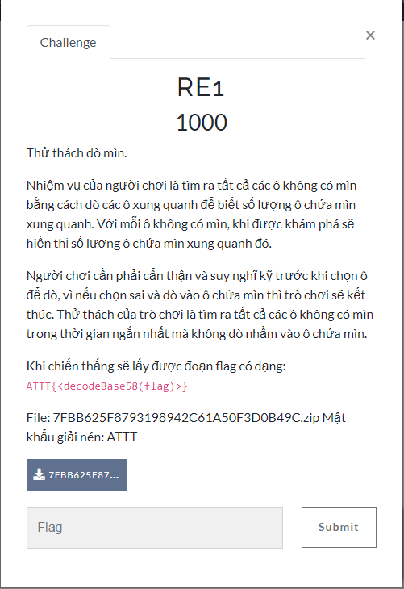
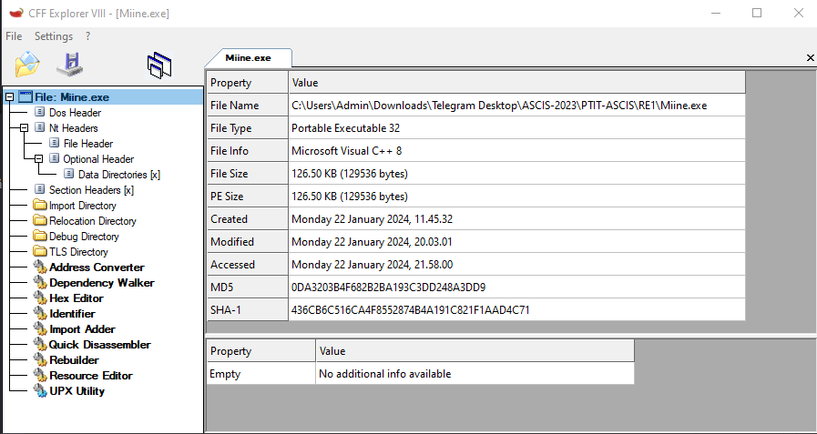
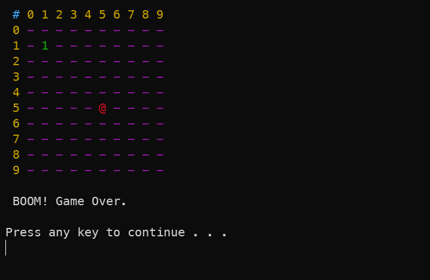
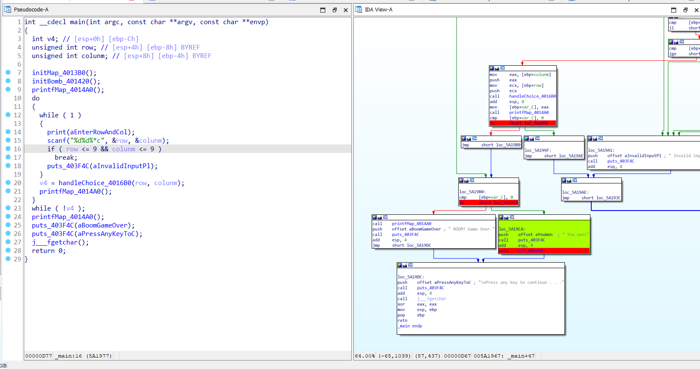
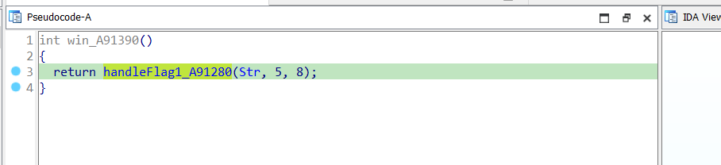
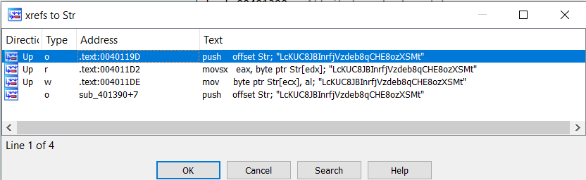
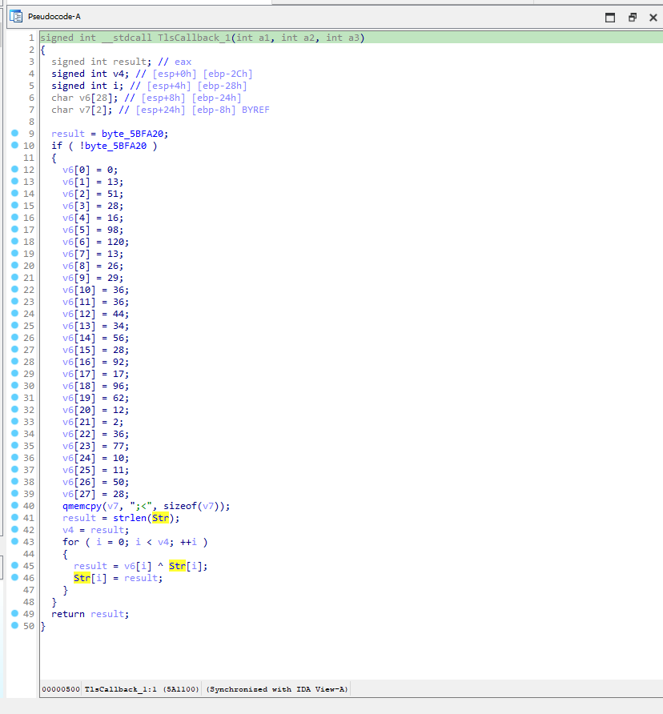
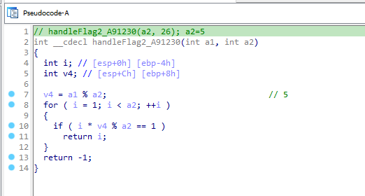
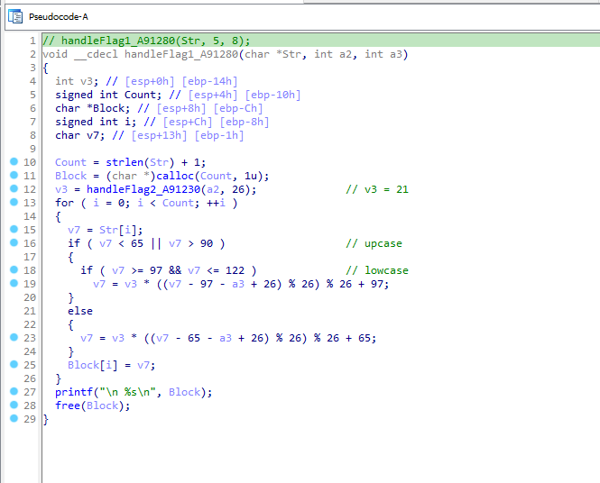
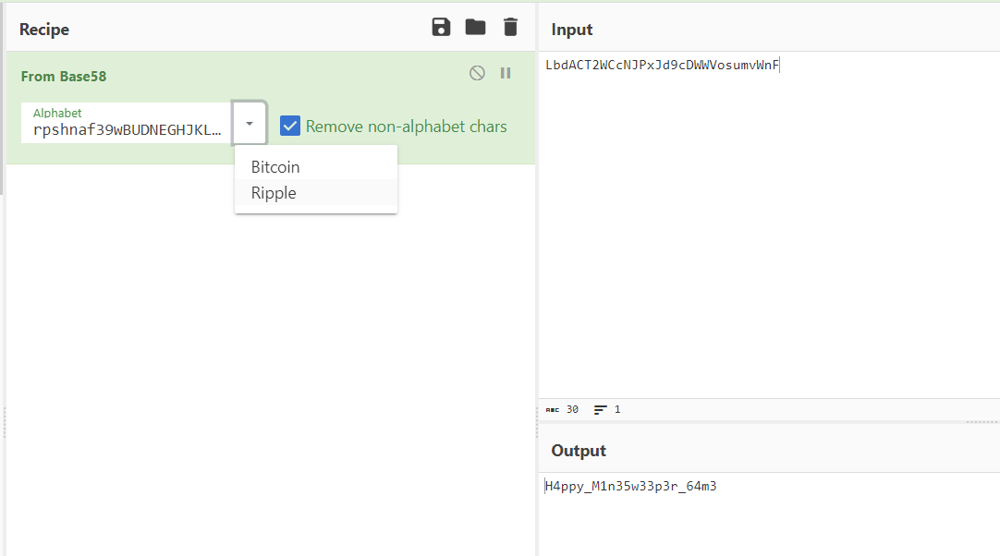

# RE1

> Khi chiến thắng sẽ lấy được đoạn flag có dạng: ATTT{<decodeBase58(flag)>} <-> File:7FBB625F8793198942C61A50F3DOB49C.zip Mật khẩu giải nén: ATTT



## [0]. Analysis Challenge

- File được cung cấp là file PE32 không bị pack.



- Thực thi chương trình thì logic cơ bản của chương trình là dạng game `Mine`, nhiệm vụ là dò mìn và tìm ra tất cả các ô không có mìn trong thời gian ngắn nhất mà không dò nhầm vào ô chứa mìn thì sẽ có được flag.



- Cơ bản sau khi dịch ngược thì xác định được follow thông báo khi thắng trò chơi và in flag là hàm `win` mình đã rename lại (pseudocode sẽ không có hàm win - là do follow thực thi sẽ không bao giờ đi vào đấy theo logic code assembly).



- Tiến hành debug trên code assembly, đặt `breakpoint` tại các instruciton jump để có thể nhảy vào hàm `win`.



- Follow theo các hàm được gọi từ hàm `win` mình thấy có một chuỗi đặc biệt được xử lý là `Str db 'LcKUC8JBInrfjVzdeb8qCHE8ozXSMt',0` sau khi giải mã thì có lẽ đây là flag được mã hóa ở dạng Base58 mà mô tả nói đến.

- Mình check xem có những đoạn xử lý nào trong code gọi đến chuỗi này thì có 2 chỗ là xử lý ở dạng giải mã chuỗi này thành mã base58 đúng mà mình đang tìm:
  - `1.`: Đoạn code này đã được ida pseudocode và định danh hàm, đây là hàm xử lý theo follow của hàm `win` được gọi từ hàm `main`.
  - `2.`: Hàm này thì lại chưa được make function do ida không thể hiểu 1 số instruction bị sai, đây là do kỹ thuật `disassembly`, đến đây mình xử lý hàm này trước.



- Sửa lại các lệnh bị sai và khi đặt breakpoint debug thì hàm này còn được gọi trước cả hàm `main` (đây là TlsCallback).



- Hàm còn lại liên quan đến xử lý chuỗi `Str` như sau:





## [1]. Solve Idea

- Mình tiến hành viết 1 chương trình code cpp để xử lý chuỗi `Str` thành chuỗi base58 đúng mà khi giải mã sẽ cho flag có nghĩa dựa trên các hàm của chương trình gốc.

```cpp
#include<bits/stdc++.h>
using namespace std;

char Str[] = "LcKUC8JBInrfjVzdeb8qCHE8ozXSMt";
int byte_5BFA20 = 0;

signed int __stdcall TlsCallback_1()
{
  signed int result; // eax
  signed int v4; // [esp+0h] [ebp-2Ch]
  signed int i; // [esp+4h] [ebp-28h]
  char v6[30]; // [esp+8h] [ebp-24h]
//  char v7[2]; // [esp+24h] [ebp-8h] BYREF

  result = byte_5BFA20;
  if ( !byte_5BFA20 )
  {
    v6[0] = 0;
    v6[1] = 13;
    v6[2] = 51;
    v6[3] = 28;
    v6[4] = 16;
    v6[5] = 98;
    v6[6] = 120;
    v6[7] = 13;
    v6[8] = 26;
    v6[9] = 29;
    v6[10] = 36;
    v6[11] = 36;
    v6[12] = 44;
    v6[13] = 34;
    v6[14] = 56;
    v6[15] = 28;
    v6[16] = 92;
    v6[17] = 17;
    v6[18] = 96;
    v6[19] = 62;
    v6[20] = 12;
    v6[21] = 2;
    v6[22] = 36;
    v6[23] = 77;
    v6[24] = 10;
    v6[25] = 11;
    v6[26] = 50;
    v6[27] = 28;
    v6[28] = 59;
    v6[29] = 60;
    // memcpy(v7, ";<", sizeof(v7));

    result = strlen(Str);
    v4 = result;
    for ( i = 0; i < v4; ++i )
    {
      result = v6[i] ^ Str[i];
      Str[i] = result;
    }
  }
  return result;
}

// handleFlag2_A91230(a2, 26); a2=5
int __cdecl handleFlag2_A91230(int a1, int a2)
{
  int i; // [esp+0h] [ebp-4h]
  int v4; // [esp+Ch] [ebp+8h]

  v4 = a1 % a2;                                 // 5
  for ( i = 1; i < a2; ++i )
  {
    if ( i * v4 % a2 == 1 )
      return i;
  }
  return -1;
}

// handleFlag1_A91280(Str, 5, 8);
void __cdecl handleFlag1_A91280(char *Str, int a2, int a3)
{
  int v3; // [esp+0h] [ebp-14h]
  signed int Count; // [esp+4h] [ebp-10h]
  char *Block; // [esp+8h] [ebp-Ch]
  signed int i; // [esp+Ch] [ebp-8h]
  char v7; // [esp+13h] [ebp-1h]

  Count = strlen(Str) + 1;
  Block = (char *)calloc(Count, 1u);
  v3 = handleFlag2_A91230(a2, 26);              // v3 = 21
  for ( i = 0; i < Count; ++i )
  {
    v7 = Str[i];
    if ( v7 < 65 || v7 > 90 )                   // upcase
    {
      if ( v7 >= 97 && v7 <= 122 )              // lowcase
        v7 = v3 * ((v7 - 97 - a3 + 26) % 26) % 26 + 97;
    }
    else
    {
      v7 = v3 * ((v7 - 65 - a3 + 26) % 26) % 26 + 65;
    }
    Block[i] = v7;
  }
  printf("\nATTT{<decodeBase58(flag)>} : %s\n", Block);
  free(Block);
}

int main(){
	TlsCallback_1();
	cout << Str << endl;
	handleFlag1_A91280(Str, 5, 8);
	return 0;
}
```

- Kết quả thu được mã base58 sau : `LbdACT2WCcNJPxJd9cDWWVosumvWnF`, tiến hành giải mã base58 dạng `Ripple` thì thu được flag có nghĩa `ATTT{H4ppy_M1n35w33p3r_64m3}`.


