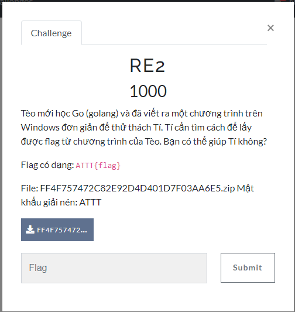
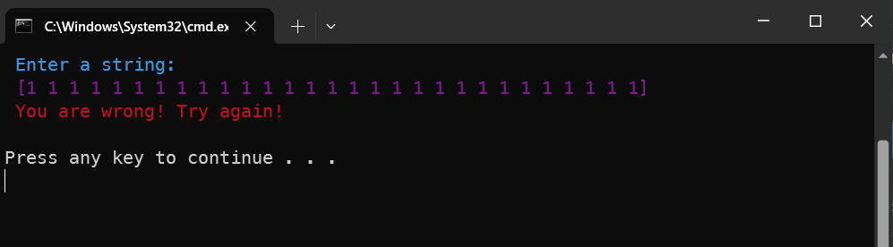
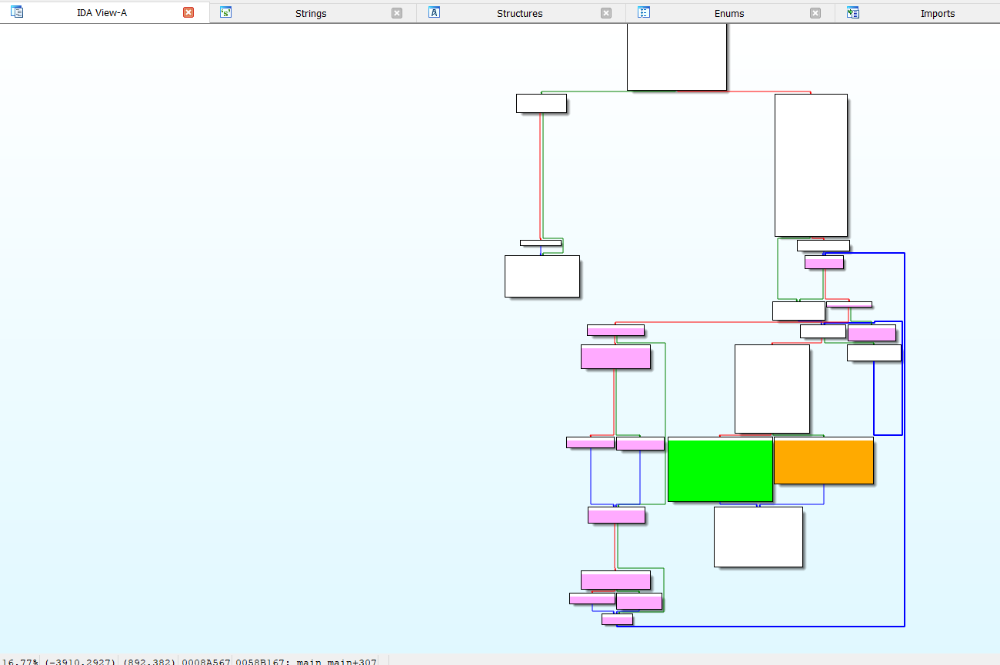
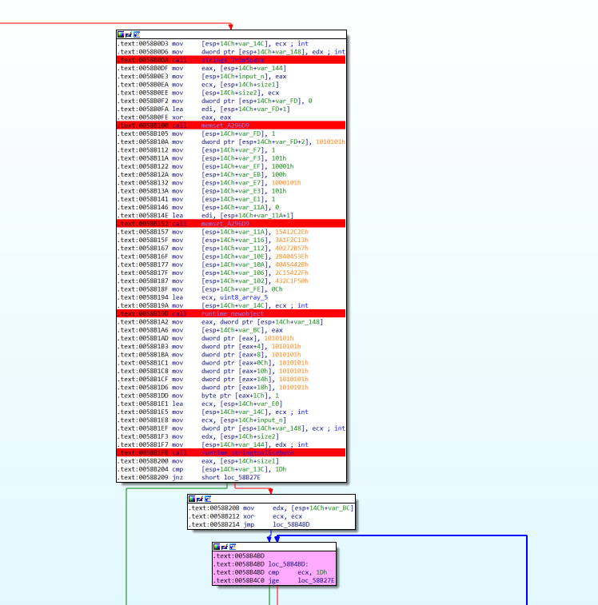
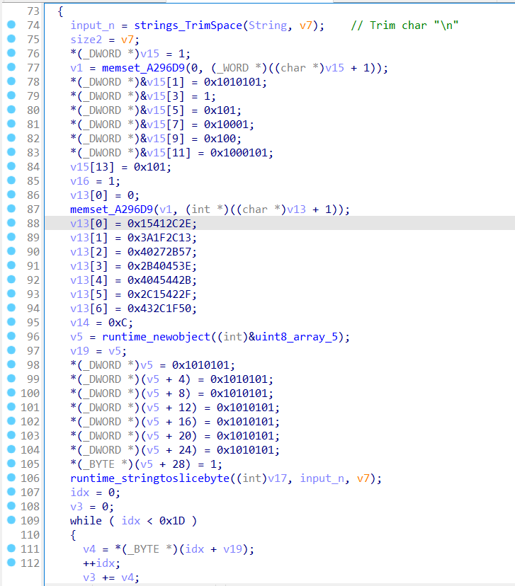
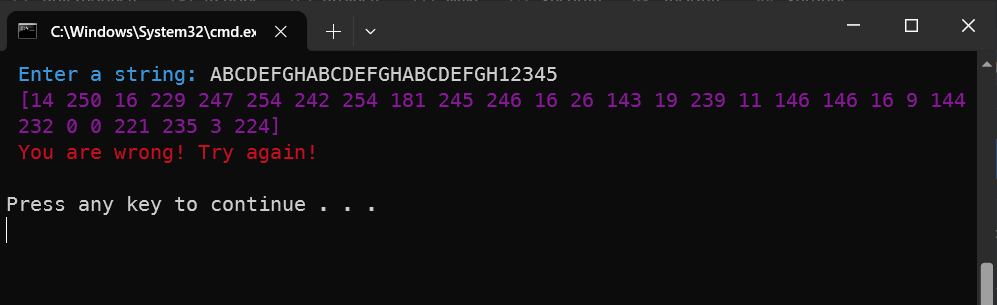
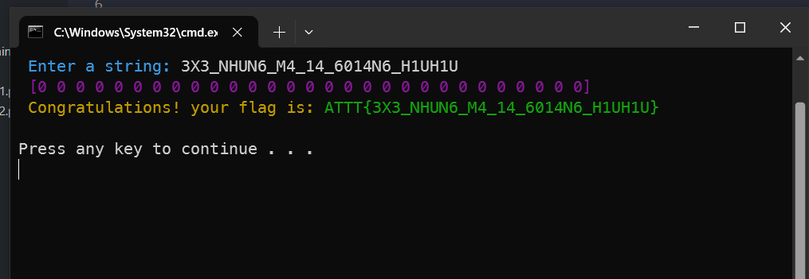

# RE2

> Flag có dạng: ATTT{flag} <-> File: FF4F757472C82E92D4D401D7F03AA6E5.zip Mật khẩu giải nén: ATTT



- File được cung cấp là file 32-bit được code bằng Golang, chạy thử chương trình và sử dụng IDA để dịch ngược.



- Sau khi phân tích file và debug thì mình phát hiện có nguyên một đoạn code assembly không được IDA define sang pseudocode (đó là các khối mình để màu tím).



- Khi debug với input ngẫu nhiên đủ 0x1d ký tự `ABCDEFGHABCDEFGHABCDEFGH12345` thì mình phát hiện đoạn xử lý chính liên quan đến input nằm trong đoạn code assembly không được pseudocode, trước đoạn code trên thì dữ liệu được gán cho ba biến `v15, v13, v5 và biến v17 chính là input  của mình`.





- Convert địa chỉ tại dữ liệu muốn lấy thành kiểu dữ liệu của biến (v15[] có kiểu dữ liệu phần tử là word) sau đó chọn array nhập số lượng rồi convert, chọn shift + E để lấy liệu.

```cpp
################################################################################################
unsigned char ida_chars[] =
{
0x01, 0x00, 0x01, 0x01, 0x01, 0x01, 0x01, 0x00, 0x00, 0x00,
0x01, 0x01, 0x00, 0x00, 0x01, 0x00, 0x01, 0x00, 0x00, 0x01,
0x00, 0x00, 0x01, 0x01, 0x00, 0x01, 0x01, 0x01, 0x01
};

_WORD v15[14] = {1, 0x101, 0x101, 1, 0, 0x101, 0, 1, 1, 0x100, 0, 0x101, 0x100, 0x101}
v16 = 1;

################################################################################################
unsigned char ida_chars[] =
{
0x2E, 0x2C, 0x41, 0x15, 0x13, 0x2C, 0x1F, 0x3A, 0x57, 0x2B,
0x27, 0x40, 0x3E, 0x45, 0x40, 0x2B, 0x2B, 0x44, 0x45, 0x40,
0x2F, 0x42, 0x15, 0x2C, 0x50, 0x1F, 0x2C, 0x43, 0x0C
};

int v13[7] = {0x15412C2E, 0x3A1F2C13, 0x40272B57, 0x2B40453E, 0x4045442B, 0x2C15422F, 0x432C1F50}
v14 = 0xC;

################################################################################################
runtime_newobject - 0x11C10200

v5 = runtime_newobject((int)&uint8_array_5);
v19 = v5;
_(\_DWORD _)v5 = 0x1010101;
_(\_DWORD _)(v5 + 4) = 0x1010101;
_(\_DWORD _)(v5 + 8) = 0x1010101;
_(\_DWORD _)(v5 + 12) = 0x1010101;
_(\_DWORD _)(v5 + 16) = 0x1010101;
_(\_DWORD _)(v5 + 20) = 0x1010101;
_(\_DWORD _)(v5 + 24) = 0x1010101;
_(\_BYTE _)(v5 + 28) = 1;

```

- Mình sẽ không giải thích kỹ cách debug để hiểu logic đoạn code assembly mà chỉ vẽ lại biểu đồ mô tả logic ý và tác dụng của 4 biến `v15, v13, v5 và biến v17 chính là input của mình`.

  - `v15`: là option tương ứng với hai case xử lý là 0 hoặc 1.
  - `v13`: là key được dùng để xử lý logic với input của mình.
  - `v5`: là mảng lưu kết quả sau khi handle toàn bộ input của mình.
  - `v17`: input của mình.

- Nếu input đúng (cũng chính là flag) thì mảng in ra sẽ toàn số 0, mình dựa vào kết quả được in ra khi xử lý input `ABCDEFGHABCDEFGHABCDEFGH12345` và debug code assembly để viết lại mô tả logic chương trình như sau:



```ps1
0 <= idx < 0x1d

+) v15[idx] = 1 : (input + v13[idx]) : instruction `test ecx, 3` (kiểm tra xem idx có chia hết cho 4 không) :
    +) idx % 4 = 0 : (input + v13[idx]) - 0x61 = 0
    +) idx % 4 = 1 : (input + v13[idx]) - 0x74 = 0


+) v15[idx] = 0 : (input ^ v13[idx]) : instruction `test ecx, 3` (kiểm tra xem idx có chia hết cho 4 không) :
    +) idx % 4 = 0 : (input + v13[idx]) + 0xffffff9F = 0x100000000
    +) idx % 4 = 1 : (input + v13[idx]) - 0xffffff8C = 0x100000000
```

- Dựa vào dữ liệu lấy được từ ida và mình viết lại 1 đoạn code python xử lý logic trên thì lấy được input đúng `3X3_NHUN6_M4_14_6014N6_H1UH1U`.

```python
option = [
    0x01, 0x00, 0x01, 0x01, 0x01, 0x01, 0x01, 0x00, 0x00, 0x00,
    0x01, 0x01, 0x00, 0x00, 0x01, 0x00, 0x01, 0x00, 0x00, 0x01,
    0x00, 0x00, 0x01, 0x01, 0x00, 0x01, 0x01, 0x01, 0x01
]

key = [
    0x2E, 0x2C, 0x41, 0x15, 0x13, 0x2C, 0x1F, 0x3A, 0x57, 0x2B,
    0x27, 0x40, 0x3E, 0x45, 0x40, 0x2B, 0x2B, 0x44, 0x45, 0x40,
    0x2F, 0x42, 0x15, 0x2C, 0x50, 0x1F, 0x2C, 0x43, 0x0C
]
result = ""

for i in range(len(option)):
    if option[i] == 0x1:
        if i % 4 == 0:
            a = 0x61 - key[i]
            result += chr(a)
        else:
            b = 0x74 - key[i]
            result += chr(b)
    else:
        if i % 4 == 0:
            c = (0x100000000 - 0xffffff9f) ^ key[i]
            result += chr(c)
        else:
            d = (0x100000000 - 0xffffff8c) ^ key[i]
            result += chr(d)


print("Result Input ", result)
```

- Nhập input đúng thì mình có được flag `ATTT{3X3_NHUN6_M4_14_6014N6_H1UH1U}`:



- Bài này có thể bruteforce ký tự từ process của chương trình để có được flag:

```python
import subprocess
import re

flag =b"xxxxxxxxxxxxxxxxxxxxxxxxxxxxx"
f = [None] * 29
file = open("save.txt", "w")
for i in range(32,128):                                 #brute force (if array[i] == 0 ---> array[i] = 32-128)
    payload = flag.replace(b"x", chr(i).encode("ascii"))
    process = subprocess.Popen([r"C:\Users\Admin\Downloads\Telegram Desktop\ASCIS-2023\PTIT-ASCIS\RE2\easyRE.exe"], stdin=subprocess.PIPE, stdout=subprocess.PIPE, stderr=subprocess.PIPE)       ##open file easyRE
    process.stdout.read(36)                             #read 36 bytes stdout
    process.stdin.write(payload + b"\r\n")              #write flag stdin
    process.stdin.flush()
    process.stdout.read(7)                              #read 7 bytes stdout remove color "\x1b[35m"
    char = process.stdout.read(1)                       #read 1 byte (array check number)
    while(char!=b"]"):                                  #compare "]" to remove "\x1b[0m"
        file.write(char.decode("ascii"))                #write array to .txt
        char = process.stdout.read(1)
    file.write("\n")
file.close()

with open("save.txt", "r") as file:                     #read file saved
    cnt = 32
    for line in file:
      lines = line.strip().split()                      #split elements
      i = 0
      for word in lines:
        if(int(word) == 0):                             #element == 0 --> save to array
          f[i] = cnt
        i+=1
      cnt+=1
real_flag = ""
file.close()
for i in f:
  real_flag += chr(i)
print(f'ATTT{{{real_flag}}}')
```
