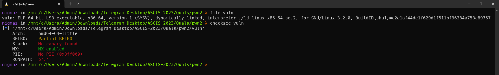
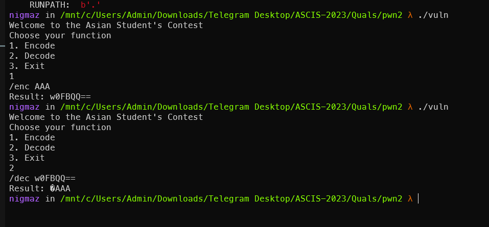
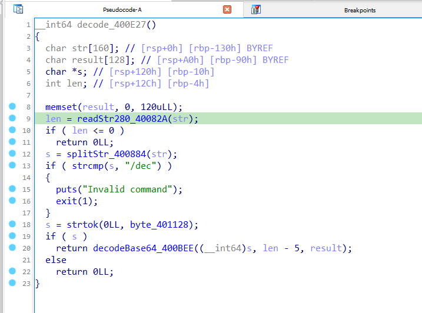
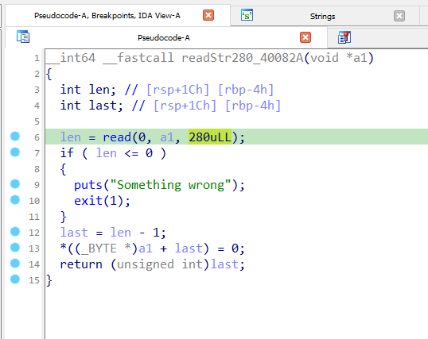
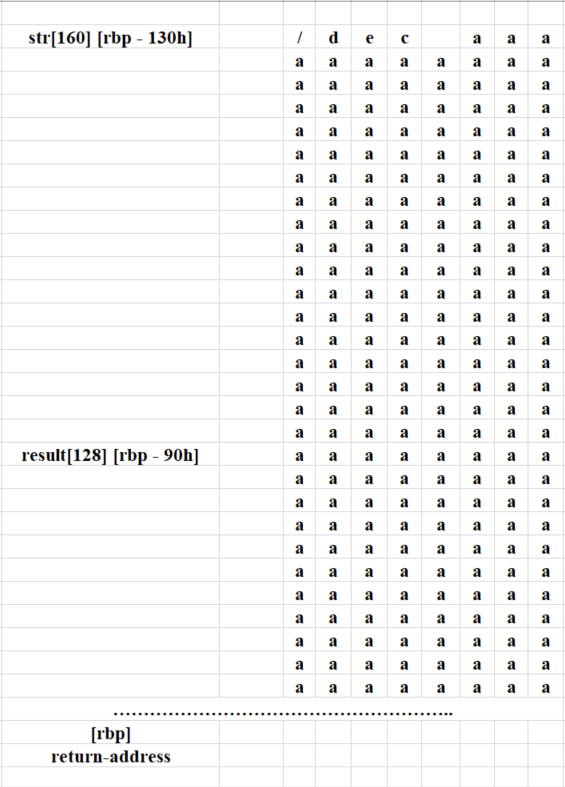
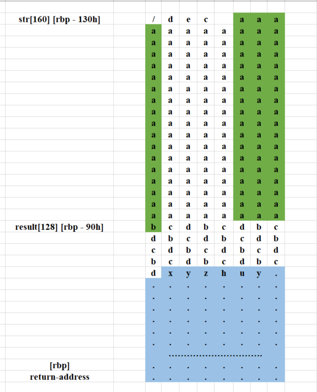

# pwn2

- Password: ASCIS2023

> Quals ASCIS-2023

## [0]. Analysis Challenge

- Kiểm tra chương trình và các biện pháp bảo vệ file được sử dụng.

- Chương trình cơ bản gồm hai chức năng là `encode` và `decode` sử dụng thuật toán mã hóa base64.

- Lỗ hổng của chương trình nằm trong chức năng nhập đầu vào cho chương trình khi mà hàm `readStr` cho phép đọc 280 ký tự đối với biến `str` chỉ được khia báo với 160 ký tự (lỗ hổng này xuất hiện ở cả hai hàm decode và encode nhưng bài này mình chỉ sử dụng hàm decode).

- Biến `str` nằm ở vị trí `[rbp - 0x130]` và hàm `readStr` cho phép đọc `0x118` là không đủ để stack-buffer-overfllow thẳng từ biến `str` vào `return-address` nhưng ở hàm `decodeBase64` (hàm `decode` -> hàm `decodeBase64`) sẽ giải mã base64 đối với chuỗi `str` và lưu giá trị đó biến `result[128] [rbp-0x90]` cũng nằm trong hàm `decode`.

- Điều đó có thể dẫn đến stack-buffer-overflow ghi đè lên `return-address` của hàm `decode`, vấn đề ở đây là giá trị nhập vào là 1 gái trị mã hóa dẫn đến khó kiểm soát các giá trị.

- Hiểu đơn giản mã hóa base64 là:

  - Encode: Cứ 3 byte tương ứng tạo thành 24 bit -> 24 bit chia 4 = 6 bit và cứ 6 bit một được tính làm 1 ký tự (3 ký tự => 4 ký tự).
  - Decode: Cứ 4 byte tương ứng tạo thành 24 bit -> 24 bit chia 3 = 8 bit và cứ 8 bit một được tính làm 1 ký tự (4 ký tự => 3 ký tự).

- Khi bạn nhập ký tự tràn từ biến `str[160]` vào biến `result[128]`.

- Theo giải mã base64, cứ 4 ký tự gộp vào thành 3 ký tự rồi lưu vào result (Giả sử trong hình vẽ là `aaaa` -> `bcd`, `aaab` -> `xyz`, `cdbc` -> `huy`). - Vấn đề phát sinh nằm ở biến `result` khi mà nó lưu kết quả của quá trình decode, như các bạn thấy mình mô tả lại trên hình thì có nghĩa là cuối chuỗi `result` sẽ có 1 đoạn được giải mã 2 lần.

- Đoạn được giải mã hai lần sẽ ghi đè lên `return-address`, vậy nên để control giá trị ghi đè lên `return-address` phải mã hóa hai lần.

- `[payload gốc (địa chỉ trong chương trình)]` -> `một ký tự bất kỳ` + `mã hóa base64 lần 1 payload` -> `mã hóa base64 lần thứ 2 cả chuỗi base64 ở bước 2`.

- Bạn có thể tham khảo code exploit để hiểu hơn đoạn mình kiểm soát giá trị ở đây.

## [1]. Solve Idea

- Bây giờ thì đã kiểm soát được giá trị nên nó lại quay về bài toán leak giá trị libc sau đó ghi đè để thiết lập 1 stack cho việc call `system('/bin/sh')`.

  - `LEAK LIBC`.
  - `Return system('/bin/sh')`.

- File exploit: [exp.py](./exp.py)

## [2]. References
