# Conti

> Quals ASCIS-2023

- Sử dụng máy ảo để chạy và phân tích file được challenge cung cấp (File `conti.exe` mô phỏng ransomware mã hóa các file trên máy tính).

- File `conti.zip` mật khẩu giải nén `infected`.

## [0]. Analysis Challenge

- Giải nén file được Challenge cung cấp ta thấy có 2 file `Conti.exe` và `flag.txt.EXTEN`.

- Sử dụng `Detect It Easy` để kiểm tra thông tin cơ bản của 2 file được cung cấp:

  - File `Conti.exe` là file PE 64-bit và không bị packed.
    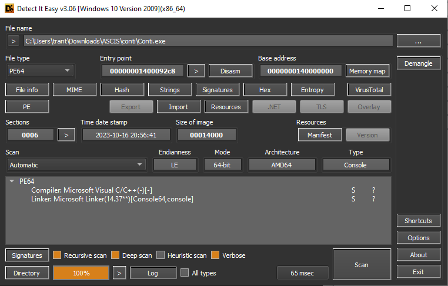

  - File `flag.txt.EXTEN` là file ở định dạng BINARY.
    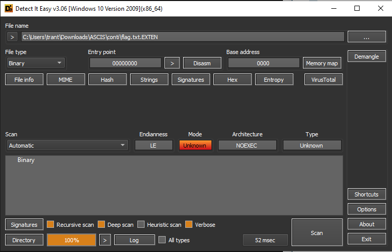

- Chạy file `Conti.exe` thì thấy các file (loại file dữ liệu như .txt, .png, ... trừ các file thực thi .exe,...) nằm trong ổ C của máy tính đều bị mã hóa, thêm đuôi `EXTEN` và sinh ra file `readme.txt` không có nội dung.

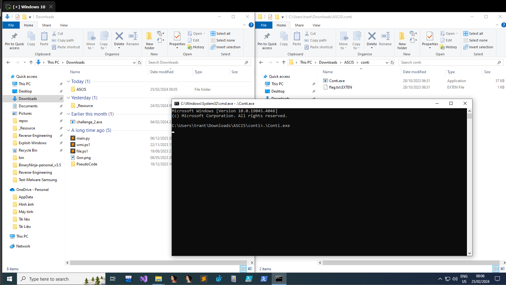

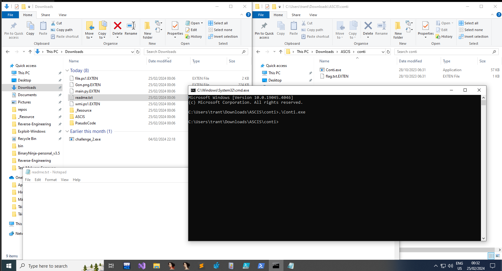

- Các file bị mã hóa `.EXTEN` khi dùng `Detect It Easy` kiểm tra định dạng là file BINARY.

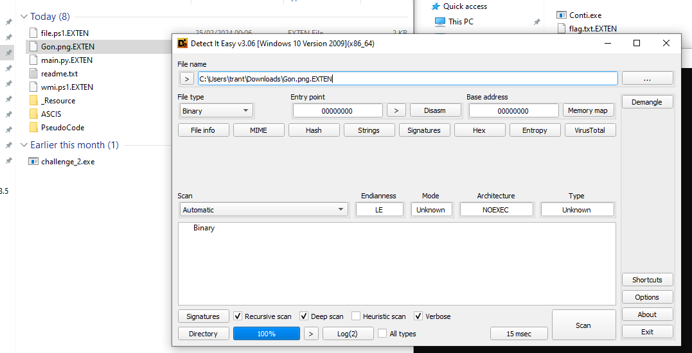

- Phân tích chương trình (Base-Program = 0x140000000) và thấy có hai hàm chạy trước hàm `main()` là `sub_140001020()` và `sub_140001000()`:

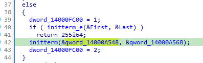

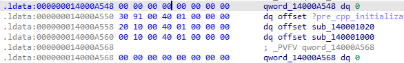

- `Hàm thứ nhất` là `sub_140001020()` -> `sub_1400063D0()` -> `sub_140006200()` và chức năng của luồng thực thi này là đặt hook vào hàm `NtReadFile` (một hàm NativeAPI).

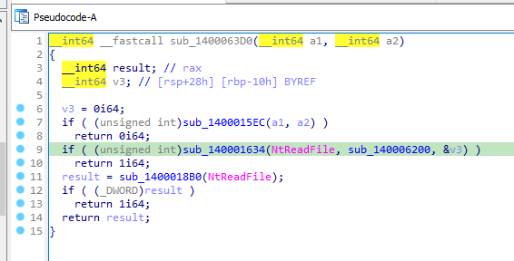

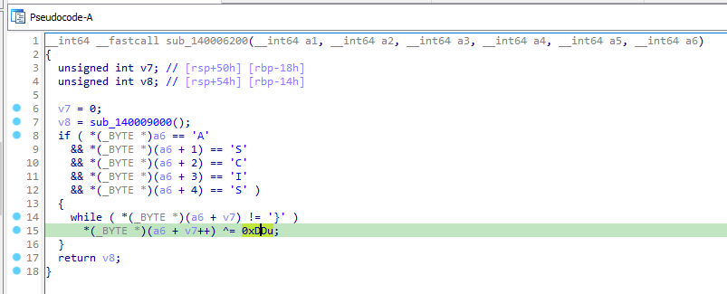

- `Hàm thứ hai` là `sub_140001000()` -> `sub_140006430()` và chức năng của luồng thực thi này là vá thông tin liên quan tới xử lý `Exception` và vào section `.ldata`.

  - Section này gốc phải là `.rdata` nhưng đã bị tác giả sửa thành `.ldata` và có quyền ghi.
    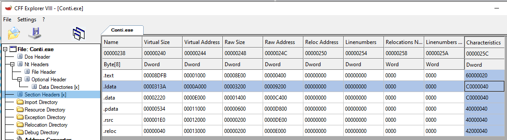
  - Như vậy sau khi vá `0x6360` vào vị trí `base-program + 0x5f06` thì hàm `exception handler` thực sự được gọi là `sub_140006360()`.
    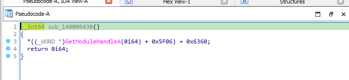

- Luồng thực thi hàm `sub_140006360()` (Hàm này cũng được gọi trong hàm main) -> `sub_140009016()` -> `sub_140005DF0()` -> gọi 2 hàm là `sub_140005C20()` và `sub_140004BF0()`.

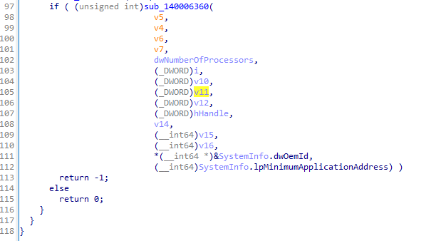

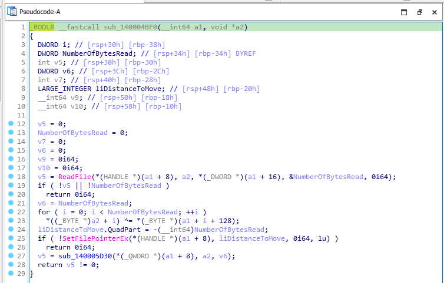

- `Exception` xảy ra khi ở hàm kiểm tra flag - `sub_140004730()`, nó sẽ nhảy tới hàm rác gây `exception`.

  - Luồng thực thi `main()` -> `sub_140008AE0()` (Hàm này được gọi tới ba lần trong hàm main) -> `sub_140008BA0()` -> `sub_1400081B0()` -> `sub_140004970()` -> `sub_140004730()`.
    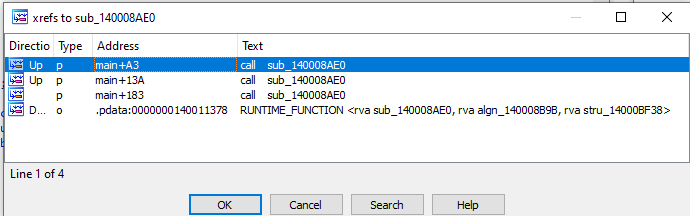
  - `Exception` trong hàm kiểm tra flag - `sub_140004730()`.
    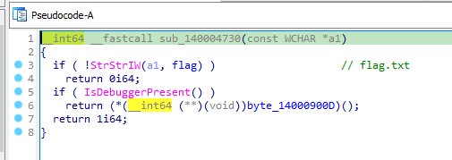
    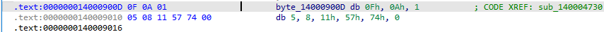

- Đi theo luông thực thi từ hàm `main()` -> `sub_140006360()` -> `...` -> gọi 2 hàm là `sub_140005C20()` và `sub_140004BF0()` và đọc hiểu 2 hàm này ta có dc cách tính flag.

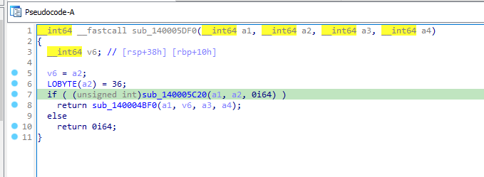

## [1]. Solve Idea

- Giá trị mã hex của file `flag.txt.EXTEN` - đây có lẽ là file flag đã bị mã hóa bởi chương trình mô phỏng ransomware trên.

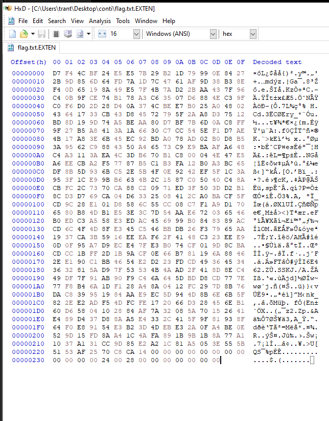

- Những bytes cuối chứa thông tin của file bị mã hoá, trong đó 0x28 là kích thước file.

  - Do đó 28 bytes đầu là flag bị mã hoá
  - Những bytes phía sau là key.
  - Hàm `sub_140006200()` trong luồng thực thi hook `NtReadFile` sẽ XOR input của flag với `0xdd`.
  - Còn hàm `exception handler` ẩn sẽ xor key, tức là các bytes phía sau offset `0x28`.
  - Ví dụ: FLAG có dạng `ASCIS{}`.
    - Khi đó kết quả mã hóa là `ord('A') ^ 0xDD ^ 0x4b = 0xD7`.
    - Trong đó 0x4b là byte bắt đầu ở offset 0x28 và 0xD7 là byte đầu tiên trong số 28 byte đầu của file `flag.txt.EXTEN`.

  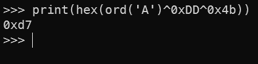

  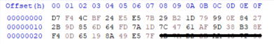

- Viết script-python [solve.py](./Conti/solve.py) giải mã và lấy được FLAG: `ASCIS{G00d_j0b!Y0u_f1nd_all_h1dden_tr4p}`.

- Script [decryptor.c](./Conti/decryptor.c) giải mã các file bị mã hóa bởi chương trình `Conti.exe`.

## [2]. References

- [writeup-Conti.docx](./Conti/writeup-Conti.docx)
