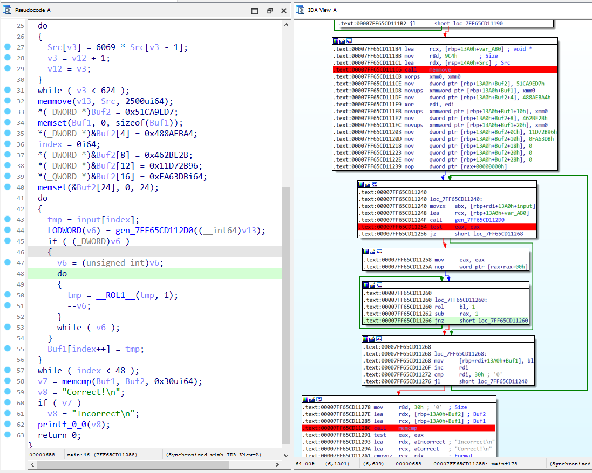
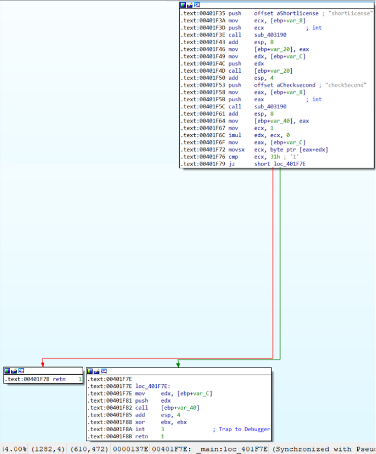

# Sanryu

- Password: ASCIS2023

> Quals ASCIS-2023

```bash
There is a myth about a dragon that had three heads. Fight and rescue our princess.

Password: notinfected

Also me fighting with the dragon: **insert pepe diamond sword meme**


Hint 1: What? This three-headed dragon was not designed to be here.
You are supposed to meet this dragon at the next round of the competition but he've respawned earlier than I expected. Becareful, he's dangerous...
This is not a hint , just a small note left by a brave warrior.

Hint 2: Deep down in assembly codes, there's a way to find the secret dll which contained a simple math to get the second part of the license. In this part, I've already given you one character for free :D

Hint 3: There's a weak hash string which can be easily found on the internet, that's 3 final characters of the secret license. Goodluck.
```

## [0]. Analysis Challenge

- Sử dụng `CFF Explorer` và `Detect It Easy` xác định file thực thi là file `PE-32 bit` sử dụng thư viện .NET và không bị pack.


- Chạy file thực thi DotNet ta thấy dòng chữ `Fighting with three-headed dragon to get the flag` và ảnh meme hydra rồng ba đầu.


- Theo hướng dẫn thì ta cần đánh bại ba cái đầu rồng này để có được flag, mình load chương trình vào `dnSpy` và bắt đầu đọc source.

- Chương trình gọi `frmMain()` -> `InitializeComponent()`.

```cs
		private void InitializeComponent()
		{
			this.pictureBox1 = new PictureBox();
			((ISupportInitialize)this.pictureBox1).BeginInit();
			base.SuspendLayout();
			this.pictureBox1.Image = Resources._9e2;
			this.pictureBox1.Location = new Point(-5, -2);
			this.pictureBox1.Name = "pictureBox1";
			this.pictureBox1.Size = new Size(689, 545);
			this.pictureBox1.SizeMode = PictureBoxSizeMode.StretchImage;
			this.pictureBox1.TabIndex = 0;
			this.pictureBox1.TabStop = false;
			this.pictureBox1.Click += this.pictureBox1_Click;
			this.pictureBox1.MouseUp += new MouseEventHandler(this.pictureBox1_MouseUp);
			this.pictureBox1.MouseDown += new MouseEventHandler(this.pictureBox1_MouseDown);
			base.AutoScaleDimensions = new SizeF(8f, 16f);
			base.AutoScaleMode = AutoScaleMode.Font;
			base.ClientSize = new Size(682, 542);
			base.Controls.Add(this.pictureBox1);
			base.FormBorderStyle = FormBorderStyle.FixedToolWindow;
			base.Name = "frmMain";
			this.Text = "Fighting with three-headed dragon to get the flag";
			base.Load += this.frmMain_Load;
			((ISupportInitialize)this.pictureBox1).EndInit();
			base.ResumeLayout(false);
		}

		// Token: 0x04000001 RID: 1
		private IContainer components;

		// Token: 0x04000002 RID: 2
		private PictureBox pictureBox1;
	}
}

// launcher.frmMain
// Token: 0x06000001 RID: 1 RVA: 0x00002050 File Offset: 0x00000250
public frmMain()
{
	this.InitializeComponent();
}
```

- Hàm `InitializeComponent()` đăng ký hàm `pictureBox1_MouseUp()`, từ mã dịch ngược chúng ta có thể thấy rằng khi bạn nhấp vào từng đầu trong số ba đầu của hydra, một mã nhị phân khác sẽ được chạy.

```cs
		private void pictureBox1_MouseUp(object sender, EventArgs e)
		{
			Cursor cursor = new Cursor(Resources.sword_up.Handle);
			this.pictureBox1.Cursor = cursor;
			Point location = ((MouseEventArgs)e).Location;
			if (location.X > 8 && location.X < 157 && location.Y > 117 && location.Y < 429)
			{
				this.runResource("challenge_1.exe", Resources.challenge_1);
			}
			if (location.X > 203 && location.X < 314 && location.Y > 88 && location.Y < 434)
			{
				this.runResource("challenge_2.exe", Resources.challenge_2);
			}
			if (location.X > 368 && location.Y < 494 && location.Y > 138 && location.Y < 430)
			{
				this.runResource("challenge_3.exe", Resources.challenge_3);
			}
		}
```


- Meme cũng gợi ý rằng thử thách thứ ba là thử thách dễ giải quyết nhất nên mình sẽ bắt đầu từ nó.

### > 1. Challenge_3

```c
int __cdecl main(int argc, const char **argv, const char **envp)
{
  int v3; // eax
  __int64 index; // rdi
  char tmp; // bl
  __int64 v6; // rax
  int v7; // eax
  const char *v8; // rcx
  int Src[624]; // [rsp+20h] [rbp-E0h] BYREF
  int v12; // [rsp+9E0h] [rbp+8E0h]
  int v13[628]; // [rsp+9F0h] [rbp+8F0h] BYREF
  char Buf2[48]; // [rsp+13C0h] [rbp+12C0h] BYREF
  char Buf1[48]; // [rsp+13F0h] [rbp+12F0h] BYREF
  char input[96]; // [rsp+1420h] [rbp+1320h] BYREF
  int v17; // [rsp+1480h] [rbp+1380h]

  memset(input, 0, sizeof(input));
  v17 = 0;
  printf_0_0("input: ", argv, envp);
  scanf_s_0("%s", input);
  printf_0_0("I am checking the input. Please wait...\n");
  v3 = 1;
  Src[0] = 1337;
  v12 = 1;
  do
  {
    Src[v3] = 6069 * Src[v3 - 1];
    v3 = v12 + 1;
    v12 = v3;
  }
  while ( v3 < 624 );
  memmove(v13, Src, 2500ui64);
  *(_DWORD *)Buf2 = 0x51CA9ED7;
  memset(Buf1, 0, sizeof(Buf1));
  *(_DWORD *)&Buf2[4] = 0x488AEBA4;
  index = 0i64;
  *(_DWORD *)&Buf2[8] = 0x462BE2B;
  *(_DWORD *)&Buf2[12] = 0x11D72B96;
  *(_QWORD *)&Buf2[16] = 0xFA63DBi64;
  memset(&Buf2[24], 0, 24);
  do
  {
    tmp = input[index];
    LODWORD(v6) = gen_7FF65CD112D0((__int64)v13);
    if ( (_DWORD)v6 )
    {
      v6 = (unsigned int)v6;
      do
      {
        tmp = __ROL1__(tmp, 1);
        --v6;
      }
      while ( v6 );
    }
    Buf1[index++] = tmp;
  }
  while ( index < 48 );
  v7 = memcmp(Buf1, Buf2, 0x30ui64);
  v8 = "Correct!\n";
  if ( v7 )
    v8 = "Incorrect\n";
  printf_0_0(v8);
  return 0;
}
```

- Chương trình sẽ nhắc chúng mình nhập dữ liệu đầu vào, đầu vào đó được mã hóa ROL và kết quả cuối cùng sẽ so sánh với mảng `Buf2[]`.

- Số lần dịch bit sang trái đối với mỗi ký tự sẽ phụ thuộc vào biến `v6` - được sinh ra bởi 1 hàm `gen` và giá trị của mảng `v13`.

- Ý tưởng ở đây là mình sẽ viết 1 script điều chỉnh giá trị của mảng `Buf2[]` theo 8 (vì mỗi 1 ký tự là 1 byte - 8 bit), các giá trị như kết quả sau khi `ROL` input (nếu đúng input của chương trình) là mảng `Buf2[]` và giá trị trong biến `v6` là số lần thực hiện ROL 1 bit đều được lấy thông qua debug.



- Để hiểu về cách ngôn ngữ Cpp triển khai mã hóa ROL bạn có thể tìm đọc tài liệu trên mạng và tham khảo code C mình viết ở đây [ROL.cpp](./sanryu/ROL.cpp) (ROL 8 lần thì về số ban đầu).

- Sử dụng script [solve1.py](./sanryu/solve1.py) giải mã challenge3 này cho chúng ta phần thứ ba của flag: `_OVER_THe_1@ZY_Do6}`.

```python
def rol(a, x):
    tmp = bin(a)[2:].rjust(8, '0')
    return int(tmp[x:] + tmp[:x], 2)

data = [0xD7, 0x9E, 0xCA, 0x51, 0xA4, 0xEB, 0x8A, 0x48, 0x2B, 0xBE,
  0x62, 0x04, 0x96, 0x2B, 0xD7, 0x11, 0xDB, 0x63, 0xFA]

rol_count = [0xf3a8d24e, 0x57286251, 0xed0bb215, 0xc54297c6, 0x1372d3d1, 0x9aebb2fd,
      0x4074858d, 0xd8f50000, 0x95e8f163, 0x325640e9, 0x6c750331, 0x86a54774,
      0xd88dda56, 0xfbd660c5, 0x77f412ae, 0x9077a73e, 0xb8817c4e, 0xb4a4110c,
      0xbc4e8a99, 0x409d7713, 0x935c8213]


for a in data:
    print(bin(a)[2:].rjust(8, '0'))

for i in range(min(len(rol_count), len(data))):
    print(end=chr(rol(data[i], 8 - (rol_count[i] % 8))))
```

### > 2. Challenge_2

- File thực thi được sinh ra là file PE 64 bit, mình sử dụng IDA trên tệp nhị phân này và nó trông phức tạp hơn tệp nhị phân trước đó. Phân tích nhanh hàm `main()` chương trình cho mình kết quả sau:


- Hàm `fn_checkInput()` kiểm tra đầu vào của chương trình do mình nhập vào và so sánh nó với giá trị được giải mã XOR đang được lưu trong bộ nhớ, nếu đúng thì thực hiện luồng thực thi chương trình gọi hàm `fn_handle1_decrypt_image()` để decrypt 1 ảnh từ resource của chương trình.


- Giải mã nhanh giá trị được lưu trong bộ nhớ mình thu được input `ZQLODBY4UGXHK5TRYILGMEZZVYU2ILTE`.

```python
### XOR in fn_checkInput()
a = bytes.fromhex('C1B762F697A76872A7BA15F990B37E7D')
b = bytes.fromhex('D6B71BF4EDAA7671C9B912F098B3667E')
c = bytes.fromhex('93E357BDDFFF2F2793E357BDDFFF2F27')

str1 = []
str2 = []
for i, j in zip(a, c):
	str1.append(chr(i ^ j))
str1 = ''.join(str1[::-1])
print(str1)

for i, j in zip(b, c):
	str2.append(chr(i ^ j))
str2 = ''.join(str2[::-1])
print(str2)
print(str1 + str2)
```

- Mình đã thử nhập input `ZQLODBY4UGXHK5TRYILGMEZZVYU2ILTE` nhưng nó không cho kết quả gì.


- Quay lại kiểm tra code của hàm `fn_checkInput()` thì mình thấy cuối hàm có thực hiện lệnh `call MEMORY[0xFFFFFFFFFFFFFFFF]`, điều này dẫn đến xảy ra 1 Exception khi mình chạy và debug chương trình.

- Mình phân tích hàm `fn_handle1_decrypt_image()` - (hàm này sẽ được gọi khi input pass điều kiện của hàm `fn_checkInput()`), chức năng chính của hàm này là tìm và giải mã resource của chương trình rồi extract thành 1 file `SusFlag.jpg`, thuật toán mã hóa được sử dụng là `RC4` và hàm này bị obfuscation bởi một số byte-junk.


- Mình dùng `Resource Hacker` để extract lấy phần resource của file và viết script [solve2-RC4Decrypt.cpp](./sanryu/solve2-RC4decrypt.cpp) mô phỏng lại thuật toán RC4 sử dụng input `ZQLODBY4UGXHK5TRYILGMEZZVYU2ILTE` làm key để giải mã lấy hình ảnh.


- Ảnh không chứa nội dung flag nên đến đây mình tiếp tục phân tích tĩnh chương trình để xem có bỏ xót đoạn code quan trọng nào không thì mình phát hiện ra hai hàm được sử dụng cho quá trình decrypt thuật toán RC4 để extract file images được sử dụng hai lần.


- Ở lần gọi giải mã thuật toán RC4 trong hàm `fn_handle2_decrypt_PEfile()` - hàm này mình đã đặt lại tên và chương trình gọi nó ở phần init của chương trình (nó được gọi trước hàm main bằng cách sử dụng `initterm()` và gọi kèm cùng các exception, đó là lí do tại sao khi debug chương trình bị treo), chương trình giải mã một file PE khác và mình có thể dump nó bằng cách đặt 1 điểm dừng ở các hàm giải mã RC4 để lấy PE file được giải mã.

- Hàm giải mã RC4 đầu tiên `fn_rc4Decrypted_1()` thực hiện tạo bảng key giải mã với khóa là `YE2UXLUHMOLZTB4YIDIQTZG5KELYRZVG`.


- Hàm giải mã RC4 thứ hai `fn_rc4Decrypted_2()` sẽ giải mã data trong chương trình thành PE-file tại địa chỉ (đối số thứ hai tại rdx).


- Mình viết 1 script-python để extracted 0x3400 byte bắt đầu từ địa chỉ (giá trị địa chỉ này nằm trong thanh ghi RDX) vào 1 file PE.

```python
import os
from idautils import *
from idc import *

def get_bytes(start_address, num_bytes):
    bytes_data = b""
    for i in range(num_bytes):
        byte = get_wide_byte(start_address + i)
        if byte != -1:
            bytes_data += bytes([byte])
        else:
            print("Failed to read byte at address: 0x{:X}".format(start_address + i))
            return None
    return bytes_data

def save_to_file(bytes_data):
    with open("output.exe", "wb") as f:
        f.write(bytes_data)
    print("Data saved to output.exe")

def main():
    start_address = 0x00000229F1E111A0
    num_bytes = 0x3400

    bytes_data = get_bytes(start_address, num_bytes)
    if bytes_data:
        save_to_file(bytes_data)
    else:
        print("Failed to read bytes.")

if __name__ == "__main__":
    main()
```

- Đây là 1 Dll 64-bit, phân tích luồng thực thi của chương trình thì mình tìm thấy hàm xử lý chính để kiểm tra input.


- Mình viết script [solve2.py](./sanryu/solve2.py) bruteforce ký tự và lấy được phần thứ hai của flag `Br0WN_FOX_JUmP$`.

```python
def enc(a1, a2):
    return ((a1 << (8 - a2)) | (a1 >> a2)) & 0xFF

a = [0xDC, 0x3C, 0x0A, 0xBE, 0x75, 0xCB, 0x0A, 0x80, 0xF4, 0x4A,
  0x8C, 0x86, 0xAA, 0xE4, 0xC3]

b = [0xA7, 0x4F, 0xB2, 0x70, 0x70, 0x50, 0xD8, 0xF9, 0xAB, 0xB1,
  0xFB, 0x78, 0x77, 0x87, 0x1D, 0xC3]

for i in range(15):
    for j in range(32, 127):
        c = j + 10
        if a[i] ^ enc(a[i], 2) ^ c == b[i]:
            print(end=chr(j))
            break
```

### > 3. Challenge_1

- Thử thách này là khó nhất trong ba file được sinh ra và là PE file định dạng 32-bit.


- Phân tích code của challenge-1 được triển khai theo `nanomite`, trong đó có hai quá trình song song giao tiếp với nhau.

- Nói chung, `parent process` muốn nhập đầu vào từ người dùng sau đó gửi đến `child process` bằng giá trị thứ hai của argv. Hai tiến trình `parent process` và `child process` giao tiếp với nhau bằng cách sử dụng các hàm `WaitForDebugEvent`, `GetThreadContext`,... và thông qua cả các `register` giống như cách hoạt động của các challenge liên quan đến `nanomite`.

- Mỗi khi `child process` gặp một instrution call `int 3`, `parent process` sẽ tiếp tục và sau khi hoàn thành công việc của nó thì `EIP` thay đổi và quay trở lại `child process` (https://learn.microsoft.com/en-us/cpp/intrinsics/debugbreak?view=msvc-170).


- Luồng thực thi chính của `child process` được triển khai theo format `nanomite`:

```c
int __cdecl main(int argc, const char **argv, const char **envp)
{
  int (__stdcall *v3)(void *, int, _DWORD, _DWORD, int, int, _DWORD, unsigned int, const char *, unsigned int, const char *, unsigned int, const char *, int, unsigned int, unsigned int, unsigned int, int, void *, int, int); // eax
  int result; // eax
  int v5; // [esp+0h] [ebp-50h]
  int v6; // [esp+Ch] [ebp-44h]
  int v7; // [esp+10h] [ebp-40h]
  const char *v8; // [esp+1Ch] [ebp-34h]
  const char *v9; // [esp+24h] [ebp-2Ch]
  const char *v10; // [esp+2Ch] [ebp-24h]
  int v11; // [esp+30h] [ebp-20h]
  const char *v12; // [esp+34h] [ebp-1Ch]
  unsigned int v13; // [esp+34h] [ebp-1Ch]
  const char *v14; // [esp+38h] [ebp-18h]
  unsigned int v15; // [esp+38h] [ebp-18h]
  const char *v16; // [esp+3Ch] [ebp-14h]
  unsigned int v17; // [esp+3Ch] [ebp-14h]
  int v18; // [esp+40h] [ebp-10h]
  void *v19; // [esp+44h] [ebp-Ch]
  int v20[2]; // [esp+48h] [ebp-8h] BYREF

  v20[0] = 0;
  if ( OpenMutexA(0x100000u, 0, "ASCIS_2023") )  // Patched this for child process debugging later.
  {
    if ( argc == 2 )                            // child process
    {
      v16 = argv[1];
      v10 = v16 + 1;
      v17 = &v16[strlen(v16) + 1];
      v19 = malloc(__CFADD__(v17 - v10, 1) ? -1 : v17 - v10 + 1);
      v14 = argv[1];
      v9 = v14 + 1;
      v15 = &v14[strlen(v14) + 1];
      memset(v19, 0, v15 - v9 + 1);
      v12 = argv[1];
      v8 = v12 + 1;
      v13 = &v12[strlen(v12) + 1];
      memmove(v19, argv[1], v13 - v8);
      if ( fn_getDataFromResource_BD1120(v20) )
      {
        v3 = sub_BD3190(v20[0], "checkFormat");
        result = v3(
                   v19,
                   v5,
                   0,
                   0,
                   v6,
                   v7,
                   v3,
                   v13 - v8,
                   v8,
                   v15 - v9,
                   v9,
                   v17 - v10,
                   v10,
                   v11,
                   v13,
                   v15,
                   v17,
                   v18,
                   v19,
                   v20[0],
                   v20[1]);
        __debugbreak();
      }
      else
      {
        return -1;
      }
    }
    else
    {
      return -1;
    }
  }
  else
  {
    fn_parentProc_BD16C0();                     // parent process
    return 0;
  }
  return result;
}
```

> Mình debug bằng cách vá kiểm tra mutex và truyền input ở dạng argv2 để debug luồng thực thi của child process, cần lưu ý pass qua các instrution "int 3".

- Mình debug vào hàm được lưu trữ trong biến `v3` (make function `sub_10001000()`) và phát hiện ra nó được sử dụng để kiểm tra định dạng của đầu vào từ `parent process`.

```c
BOOL __cdecl sub_10001000(_BYTE *a1)
{
  int v1; // edx
  _BYTE *v2; // esi
  int v3; // edi
  char v4; // cl
  char v5; // bl
  char v6; // ch
  int v7; // eax
  _BYTE *v8; // esi
  int v9; // eax
  __int128 v11; // [esp+0h] [ebp-14h]

  v1 = 0;
  v2 = a1;
  v3 = 0;
  v11 = xmmword_100020A0; // xmmword_100020A0 xmmword = 3000000020000000400000001h
  v4 = *a1;
  if ( !*a1 )
    return 0;
  v5 = *a1;
  do
  {
    v6 = v5;
    if ( v5 == '\n' )
      break;
    v5 = v2[1];
    v7 = v3 + 1;
    ++v2;
    if ( v6 != '-' )
      v7 = v3;
    v3 = v7;
  }
  while ( v5 );
  v8 = a1;
  if ( v3 != 3 )
    return 0;
  v9 = 0;
  do
  {
    if ( v4 == '\n' )
      break;
    if ( v4 == '-' )
    {
      if ( *((_DWORD *)&v11 + v1) != v9 )
        return 0;
      ++v1;
      v9 = 0;
    }
    else
    {
      ++v9;
    }
    v4 = *++v8;
  }
  while ( v4 );
  return *((_DWORD *)&v11 + v1) == v9;
}
```

- Định dạng của license là `X-XXXX-XX-XXX` và mình tiến hành phân tích luồng thực thi kiểm tra license.

- Đây là phần thực hiện xử lý đối với đầu vào của mình, sau đó luồng thực thi sẽ thay đổi thành `parent process` để thực hiện so sánh và `khóa giải mã ra hình ảnh có chứa FLAG` sẽ được chỉnh sửa và xử lý trong suốt quá trình này.


#### A. Phần đầu tiên của license - ký tự X

- Phân tích đoạn xử lý đầu tiên liên quan đến license.


- Hàm `sub_401C50` được gọi và thực hiện một số loại mã hóa liên quan đến thời gian của máy tính chạy chương trình.

```c
int __stdcall sub_401C50(char a1)
{
  _DWORD *v2; // [esp+8h] [ebp-24h]
  HANDLE hFile; // [esp+Ch] [ebp-20h]
  HANDLE hFilea; // [esp+Ch] [ebp-20h]
  CHAR *lpBuffer; // [esp+10h] [ebp-1Ch]
  int v6; // [esp+14h] [ebp-18h] BYREF
  _BYTE Buffer[11]; // [esp+1Ch] [ebp-10h] BYREF
  unsigned __int8 v8; // [esp+27h] [ebp-5h]

  v2 = VirtualAlloc(0, 0xAu, 0x1000u, 0x40u);
  fn_getTime_4012C0(Buffer);
  lpBuffer = malloc(0x1000u);
  GetEnvironmentVariableA("temp", lpBuffer, 0x1000u);
  fn_vfprintf_BD1280(lpBuffer, "%s\\pointer.time", lpBuffer);
  hFile = CreateFileA(lpBuffer, 0x40000000u, 0, 0, 1u, 0x80u, 0);
  if ( GetLastError() == 80 )
  {
    hFilea = CreateFileA(lpBuffer, 0x80000000, 0, 0, 3u, 0x80u, 0);
    ReadFile(hFilea, Buffer, 8u, 0, 0);
  }
  else
  {
    WriteFile(hFile, Buffer, 8u, 0, 0);
  }
  fn_getTime_4012C0(&v6);
  v8 = a1 ^ (v6 - Buffer[0]);
  *v2 = 0;
  v2[1] = 0;
  *(v2 + 4) = 0;
  *v2 = v8;
  (v2)(v2);
  return v8;
}
```

- Mình debug chương trình và thấy hàm `fn_getTime_4012C0()` được gọi hai lần để lấy thời gian ở hai thời điểm khác nhau.

- Biến `v8` chứa kết quả của phép XOR giữa hiệu của hai giá trị thời gian được lấy ở trên với biến `a1` - là ký tự đầu vào của chúng mình cho phần đầu tiên của license. Sau đó chương trình đặt giá trị của `v8` vào `v2` và gọi `v2()` như một shellcode.

> Điều này làm mình nhớ đến challenge 4th của Flare-On 9th đó là mình cần thực hiện instrution ret để chhuowng trình tiếp tục chạy bình thường.

- Từ đó mình có thể kết luận là đầu vào cho phần đầu tiên của chương trình bằng kết quả của phép XOR giữa `hiệu của hai giá trị thời gian` và byte `0xc3` - giá trị mã hex của `ret`.

> Kết luận của phần đầu tiên là mình sẽ vá chức năng này để có thể nhập input là bất cứ thứ gì mà chúng mình muốn nhưng giá trị vẫn là 0xc3.

```python
>>> print(hex(ord('X') ^ 0xc3))
0x9b
>>>
```

#### B. Phần thứ hai của license - ký tự XXXX

- Phân tích đoạn xử lý thứ hai liên quan đến license.



- Chuyển sang phần thứ hai (mình đã sửa đổi thanh ghi EIP trong khi debug `child process` để bypass lệnh gọi `int 3` để chuyển sang phần kiểm tra phần thứ hai, vì trước mỗi chức năng kiểm tra sẽ có một chức năng khác tải chúng vào), mình có thể thấy rằng hàm được gọi ở `.text:00401F4D` (base-program = 0x00400000) thực sự tách phần đầu tiên của license ra.

- Sau đó license còn lại là `XXXX-XX-XXX`, khi đó ký tự đầu tiên sẽ được so sánh với 1, tức là chúng ta có `1XXX-XX-XXX`.


- Hàm được gọi ở `.text:00401F82` là hàm với chức năng kiểm tra phần thứ hai của license và debug bên trong nó sẽ hiển thị luồng thực thi như sau.

```
debug035:100010E7 mov     al, [edi+2]
debug035:100010EA xor     al, [edi+1]
debug035:100010ED mov     byte ptr [ebp+arg_0+3], al
debug035:100010F0 xor     ebx, ebx
debug035:100010F2 mov     ebx, 3
debug035:100010F7 xor     edx, edx
debug035:100010F9 mov     dl, byte ptr [ebp+arg_0+3]
debug035:100010FC int     3      ; Trap to Debugger
debug035:100010FD mov     eax, 0
debug035:10001102 retn
```

- Thanh ghi `edi` là là vị trí trong phần thứ hai của license. Dưới đây là hàm được gọi sau lệnh `int 3` (được lặp lại 4 lần).

```c
int __usercall sub_10001103@<eax>(int a1@<ecx>, int a2@<ebp>, char *a3@<edi>)
{
  int result; // eax
  char v4; // al
  char v5; // bl

  *(_DWORD *)(a2 + 8) = 0;
  result = 1;
  if ( a1 > 0 )
  {
    *(_DWORD *)(a2 - 4) = 1 - (_DWORD)a3;
    v4 = *a3;
    v5 = a3[1 % a1];
    if ( (*(_DWORD *)(a2 + 8) & 1) != 0 )
      *(_BYTE *)(a2 + 11) = v4 - v5 + 48;
    else
      *(_BYTE *)(a2 + 11) = v4 + v5;
    __debugbreak();
    return 0;
  }
  return result;
}
```

- Thanh ghi `ebx` lần này có giá trị là `0xDEAD` nên chúng mình sẽ tìm trường hợp đó trong `parent process`.

```c
strcpy(v16, "d0j6");

case 0xDEADu:
  Eax = Context.Eax;
  Eax = v16[i++] ^ LOBYTE(Context.Eax);
  if ( !Eax )
    Context.Eip += 6;
  break;
```

> Vì vậy, v4 và v5 chứa từng cặp ký tự trong đầu vào của chúng mình cho phần thứ hai (nó sử dụng [1 % a1] để tạo vòng tròn đầu vào - tức là a3[3] với a3[0] cũng được coi là một cặp). Khi đó dựa vào tính chẵn lẻ của _(a2 + 8), _(a2 + 11) sẽ được tính khác, và được thanh ghi eax kéo ra để tiến trình cha sử dụng. mình đã viết một đoạn script để giải quyết phần này như dưới đây.

```python
buf = b'1'
s = b'd0j6'

for i in range(3):
    token = 0
    if i % 2 == 0:
        buf += bytes([s[i] - buf[-1]])
    else:
        buf += bytes([buf[-1] - s[i] + 0x30])

print(buf.decode())
```

#### C. Phần thứ ba của license - ký tự XX

- Phân tích đoạn xử lý thứ ba liên quan đến license.


- Đối với phần thứ ba, mình đã thay đổi EIP thành `.text:00401FA4` để truy cập nhanh hơn và debug vào hàm được gọi tại `.text:00401FBC` - hàm kiểm tra phần thứ ba.

```c
debug035:10001193 loc_10001193:   ; CODE XREF: sub_10001170+2F↓j
debug035:10001193 movsx   ecx, byte ptr [esi+edi]
debug035:10001197 inc     esi
debug035:10001198 shl     edx, 8
debug035:1000119B add     edx, ecx
debug035:1000119D cmp     esi, eax
debug035:1000119F jl      short loc_10001193
debug035:100011A1 mov     [ebp+var_4], edx
debug035:100011A4
debug035:100011A4 loc_100011A4:    ; CODE XREF: sub_10001170+21↑j
debug035:100011A4 xor     eax, eax
debug035:100011A6 xor     ebx, ebx
debug035:100011A8 mov     ebx, 0BEEFh
debug035:100011AD mov     eax, [ebp+var_4]
debug035:100011B0 xor     eax, ebx
debug035:100011B2 int     3        ; Trap to Debugger
debug035:100011B3 mov     eax, 0
debug035:100011B8 retn
```

- Phần thứ 3 chỉ có `2 ký tự`, ký tự thứ 2 sẽ lưu vào `ecx` và ký tự thứ nhất lưu trong `edx`. Đối với phần này, `[ebp+var_4]` sẽ chứa `(edx << 8) + ecx` và `eax` sẽ chứa `((edx << 8) + ecx) ^ 0xBEEF`.

- Trường hợp thanh ghi `ebx` = `0xBEEF`.

```c
case 0xBEEFu:
  v1[179] = Context.Eax ^ 0xD6A6;
  if ( Context.Eax == 0xD6A6 )
    Context.Eip += 6;
  break;
```

> Chúng ta có thể dễ dàng nhận thấy rằng ((edx << 8) + ecx) ^ 0xBEEF == 0xD6A6. Để giải quyết vấn đề này, mình đã viết đoạn script ngắn dưới đây.

```python
for i in range(32, 127):
    for j in range(32, 127):
        if 0xD6A6 == ((i << 8) + j) ^ 0xBEEF:
            print(end=chr(i) + chr(j))
```

#### D. Phần cuối cùng của license - ký tự XXX

- Phân tích đoạn xử lý phần cuối cùng liên quan đến license.


- Hàm `sub_4013E0()` sẽ kiểm tra phần cuối cùng của license. Debug trong hàm này thấy có gọi hàm `sub_405D70()` để tính toán hàm hash sha256 của 3 ký tự cuối từ input của mình.

- Sau đó, hàm hash được so sánh với biến `v4` trong `parent process`, do ebx = `0xFEED`.


```c
case 0xFEEDu:
  v9 = Context.Eax;
  v9 = hash[v3++] ^ LOBYTE(Context.Eax);
  if ( !v9 )
    Context.Eip += 6;
  break;
```

> Mình cracked hàm hash `0F1575AB177C63B4A9DE71C81AAF76CD2680BC20FA9B0BA6444E14E5303803E8` và kết quả là `br0`.


## [1]. Solve Idea

- `FLAG3`: `_OVER_THe_1@ZY_Do6}`.

- `FLAG2`: `Br0WN_FOX_JUmP$`.

- `FLAG1`: `ASCIS{ThE_quicK_`.

  - Kết hợp mọi thứ lại với nhau (Tham khảo [solve1.py](./sanryu/solve1.py)) có license = `X-1337-hI-br0` với X là bất kỳ thứ gì vì mình đã vá chức năng kiểm tra phần đầu tiên license.
  - Nhập `license` mang lại cho chúng tôi phần đầu tiên của flag.
    

- Kết hợp cả 3 phần của FLAG đã giải quyết được thử thách! `ASCIS{ThE_quicK_Br0WN_FOX_JUmP$_OVER_THe_1@ZY_Do6}`.

## [2]. References

- https://fazect.github.io/ascis2023-sanryu/

- `initterm`: https://cxiao.net/posts/2021-10-10-unionware-writeup-part-a/

- `Nanomites`: https://malwareandstuff.com/nanomites-on-linux/
