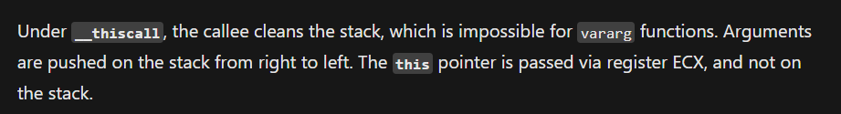

# Faku

- Password: ASCIS2023

- Faku là 1 bài giải hệ phương trình ba ẩn, khi anti debug thì hệ số của phương trình khác so với chạy bình thường do cái kỹ thuật antidebug được gọi đến ở các hàm init().

> Quals ASCIS-2022

## [0]. Analysis Challenge

- Kiểm tra thông tin cơ bản của file, đây là file PE 32-bit và không bị packed nên tiếp theo dùng IDA để phân tích.


- Vấn đề đầu tiên xuất hiện là khi mình "F5" chương trình là pseudo-code được tạo ra bởi IDA thiếu rất nhiều so với logic mã assembly và một số hàm khi decompile còn xuất hiện lỗi `Please refer to the manual to find appropriate actions`.


- Để có thể sửa được lỗi này, chúng ta cần phải có một chút kiến thức nhỏ về IDA. Khi vừa mở một file để phân tích trong IDA, chương trình sẽ không phân tích kĩ hoàn toàn 100% mà chỉ phân tích kĩ những hàm đang được disassemble.

- Lỗi trên xảy ra có thể là do những đoạn mã assembly khi được IDA nhận diện thì bản thân IDA tưởng rằng hàm có thể bị lỗi gì đó nên đã không tiến hành phân tích kỹ.

- Như vậy để sửa được trường hợp trên, ta cần IDA phân tích tất cả các hàm một cách cẩn thận. Để làm được điều này ta chọn option như hình bên dưới, lưu file C ở bất kì đâu và mọi chuyện sẽ được giải quyết.


- Bây giờ pseudo-code nhìn sáng và đầy đủ hơn hoàn toàn:


- Phân tích sơ qua và chạy chương trình thì chương trình yêu cầu chúng ta nhập input với độ dài là 30 bytes, và sẽ check xem đó có phải là flag đúng không, có vẻ đây là một bài keygen thuần túy, nhưng khi đi sâu vào các hàm thì mọi chuyện không dễ như vậy...


### I. Basic Analysis

- Khi phân tích các bạn sẽ gặp rất nhiều những lần gọi hàm như thế này `(*(void (__thiscall **)(_DWORD *, int))(*v6 + 4))(v6, v22);`.

  - Một trong những lí do chính là vì chương trình mình đang phân tích được viết bằng C++, và khả năng cao tác giả sử dụng kỹ thuật lập trình hướng đối tượng.
  - Để hiểu rõ cách biểu diễn memory của kĩ thuật OOP trong C++, các bạn có thể tham khảo link này (https://www.youtube.com/watch?v=o-FFGIloxvE).

- Luồng thực thi chương trình của đoạn check flag:

```cpp
v12 = (*(int (__thiscall **)(_DWORD *))(*ptr_level2 + 12))(ptr_level2);
v13 = "[-] Correct!";
if ( !v12 )
  v13 = "[!] Wrong!";
v14 = fn_cout_4048B4(std::cout, v13);
std::ostream::operator<<(v14, sub_C74A45);
```

- Con trỏ cấp 2 `ptr_level2` được gán cho mảng con trỏ hàm `ptrArr_func_C77324`.


- Kết quả khi kiểm tra flag được trả về biến `v12` và `v12 = (*(int (__thiscall **)(_DWORD *))(*ptr_level2 + 12))(ptr_level2);` tương ứng với hàm thứ 4 trong cấu trúc mảng

```cpp
.rdata:00C77324 ptrArr_func_C77324 dd offset sub_C727C6 ; DATA XREF: sub_C72462+2B↑o
.rdata:00C77324                                         ; fn_init_funcARR_C724DF+31↑o
.rdata:00C77328                 dd offset sub_C72A7A
.rdata:00C7732C                 dd offset sub_C728E9
.rdata:00C77330                 dd offset sub_C72BA1
```

- Tới đây mình chuyển sang debug để có thể hiểu rõ hơn về cách chương trình xử lý và kiểm tra input `aaaaaaaaaabbbbbbbbbbcccccccccc` (`python3 -c 'print("a" * 10 + "b" * 10 + "c" * 10)'` - cứ 10 ký tự mình thay bằng 1 ký tự khác là do đoạn `do while` ở trên chia payload của mình ra làm 3 để xử lý gì đó).

- Khi bước vào phân tích nhìn mọi thứ có vẻ rất dài và có thể sẽ rất dễ làm nản chí các Reverser. Nhưng việc reverse hết tất cả các hàm là một cách tiếp cận không tốt khi khoảng thời gian cho phép là không nhiều, nên mình sẽ tiếp tục debug và `theo dõi các input và output để "đoán" chức năng các hàm`.

- Đặt `break point` ở instruction gọi hàm sử dụng con trỏ `(*(int (__thiscall **)(_DWORD *))(*ptr_level2 + 12))(ptr_level2);` và có 1 điều cần lưu ý khi debug chương trình C++ code sử dụng kỹ thuật OOP là calling convention `__thiscall` - Con trỏ this được truyền qua thanh ghi ECX chứ không phải trên ngăn xếp (https://learn.microsoft.com/en-us/cpp/cpp/thiscall?view=msvc-170).




- Mình lấy ví dụ về 1 hàm khi mình debug bên trong hàm được gọi ở trên.


- Quan sát giá trị các đối số được sử dụng làm input của hàm `sub_782412()` mình thấy có 2 giá trị liên quan đến output của hàm:

  - Đối số đầu tiên là 1 con trỏ chỉ đến 1 chuỗi giá trị.
    
    

  - Đối số thứ ba là 1 con trỏ chỉ đến 10 ký tự đầu tiên trong input của mình.
    
    

- Giá trị trả về của hàm `sub_782412()`:


- Tới đây mình cảm giác đây là một phép nhân số lớn nên liền code lại 1 đoạn mã python thử kiểm tra.

```python
from pwn import *

def convert_bytes_to_int(a):
	b = 0
	for i in a:
		b = (b << 8) + i
	return b

num1 = bytes.fromhex('D9 E0 8B 0B C5 85 8E 62 EE 0B')[::-1]
num1 = convert_bytes_to_int(num1)

# x = convert_bytes_to_int(b"\x61" * 10)
num2 = bytes.fromhex('61 61 61 61 61 61 61 61 61 61')[::-1]
num2 = convert_bytes_to_int(num2)

print(hex(num1 * num2))
```


- Kết quả đúng là phép nhân hai số nguyên lớn nên mình có thể kết luận được chức năng của hàm `sub_782412()`.

- Tương tự với cách làm như trên mình kết luận được thêm chức năng của hai hàm:

  - `sub_782398()` là cộng hai số lớn.
  - `sub_7823D2()` là trừ hai số lớn.

- Phân tích lại đoạn code sau khi mình đã định nghĩa được chức năng của các hàm:

```cpp
  ...
  v1 = this;
  v27 = this;
  `eh vector constructor iterator'(v28, 0x10u, 3u, sub_7815D7, sub_78245D);
  v31 = 0;
  v2 = fn_multiply_782412(v1 + 7, v22, v1 + 55);
  v3 = v1 + 59;
  LOBYTE(v31) = 1;
  v4 = fn_multiply_782412(v1 + 11, v23, v1 + 59);
  LOBYTE(v31) = 2;
  v5 = fn_plus_782398((int)v2, v24, (int)v4);
  v6 = v1 + 15;
  LOBYTE(v31) = 3;
  v1 += 63;
  v7 = fn_multiply_782412(v6, v25, v1);
  LOBYTE(v31) = 4;
  v8 = fn_minus_7823D2((int)v5, v26, (int)v7);
  LOBYTE(v31) = 5;
  ...
```

- Luồng thực thi của chương trình khi đó sẽ là: `input0 * const0 + input1 * const1 - input2 * const2` trong đó:

  - `input0`, `input1`, `input2` là input chính của mình nhập vào, được tách ra làm 3 phần có độ dài là 10 bytes mỗi phần và `const0`, `const1`, `const2` là các hằng số của chương trình.

- Tương tự với đoạn code còn lại mình tìm được thêm hai phương trình nữa:

  - `input0 * const3 + input1 * const4 + input2 * const5`.
  - `input0 * const6 - input1 * const7 - input2 * const8`.

- Đoạn cuối có 1 đoạn logic kiểm tra giá trị bằng nhau (chức năng của hàm `sub_782339()` mình dùng cách check input và output hàm để kết luận chức năng của nó):


- Như vậy mình có thể kết luận đây là một hệ phương trình ba ẩn, nên mình sẽ lấy các hằng số ra và giải (đặt breakpoint ở các hàm multiply và compare):

  - Hệ phương trình ba ẩn:

  ```ps1
  input0 * const0 + input1 * const1 - input2 * const2 = operator1
  input0 * const3 + input1 * const4 + input2 * const5 = operator2
  input0 * const6 - input1 * const7 - input2 * const8 = operator3

  input0 * 56343458161852729254105 + input1 * 478723272345650765274709 - input2 * 94567434321898965414145 = 211025183543046550012114000377923081614499443251
  input0 * 78727474361278163830903 + input1 * 410783650765476383014385 + input2 * 830705034123630301616189 = 412372982981912134592664071464260279561099955197
  input0 * 30361498905232129414361 - input1 * 436765070189432343616507 - input2 * 638561696369834745894383 = -341249624282190731499154985520849893743820868835
  ```

  - Mình code 1 file python [operator.py](./Faku/operator.py) để giải hệ phương trình trên và kết quả khi giải hệ phương trình trên là chuỗi `FAKU{N3V3R_9onn4_91v3_yOU_uP!}`.

- Nhưng khi mình thử chạy chương trình lúc DEBUG và nhập flag này vào, kết quả trả về là `[-] Correct!`, và khi mình chạy chương trình không dùng debugger thì kết quả trả về là `[!] Wrong!`.

### II. Anti Debugger

- Việc output khác nhau khi mình nhập chung 1 input cho quá trình DEBUG và không DEBUG là dấu hiệu rất rõ ràng chương trình có anti debugger. Nhưng làm sao để biết được đoạn code nào có kỹ thuật anti debugger?

- Nếu như hiểu đủ rõ chương trình này, chúng ta có thể để ý hầu như không thấy sự xuất hiện nào của kỹ thuật anti debugger trong chương trình chính. Tới đây mình đoán chắc có thể những hàm đó nằm trong phần init - gồm các hàm được gọi đến trước hàm `main()`.

- Mình tiến hành phân tích chương trình bắt đầu từ `entrypoint` để tìm anti-debug, mình phát hiện chương trình sử dụng `initterm` để gọi thực thi các hàm từ địa chỉ `0x407190` đến `0x4071B0`.


- Khi mình kiểm tra các hàm, mình phát hiện tận 3 kỹ thuật anti debugger: `PEB`, `NtQueryInformationProcess` và `GetThreadContext`.

- Lúc này mình bypass những chỗ anti debugger trên, và các hằng số sẽ thay đổi để khi giải hệ phương trình.

```ps1
56343458161852729254105 * x + 478723272345650765274709 * y - 94567434321898965414145 * z = 77205325028399246428625144727543316375512475203
78727474361278163830903 * x + 410783650765476383014385 * y + 830705034123630301616189 * z = 576728373602368866029583485236697935421371408887
30361498905232129414361 * x - 436765070189432343616507 * y - 638561696369834745894383 * z = -443550489437008394034948849149808613388615954563
```

- Tham khảo file [solve.py](./Faku/solve.py) và mình có được flag `ASCIS{Cpp_1s_34SY_bUt_(TT_TT)}`.

## [1]. Solve Idea

- https://www.wolframalpha.com/input?i=systems+of+equations+calculator&assumption=%7B%22F%22%2C+%22SolveSystemOf3EquationsCalculator%22%2C+%22equation1%22%7D+-%3E%2256343458161852729254105+x+%2B+478723272345650765274709+y+-+94567434321898965414145+z+%3D+77205325028399246428625144727543316375512475203%22&assumption=%22FSelect%22+-%3E+%7B%7B%22SolveSystemOf3EquationsCalculator%22%7D%7D&assumption=%7B%22F%22%2C+%22SolveSystemOf3EquationsCalculator%22%2C+%22equation2%22%7D+-%3E%2278727474361278163830903+x+%2B+410783650765476383014385+y+%2B+830705034123630301616189+z+%3D+576728373602368866029583485236697935421371408887%22&assumption=%7B%22F%22%2C+%22SolveSystemOf3EquationsCalculator%22%2C+%22equation3%22%7D+-%3E%22-30361498905232129414361+x+%2B+436765070189432343616507+y+%2B+638561696369834745894383+z+%3D+443550489437008394034948849149808613388615954563%22

- https://www.wolframalpha.com/input?i=systems+of+equations+calculator&assumption=%7B%22F%22%2C+%22SolveSystemOf3EquationsCalculator%22%2C+%22equation1%22%7D+-%3E%22x+*+56343458161852729254105+%2B+y*+478723272345650765274709+-+z+*+94567434321898965414145+%3D+211025183543046550012114000377923081614499443251%22&assumption=%22FSelect%22+-%3E+%7B%7B%22SolveSystemOf3EquationsCalculator%22%7D%2C+%22dflt%22%7D&assumption=%7B%22F%22%2C+%22SolveSystemOf3EquationsCalculator%22%2C+%22equation2%22%7D+-%3E%22x+*+78727474361278163830903+%2B+y+*+410783650765476383014385+%2B+z+*+830705034123630301616189+%3D+412372982981912134592664071464260279561099955197%22&assumption=%7B%22F%22%2C+%22SolveSystemOf3EquationsCalculator%22%2C+%22equation3%22%7D+-%3E%22x+*+30361498905232129414361+-+y+*+436765070189432343616507+-+z+*+638561696369834745894383+%3D+-341249624282190731499154985520849893743820868835%22

## [2]. References

- https://mochinishimiya.github.io/posts/ascis2022/
