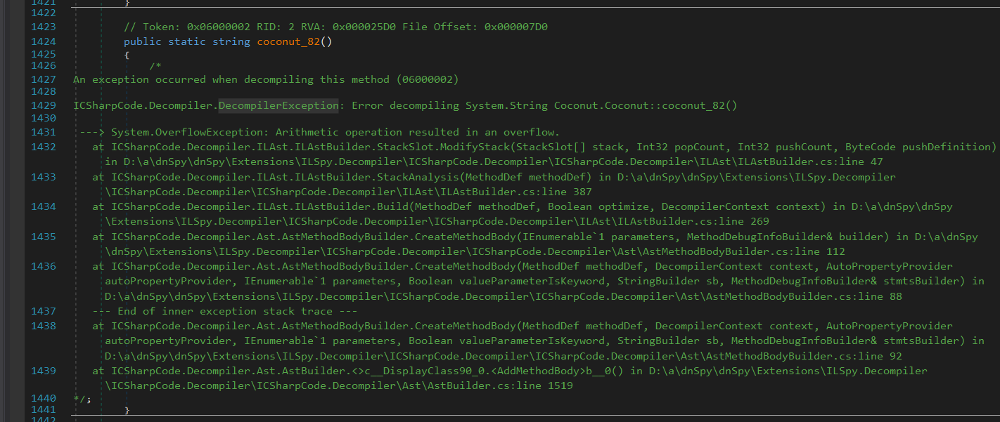

# Coconut

- Password: ASCIS2023

- Bài coconut đầu tiên là patch qua đoạn obfuscate rồi giải phương trình và cho pass qua đoạn sleep.

- Gọi hàm thì hàm lỗi, chuyển đến exception, luồng exception decrypt và resolve đóng mã IL-bytecode bị lỗi.

> Quals ASCIS-2022

## [0]. Analysis Challenge

- Mình sử dụng `Detect It Easy` để phân tích các thông tin cơ bản của file.


- Đây là file EXE được viết bằng `.Net` nên mình sẽ sử dụng `Dnspy` để decompile chương trình. Khi đọc qua code của chương trình thì có thể thấy chương trình có rất nhiều những đoạn code bị lỗi mà Dnspy không decompile được.

- Phân tích chương trình bắt đầu từ hàm `Main`:


- `Hàm Main`: Thử Debug để hiểu rõ hơn luồng thực thi của chương trình, hàm `Coconut.coconut_10()` được gọi ở đầu hàm `Main` setup nhiều các mảng byte khác nhau.


- `Hàm Main`: Tiếp theo hàm `Main` gọi hàm `Coconut.coconut_28()`
  

  - Hàm `Coconut.coconut_28()` thực hiện 1 `try{...} catch{ Exception }` với 2 luồng thực thi tương ứng gọi hai hàm `Coconut.coconut_82()` và `Coconut.coconut_25()`.
  - Hàm `Coconut.coconut_82()` bị lỗi:
    
  - Tóm lại là chương trình set một `try{...} catch{ Exception }` trong hàm `Coconut.coconut_28()`, khi chạy vào `Coconut.coconut_82()` bị lỗi thì sẽ nhảy vào `Coconut.coconut_25()`, chúng ta sẽ tiếp tục trace vào `Coconut.coconut_25()`:
  - Hàm `Coconut.coconut_25()` nhận 3 tham số đầu vào là những data được setup ở hàm `Coconut.coconut_10()` (hàm được gọi ở đầu hàm `Main`):
    ```csharp
    	catch (InvalidProgramException e)
    	{
    		result = (string)Coconut.coconut_25(e, new object[0], Coconut.meat_28, Coconut.water_28);
    	}
    ```
  - Hàm `Coconut.coconut_25()` resolve Metadata Token từ Exception:

    ```csharp
    		// Token: 0x06000003 RID: 3 RVA: 0x000025E4 File Offset: 0x000007E4
    public static object coconut_25(InvalidProgramException e, object[] args, Dictionary<uint, int> m, byte[] b)
    {
    	int metadataToken = new StackTrace(e).GetFrame(0).GetMethod().MetadataToken;
    	Module module = typeof(Program).Module;
    	MethodInfo methodInfo = (MethodInfo)module.ResolveMethod(metadataToken);
    	MethodBase methodBase = module.ResolveMethod(metadataToken);
    	ParameterInfo[] parameters = methodInfo.GetParameters();
    	Type[] array = new Type[parameters.Length];
    	SignatureHelper localVarSigHelper = SignatureHelper.GetLocalVarSigHelper();
    	for (int i = 0; i < array.Length; i++)
    	{
    		array[i] = parameters[i].ParameterType;
    	}
    	Type declaringType = methodBase.DeclaringType;
    	DynamicMethod dynamicMethod = new DynamicMethod("", methodInfo.ReturnType, array, declaringType, true);
    	DynamicILInfo dynamicILInfo = dynamicMethod.GetDynamicILInfo();
    	MethodBody methodBody = methodInfo.GetMethodBody();
    	foreach (LocalVariableInfo localVariableInfo in methodBody.LocalVariables)
    	{
    		localVarSigHelper.AddArgument(localVariableInfo.LocalType);
    	}
    	byte[] signature = localVarSigHelper.GetSignature();
    	dynamicILInfo.SetLocalSignature(signature);
    	foreach (KeyValuePair<uint, int> keyValuePair in m)
    	{
    		int value = keyValuePair.Value;
    		uint key = keyValuePair.Key;
    		int tokenFor;
    		if (value >= 1879048192 && value < 1879113727)
    		{
    			tokenFor = dynamicILInfo.GetTokenFor(module.ResolveString(value));
    		}
    		else
    		{
    			MemberInfo memberInfo = declaringType.Module.ResolveMember(value, null, null);
    			if (memberInfo.GetType().Name == "RtFieldInfo")
    			{
    				tokenFor = dynamicILInfo.GetTokenFor(((FieldInfo)memberInfo).FieldHandle, ((TypeInfo)((FieldInfo)memberInfo).DeclaringType).TypeHandle);
    			}
    			else if (memberInfo.GetType().Name == "RuntimeType")
    			{
    				tokenFor = dynamicILInfo.GetTokenFor(((TypeInfo)memberInfo).TypeHandle);
    			}
    			else if (memberInfo.Name == ".ctor" || memberInfo.Name == ".cctor")
    			{
    				tokenFor = dynamicILInfo.GetTokenFor(((ConstructorInfo)memberInfo).MethodHandle, ((TypeInfo)((ConstructorInfo)memberInfo).DeclaringType).TypeHandle);
    			}
    			else
    			{
    				tokenFor = dynamicILInfo.GetTokenFor(((MethodInfo)memberInfo).MethodHandle, ((TypeInfo)((MethodInfo)memberInfo).DeclaringType).TypeHandle);
    			}
    		}
    		b[(int)key] = (byte)tokenFor;
    		b[(int)(key + 1U)] = (byte)(tokenFor >> 8);
    		b[(int)(key + 2U)] = (byte)(tokenFor >> 16);
    		b[(int)(key + 3U)] = (byte)(tokenFor >> 24);
    	}
    	dynamicILInfo.SetCode(b, methodBody.MaxStackSize);
    	return dynamicMethod.Invoke(null, args);
    }

    ```

    - Cuối hàm `Coconut.coconut_25()` có đoạn gọi `SetCode` và `Invoke` dynamic IL Code, chúng ta có thể hiểu đoạn code bên trên là chương trình sẽ sửa những đoạn code bị lỗi ở hàm trước đó bị lỗi thành các IL code đúng, sau đó invoke để chạy chương trình (IL bytecode là mảng có chữ `water` còn dữ liệu làm key để convert là mảng có chữ `meat`).

- Vấn đề ở đây là sau khi sửa code và invoke thì chúng ta lại không debug được chương trình.

### A. Deobfuscate

- Vậy nên chắc chắn chúng ta phải code một `patcher` để patch lại những đoạn code đã bị lỗi kia.

- Nhưng có một vấn đề các bạn cần để ý đó là `method header` và `dynamic token` của mỗi hàm. Có nghĩa là mỗi hàm trong C# đều có một `header` (khoảng 1, 2 hoặc 10 byte đầu tùy chương trình), ví dụ một hàm:
  

  - Chúng ta có thể thấy `header size` sẽ là 12, vậy thì lúc patch chúng ta không được phép patch vào `header` của method.
  - Vấn đề tiếp theo là `dynamic token`, chúng ta có thể thấy đoạn bên trên `setCode` chương trình đang thực hiện các kĩ thuật để resolve ra được `dynamic token` cho chương trình, nhưng lúc chúng ta patch chương trình thì chúng ta không cần những bước đó, vì những bước đó là chỉ resolve ra token lúc `dynamic`, còn lúc patch chúng ta sẽ hiểu là chúng ta đang chạy chương trình theo kiểu `static`.

- VD: Hàm `coconut_28()` sẽ cần resolve lại code của hàm `coconut_82()` (offset và header_size lấy của hàm này) và data là `meat_28`, `water_28`. Tham khảo code [patcher.py](./Coconut/patcher.py)

- Chương trình khi chưa patch:


- Chương trình sau khi patch:


### B. Analysis Coconut_patched.exe

- Sau khi `patcher` chương trình xong các hàm đã được giải mã.

- Hàm `coconut_82()`: Nhập key qua console.

```csharp
public static string coconut_82()
{
    Console.Write("Enter key: ");
    return Console.ReadLine();
}
```

- Hàm `coconut_51()`: Xử lý input bằng cách chương trình sẽ convert các ký tự ASCII sang chuỗi số thập lục phân và xoá các ký tự `-` để thành 1 chuỗi hexstring.

```csharp
public static string coconut_51(string s)
{
    return BitConverter.ToString(Encoding.Default.GetBytes(s)).Replace("-", "");
}
```

- Hàm `coconut_52()`: Input sau khi được xóa các ký tự `-` thì qua hàm này nó được chuyển thành 1 số nguyên lớn sau đó được đưa vào 1 phương trình để so sánh.

```csharp
public static bool coconut_52(string i)
{
    return BigInteger.Parse(i, NumberStyles.HexNumber) * Coconut.coconut_89(Coconut.water_01) % Coconut.coconut_89(Coconut.water_02) == Coconut.coconut_89(Coconut.water_03);
}
```

- Hàm `coconut_89()` thực gọi hàm `coconut_98()`: Quan sát hàm `coconut_98`, chúng sẽ load lần lượt các giá trị `Coconut.water_01`, `Coconut.water_02`, `Coconut.water_03` để tính toán ra các số nguyên lớn và sau khi input được convert sang chuỗi hexstring, method BigInteger trong hàm `coconut_52` prase chuỗi hexstring thành số nguyên lớn. Sau đó thực hiện tính toán để check key.

```csharp
public static BigInteger coconut_98(byte[] b)
{
    string text = "";
    foreach (byte b2 in b)
    {
        if (b2 < 10)
        {
            text += ((char)(b2 + 48)).ToString();
        }
        else
        {
            text += ((char)(b2 + 87)).ToString();
        }
    }
    return BigInteger.Parse(text, NumberStyles.HexNumber);
}
```

- Đây là 1 bài toán liên quan đến Crypto giải phương trình, mô tả lại bài toán và cách giải như sau:

```ps1
-- PROBLEM --
passwd * coconut_water01 % coconut_water02 = coconut_water03

-- SOLVE --
passwd = (coconut_water03 * inverse(coconut_water01, coconut_water02)) % coconut_water02
```

- Thực hiện bằng python-script: [passwd.py](./Coconut/passwd.py)

```python
passwd = long_to_bytes((ASCIS_coconut_52_BIGNUMBER(coconut_water03) * inverse(ASCIS_coconut_52_BIGNUMBER(coconut_water01), ASCIS_coconut_52_BIGNUMBER(coconut_water02))) % ASCIS_coconut_52_BIGNUMBER(coconut_water02))
```

- Chạy file script trên, mình đã tìm ra được key: `Ytd_is_history_Tmr_is_a_mystery!`. Lúc này mình test thử chạy chương trình và nhập key thì nhận được thông báo dưới đây:


- Quá trình chạy trên còn sinh ra file `PANDA.png` và khi mình mở lên thì mình nhận được 1 phần của flag: `ASCIS{7hat's_Why_7h3y_call_it`.


### C. Bypass the Time

- Mình lập tức thử tìm đến đoạn code in ra dòng `Waiting for a thousand year.`, nó nằm ở hàm `coconut_60`:

```csharp
public static void coconut_60()
{
    while (DateTime.Now.Year < 3022)
    {
        Console.WriteLine("Waiting for a thousand year.");
        Thread.Sleep(86400000);
    }
    Coconut.coconut_36();
}
```

- Mình sử dụng chức năng của `DNSpy` là `Set Next Statement` để bypass đoạn điều kiện trong while xem có gì xảy ra.


- Lần này chương trình đã dump ra file `DRAGON WARRIOR.png` nhưng nó lại bị lỗi.


- Tiến hành debug vào hàm `Coconut.coconut_36()` để xem chuyện gì xảy ra khi sinh ảnh.

```csharp
public static void coconut_36()
{
	try
	{
		Coconut.coconut_63();
	}
	catch (InvalidProgramException e)
	{
		Coconut.coconut_25(e, new object[0], Coconut.meat_36, Coconut.water_36);
	}
}

public static void coconut_63()
{
	byte[] dragon_WARRIOR = Resources.DRAGON_WARRIOR;
	string s = Coconut.coconut_16();
	byte[] bytes = Coconut.coconut_26(Encoding.UTF8.GetBytes(s), dragon_WARRIOR);
	File.WriteAllBytes("DRAGON WARRIOR.png", bytes);
}

public static string coconut_16()
{
	string result;
	try
	{
		result = Coconut.coconut_61();
	}
	catch (InvalidProgramException e)
	{
		result = (string)Coconut.coconut_25(e, new object[0], Coconut.meat_16, Coconut.water_16);
	}
	return result;
}

public static string coconut_61()
{
	StackTrace stackTrace = new StackTrace();
	return stackTrace.GetFrame(2).GetMethod().ToString() + stackTrace.GetFrame(1).GetMethod().ToString();
}

public static byte[] coconut_26(byte[] p, byte[] d)
{
	byte[] result;
	try
	{
		result = Coconut.coconut_62(p, d);
	}
	catch (InvalidProgramException e)
	{
		result = (byte[])Coconut.coconut_25(e, new object[]
		{
			p,
			d
		}, Coconut.meat_26, Coconut.water_26);
	}
	return result;
}

public static byte[] coconut_62(byte[] p, byte[] d)
{
	int[] array = new int[256];
	int[] array2 = new int[256];
	byte[] array3 = new byte[d.Length];
	int i;
	for (i = 0; i < 256; i++)
	{
		array[i] = (int)p[i % p.Length];
		array2[i] = i;
	}
	int num = i = 0;
	while (i < 256)
	{
		num = (num + array2[i] + array[i]) % 256;
		int num2 = array2[i];
		array2[i] = array2[num];
		array2[num] = num2;
		i++;
	}
	int num3 = num = (i = 0);
	while (i < d.Length)
	{
		num3++;
		num3 %= 256;
		num += array2[num3];
		num %= 256;
		int num4 = array2[num3];
		array2[num3] = array2[num];
		array2[num] = num4;
		int num5 = array2[(array2[num3] + array2[num]) % 256];
		array3[i] = (byte)((int)d[i] ^ num5);
		i++;
	}
	return array3;
}
```

- Đoạn code trên chứa các hàm sẽ được gọi ở luồng thực thi code dump ra file ảnh `DRAGON WARRIOR.png`, để ý luồng thực thi `Coconut.coconut_36()` -> `Coconut.coconut_63()` -> `Coconut.coconut_16()` -> `Coconut.coconut_61()` ta thấy:
  - Hàm giải mã chính là hàm `Coconut.coconut_63()` với chuỗi s là key để giải mã.
  - Phân tích hàm `Coconut.coconut_61()` là hàm tạo ra key từ việc lấy Frame dựa trên stackTrace để lấy tên các hàm trong thứ tự được gọi đến trước hàm `Coconut.coconut_61()`, như vậy ở đây nó sẽ tương ứng: Frame(2) - `Coconut.coconut_63()` và Frame(1) - `Coconut.coconut_16()`.


> Vấn đề phát sinh từ đây ?

- Key `s` được sinh ra ở trên là key sai (Mình đang debug trên chương trình đã patch rồi là `Coconut_patched.exe`) vì nếu đúng theo logic của chương trình ban đầu thì các hàm như `Coconut.coconut_63()`, `Coconut.coconut_61()`,... bị lỗi và chương trình sử dụng `try-catch` để gọi hàm `Coconut.coconut_25()` nhằm resolve lại IL-bytecode đúng.

- Điều này dẫn đến thứ tự các hàm gọi đến nhau trong `StackFrame` đang bị sai @@, nếu muốn chương trình trả về key đúng thì mình buộc phải trace được chương trình vào hàm `Coconut.coconut_25()`.

> Giải pháp ?

- Mình sử dụng lại chương trình gốc `Coconut.exe`, hướng giải quyết là mình sẽ sửa giá trị năm điều kiện `3022` thành một năm nào đó nhỏ hơn giá trị năm trong máy tính và rồi nhập đúng key để chương trình sinh ra hai ảnh flag không bị lỗi.

```csharp
public static void coconut_60()
{
    while (DateTime.Now.Year < 3022)
    {
        Console.WriteLine("Waiting for a thousand year.");
        Thread.Sleep(86400000);
    }
    Coconut.coconut_36();
}
```

- Hàm `coconut_60()` cũng được hàm `coconut_25()` resolve IL-bytecode từ hai mảng `water_06` và `meat_06` (ở đây mình tập chung sửa mảng `water_06` do nó chứa IL-bytecode của hàm `coconut_60()`).

- Chuyển số `3022` ra dạng hexadecimal ta được `0x0BCE` tức là `206 và 11` đồng thời mở file `Coconut.exe` (file gốc chưa patched), ta lấy bytes của `water_06`:


- Sửa hai số `206 và 11` nằm trong mảng `water_06` thành `227 và 07` (tức năm `2019` - `0x07E3`) (Pattern đó chính là số 3022 thuộc đoạn while (DateTime.Now.Year > 3022)). Mảng `water_06` sau khi được modified:


- Bây giờ thì chạy lại file `Coconut.exe` và nhập đúng key `Ytd_is_history_Tmr_is_a_mystery!` ta sẽ nhận được cả hai ảnh `PANDA.png` và `DRAGON WARRIOR.png` không bị lỗi.

  - Để patch byte hex như mô tả trên thì không thể patch thẳng qua `DNSpy` và `Save Modules` được vì chương trình sau khi save sẽ lưu cả CLI dẫn đến lỗi do mình không biết chỉnh cái maxStack ở đâu cả.

  ```error
  Error calculating max stack value. If the method's obfuscated, set CilBody.KeepOldMaxStack or MetadataOptions.Flags (KeepOldMaxStack, global option) to ignore this error. Otherwise fix your generated CIL code so it conforms to the ECMA standard.
  All files written to disk.
  ```

  - Cách giải quyết là sẽ patch bằng `HXD` 2 byte theo little-edian `CE 0B` thành `E3 07`.
    

- Flag thứ 2: `_Prrrres3nt!!!!}`.


## [1]. Solve Idea

- Ghép lại flag1 và flag2, ta được 1 flag hoàn chỉnh: `ASCIS{7hat's_Why_7h3y_call_it_Prrrres3nt!!!!}`.

- Có một cách giải khác là chúng ta khi reverse có thể nhận ra

  - flag trong ảnh 1 được sử dụng thuật toán AES để giải mã resource có tên `PANDA` trong hàm `coconut_54()`.
  - flag trong ảnh 2 được sử dụng thuật toán RC4 để giải mã resource có tên `DRAGON_WARRIOR` trong hàm `coconut_62()`.

- Như vậy dùng `DNSpy` để save hai đoạn resource này ra và viết lại 1 scrip mô tả lại quá trình giải mã ta vẫn có thể lấy được 2 file.png chứa flag.

- Script-solve full [solve.py](./Coconut/solve.py).

## [2]. References

- https://mren1gma.github.io/posts/Coconut-ASCIS-CTF-2022/

- https://github.com/Ajomix/CTF/blob/main/ASCIS/coconut.md

```md
**IL** (Intermediate Language) và **MSIL** (Microsoft Intermediate Language) là hai khái niệm liên quan đến **ngôn ngữ trung gian** trong **.NET framework**. Hãy cùng tìm hiểu chi tiết về chúng:

1. **IL (Intermediate Language)**:

   - **IL** là viết tắt của **Common Intermediate Language (CIL)**.
   - Đây là một ngôn ngữ lập trình trung gian được sử dụng trong **.NET framework**.
   - Quá trình biên dịch **C#** (hoặc các ngôn ngữ khác trong .NET) sẽ tạo ra mã **IL**.
   - **IL** không thể chạy trực tiếp trên máy tính, nhưng nó là bước trung gian trước khi được chuyển thành mã máy.
   - Khi bạn chạy một tệp **.EXE** trên Windows, nếu nó là **IL**, trình thông dịch **.NET Just-In-Time (JIT)** sẽ chuyển mã **IL** thành mã máy (mã nguồn) mà CPU có thể hiểu ¹.

2. **MSIL (Microsoft Intermediate Language)**:
   - **MSIL** là tên gọi khác cho **IL**.
   - Tổ chức **ECMA** đã phê duyệt tiêu chuẩn về ngôn ngữ lập trình trung gian cho **.NET framework**, gọi là **Common Intermediate Language (CIL)** hoặc **MSIL**.
   - **MSIL** là bước trung gian trong quá trình biên dịch từ mã nguồn **C#** (hoặc các ngôn ngữ khác) thành mã máy ¹.

Nhớ rằng, **IL** và **MSIL** không phải là ngôn ngữ chạy trực tiếp, mà chỉ là bước trung gian trong quá trình biên dịch và thực thi ứng dụng .NET.

(1) IL và MSIL là gì? | Phạm Tuân's Blog. https://phamtuantech.com/il-va-msil-la-gi/.
(2) IL và MSIL là gì? | Phạm Tuân's Blog. https://bing.com/search?q=Il+code+l%c3%a0+g%c3%ac.
(3) Thẻ li trong HTML - Freetuts. https://freetuts.net/the-li-trong-html-4909.html.
(4) Intermediate Language (IL) là gì? Định nghĩa và giải thích ý nghĩa. https://filegi.com/tech-term/intermediate-language-il-6044/.
```

```md
Trong DNSPY, chức năng "Set Next Statement" (đặt lại câu lệnh tiếp theo) được sử dụng khi bạn muốn thay đổi luồng thực thi của chương trình khi đang gỡ lỗi (debugging). Thông thường, khi bạn đặt một điểm dừng (breakpoint) trong mã của mình và gỡ lỗi, chương trình sẽ tạm dừng tại điểm đó và bạn có thể kiểm tra các biến, điều kiện, v.v. Tuy nhiên, trong một số trường hợp, bạn có thể muốn chuyển tới một câu lệnh khác mà không cần thực thi các câu lệnh trung gian.

Chức năng "Set Next Statement" cho phép bạn làm điều này. Bằng cách sử dụng chức năng này, bạn có thể chọn một câu lệnh khác trong phạm vi của hàm hiện tại hoặc các hàm gọi (tùy thuộc vào tính năng của trình gỡ lỗi) và yêu cầu chương trình thực hiện từ đó thay vì từ điểm dừng hiện tại.

Lưu ý rằng việc thay đổi câu lệnh tiếp theo có thể gây ra hành vi không mong muốn hoặc không dự đoán được, và nó thường được sử dụng cho mục đích gỡ lỗi và phân tích mã nguồn.
```
