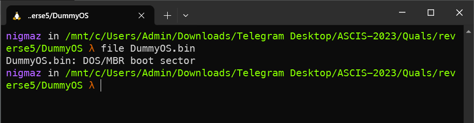
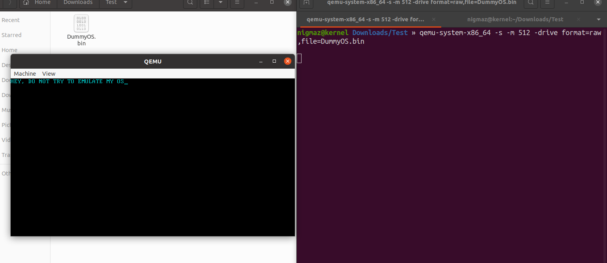
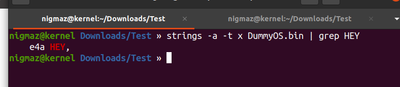
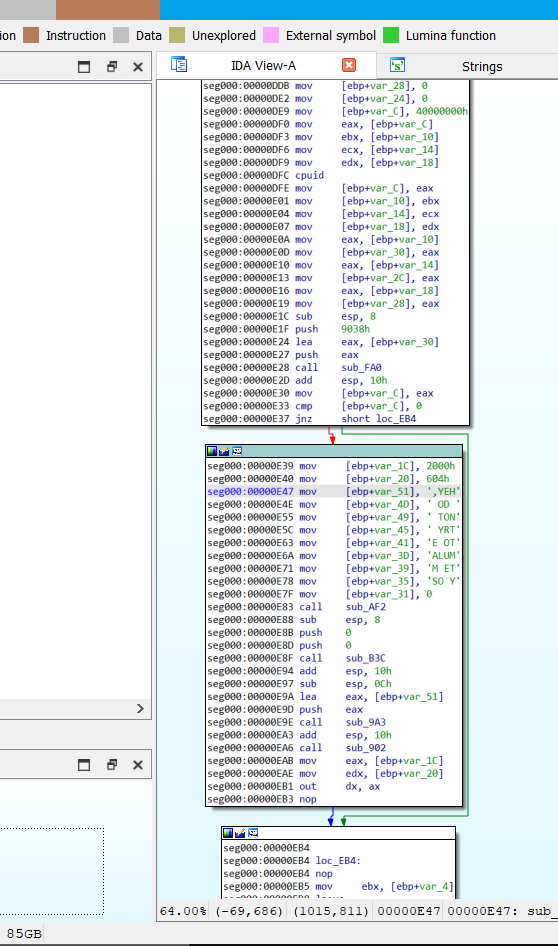
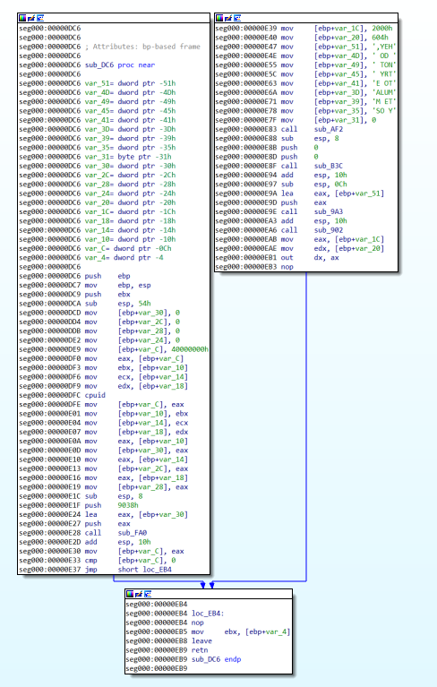
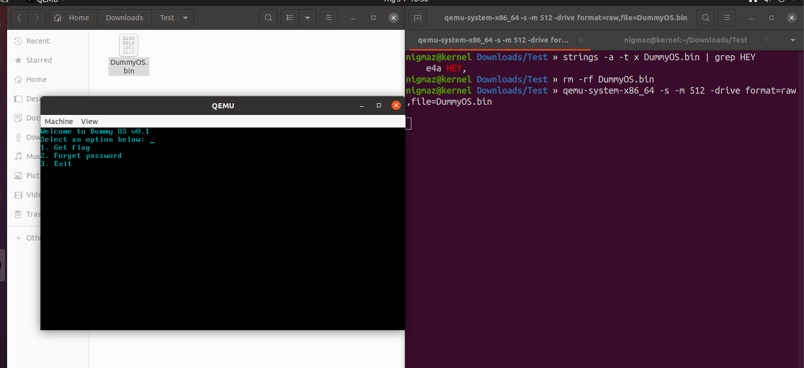
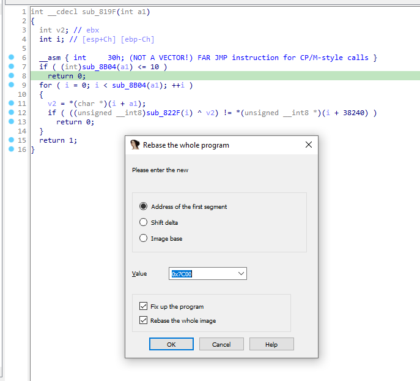
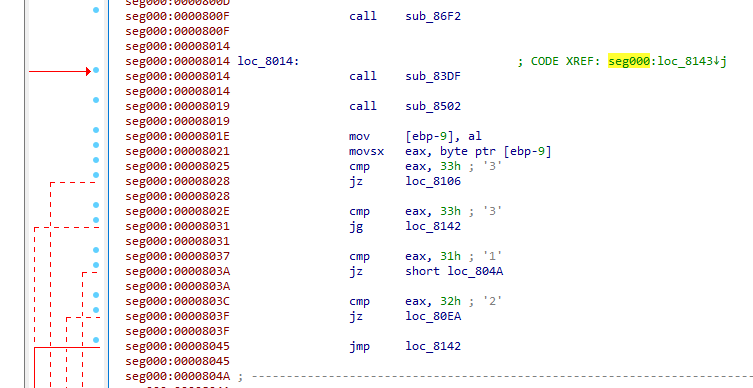
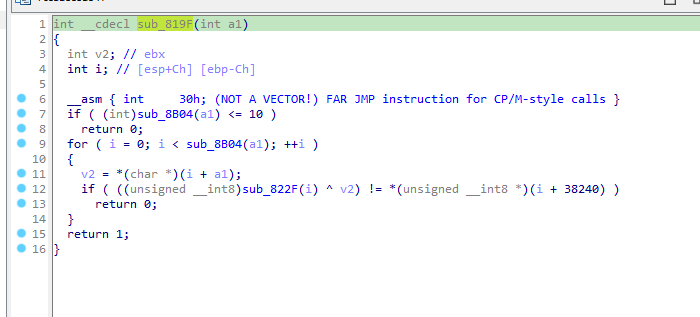
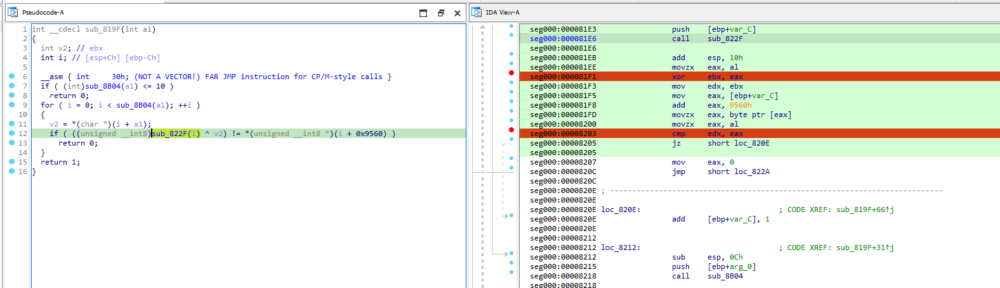

# DummyOS

- Password: ASCIS2023

> Quals ASCIS-2022

## [0]. Analysis Challenge

- Kiểm tra thuộc tính file thì đây là file `boot sector` của quá trình khởi động hệ điều hành vậy nên đây là một bài reverse `bootloader`.



- Sử dụng `qemu` để chạy file `DummyOS.bin` kết hợp với `gdb` để debug:

  - `qemu-system-x86_64 -s -S -m 512 -hda DummyOS.bin`:

    - `qemu-system-x86_64`: Loại máy ảo, trong trường hợp này là máy ảo x86_64.
    - `-s`: Mở cổng gỡ lỗi để chờ kết nối từ GDB (GNU Debugger).
    - `-S`: Dừng máy ảo ngay từ khi nó bắt đầu để đợi sự kiện kết nối từ GDB.
    - `-m 512`: Thiết lập bộ nhớ RAM cho máy ảo là 512MB.
    - `-fda winxp.img`: Chỉ định ổ đĩa mềm ảo để khởi động từ đó.

  - `qemu-system-x86_64 -s -S -m 512 -drive format=raw,file=DummyOS.bin` (Commandline này không báo lỗi), Trong đó:

    - `-drive`: Khai báo một ổ đĩa ảo.
    - `format=raw`: Xác định định dạng của file là "raw".
    - `file=DummyOS.bin`: Chỉ định tên file hình ảnh.

  - `gdb`:
    ```bash
    $ gdb
    (gdb) target remote localhost:1234
    (gdb) break *0x7c00
    (gdb) display /20i 0 + $pc
    (gdb) c
    ```

- Nếu chỉ chạy file `DummyOS.bin` với `qemu` thì bỏ đối số `-S` đi.



- Đến đây mình thấy có vẻ là đã có đoạn nào đó check được trình giả lập mình đang dùng. Mình quyết định thử tìm đến offset đoạn string trên xem nó được dùng ở đâu , mình sử dụng lệnh:
  - `strings -a -t x DummyOS.bin | grep HEY`.



- Offset `0xe4a` sẽ là điểm mình bắt đầu phân tích trong `IDA (mode 32-bit)`:



- Vậy là ở bên trên có lệnh `cpuid` lệnh này sẽ check xem chúng ta có đang dùng máy ảo hay không, nếu có thì sẽ in ra dòng `HEY,...` kia và thoát chương trình còn không thì sẽ chạy tiếp, đến đây mình thử patch đoạn in ra cảnh báo và thoát chương trình:
  - `seg000:00000E37 jnz     short loc_EB4`.



- Apply patch rồi chạy thử thì mình đã thành công:



- Đến đây mình dùng `qemu` với option `-S` và `gdb` để debug, có một số lưu ý ở đây:

  - Được rồi, chúng tôi biết từ bài viết này rằng địa chỉ khi `MBR (master boot record)` được tải là 0x7c00. Hãy đính kèm quy trình này vào gdb và đặt điểm dừng tại địa chỉ này.
  - Vì vậy, chúng ta có thể bắt đầu ghi một số ghi chú từ nơi chúng bắt đầu trong tệp nhị phân (lưu ý rằng vì khu vực khởi động chưa được bios tải vào bộ nhớ nên tất cả các địa chỉ đều bắt đầu từ 0 nhưng khi chúng ta bắt đầu gỡ lỗi thì mọi thứ sẽ bắt đầu sau 0x7c00).
  - VD: Chuỗi `Correct, here is your flag: ` ở địa chỉ 0x00001365 thì khi debug bằng gdb thì nó nằm ở địa chỉ 0x7c00 + 0x00001365 = 0x8F65

- Ở đây mình dùng chức năng `See Edit-->Segments-->Rebase program menu item in Ida` để đặt lại địa chỉ base của file khi phân tích bằng IDA.



- Tiếp theo mình tìm thấy 1 đoạn code compare các option để nhảy đến xử lý (nó là đoạn code main của bootloader nhưng do bytecode ở đầu IDA không đọc được nên không thể define lại thành hàm pseudocode).



- Mình phân tích theo hướng option 1 khi mà chương trình yêu cầu nhập đầu vào so sánh với đoạn check flag. Mình tìm được hàm check flag như sau:



- Đặt breakpoint tại hai địa chỉ liên quan đến phép toán XOR và CMP.



- Input option 1 nhập vào = 11 vì có đoạn check độ dài input, lấy giá trị của thanh ghi eax (giá trị trả về từ hàm sub_822F())

```bash
$ gdb
(gdb) target remote localhost:1234
(gdb) break *0x7c00
(gdb) break *0x81f1
(gdb) break *0x8203
```

## [1]. Solve Idea

- Mình debug và lấy ra các giá trị để xor:
  - d lấy từ quá trình debug là giá trị trả về của hàm `sub_822F(i)` với i (0 -> 10) - thanh ghi `eax`.
  - d1 có thể lấy từ địa chỉ 0x9560

```python
d = [1,2,3,5,8 ,0xd ,0x15 ,0x22 ,0x37 ,0x59 ,0x90]
d1 =[48, 52, 115, 105, 125, 126, 38, 16, 10, 109,0xa8]

for i in range(11):
	print(chr(d[i] ^ d1[i]),end = "")
```

- Nhập vào password `16plus32=48` chúng ta có flag: `ASCIS{dO_You_w@N7_tO_Bu1LD_@N_0S!!!}`.

## [2]. References

- https://github.com/Ajomix/CTF/blob/main/ASCIS/dummy.md

- Tham khảo một số github hay writeup về những challenges liên quan đến reverse `bootloader`:

  - https://github.com/VoidHack/write-ups/blob/master/Square%20CTF%202017/reverse/floppy/README.md
  - https://rwmj.wordpress.com/2011/10/12/tip-debugging-the-early-boot-process-with-qemu-and-gdb/
  - https://teamrocketist.github.io/2018/10/11/Reverse-InCTF-2018-load3r/index.html

- `Debug bootloader + IDA`: https://github.com/Dump-GUY/Malware-analysis-and-Reverse-engineering/blob/main/Debugging%20MBR%20-%20IDA%20+%20Bochs%20Emulator/Debugging%20MBR%20-%20IDA%20+%20Bochs%20Emulator.md
- https://b4d.sablun.org/blog/2020-09-07-247ctf-com-rev-the-flag-bootloader/

```bash
ndisasm -b32 -o 7c00h DummyOS.bin > DummyOS.asm
```
