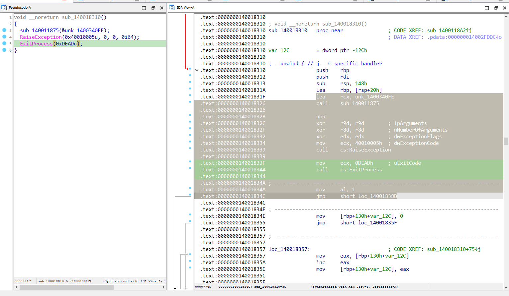

# OXYGEN

> RE02 - Warmup ASCIS-2023

## [0]. Analysis Challenge

- Sử dụng `Cff Explorer` và `Detect It Easy` xác định file thực thi là file `PE-64 bit`.


- Chạy chương trình thì mình thấy nó đứng yên và không cho nhập input hay tự thoát (theo như kinh nghiệm thì có thể chương trình mở port và lắng nghe kết nối từ bên ngoài qua cổng nào đó, bạn có thể dùng TCPview để kiểm tra nhưng ở đây mình không check mà chứng minh nó qua reverse chương trình).


- Khi check pseudocode qua IDA và pull data từ `lumina` thì mình check thấy có hàm `j___CheckForDebuggerJustMyCode(int a1)`, đây là hàm anti debug từ dữ liệu của `Lumina` (Không có hàm main nên bắt đầu đọc và tìm follow code từ hàm `start`).


- Đọc hết follow code thì thấy có hai đoạn code đặc biệt mà IDA không thể resolve hết toàn bộ instruction assembly sang pseudocode (phần không được resolve khá là nhiều do đó có thể là follow chính của chương trình được không được hiển thị khi dùng các debugger để phân tích).

- `Page-1`.


- `Page-2`.


- Mình sẽ phân tích đoạn code `Page-2` trước vì nó liên quan đến 1 đoạn shellcode mà sẽ được sử dụng trong `Page-1`.

- Sau khi vá hết đoạn `Exception` thành `Nops` thì mình nhận được 1 đoạn xử lý dữ liệu shellcode khi xor nó với `0x69`.




- Bây giờ tiến hành quay lại `Page-1`, do để IDA resolve ra pseudocode được từ đoạn mã assembly (đoạn code assembly chưa dịch ngược được sang pseudocode) mình cần Nops hết toàn bộ chỗ bôi đen bao gồm cả hàm gọi đến follow mà resolve shellcode của chương trình (nên ở đây mình cần viết script python để tự resolve lại shellcode trước khi shellcode được sử dụng ở hàm đang được phân tishc tại `Page-1`).


- Sau khi Patch đây là code chương trình:


- Đúng như mình dự đoán, chương trình tiến hành mở port tại 1337 để lắng nghe kết nối và sẽ trả về flag với input đúng.

- Đoạn xử lý input (compare input sử dụng thuật toán nào đó) là đoạn shellcode sau khi được xử lý xor với 0x69 nên mình viết script tự resolve đoạn shellcode này (Do đã patch follow chương trình đến đoạn xor 0x69 với shellcode nên phải tự xor các instruction bằng `ida-python-script`).


```python
import ida_bytes


array_start_address = <ida_address_shellcode>
array_length = 123

for i in range(array_length):
    byte_address = array_start_address + i
    current_byte = ida_bytes.get_byte(byte_address)
    new_byte = current_byte ^ 0x69
    ida_bytes.patch_byte(byte_address, new_byte)

# - `Edit -> Segments -> Rebase Program...`.
```

- Đoạn shellcode ở dạng pseudocode sau khi được xor 0x69.


- Cơ bản đoạn code sẽ xử dụng toán tử ba ngôi để so sánh ký tự theo thuật toán tương ứng với vị trí chắn lẻ.

  - check_buf = `"n[}>}C]qRm["`.
  - `Vị trí chẵn`: (a | 0xA) - (a & 0xA) == ord(check_buf[i]); trong đó ký tự a là ký tự từ input

  - `Vị trí lẻ`: (a | 0xA) + (a & 0xA) == ord(check_buf[i]); trong đó ký tự a là ký tự từ input

## [1]. Solve Idea

- Mình viết đoạn script python để bruteforce chuỗi cần tìm từ thuật toán của chương trình và sau đó gửi input đến cổng đang được lắng nghe và lấy flag.

```python
from pwn import *
check_buf = "n[}>}C]qRm["
result = ""

for i in range(0, len(check_buf)):
    if i % 2 == 0:
        for a in range(0, 0xff):
            if (a | 0xA) - (a & 0xA) == ord(check_buf[i]):
                result += chr(a)
    else:
        for a in range(0, 0xff):
            if (a | 0xA) + (a & 0xA) == ord(check_buf[i]):
                result += chr(a)

print("[+] Bruteforce Input: ", result)


p = remote("127.0.0.1", "1337")
p.sendline(result.encode())
flag = p.recvuntil(b"}")
print(flag)
```

- Flag `ASCIS{W3_g0nn4_m33t_4t_th3_f1naL_r0uND}`:


