# WARMUP

> RE01 - Warmup ASCIS-2023

## [0]. Analysis Challenge

- Sử dụng `Cff Explorer` và `Detect It Easy` xác định file thực thi là file `PE-64 bit`, được code bằng Cpp và không bị pack.

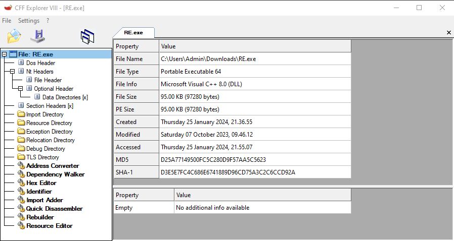

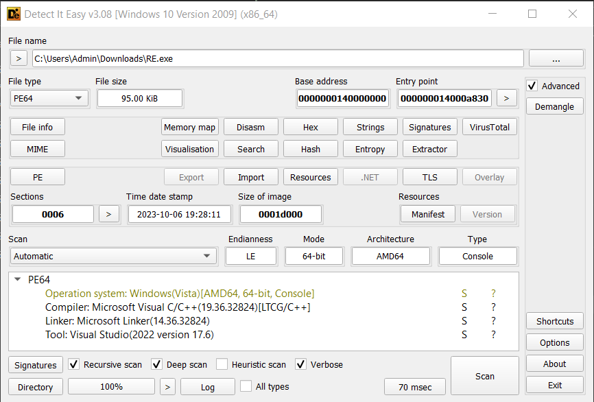

- Chạy chương trình thì thấy logic chương trình thường gặp là yêu cầu nhập vào input và chương trình sẽ kiểm tra input đó xem có đúng là flag không.

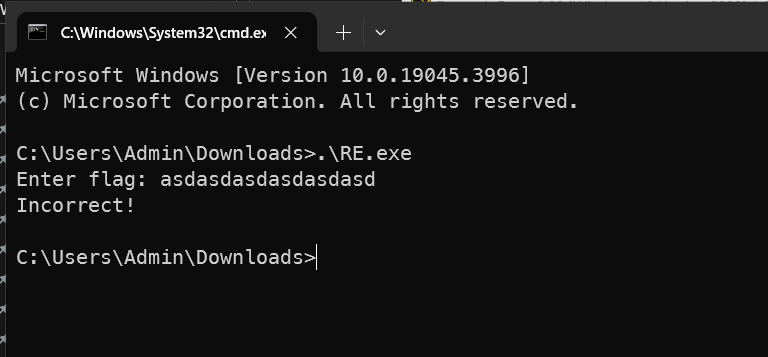

> Do IDA không thể tự resolve lại các hàm của thư viện cpp nên khi reverse cpp cần phải debug để kiểm tra khác biệt giữa giá trị input và output, giá trị trả về cùng với đó là define lại tên hàm để dễ theo dõi trong quá trình đọc hiểu chương trình.

- Đoạn đầu chương trình là khởi tạo buffer cùng với đó là in ra dòng chữ `"Enter flag: "` và yêu cầu nhập vào input.

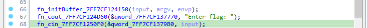

- Đoạn chương trình tiếp theo lấy chuỗi con nằm trong input có độ dài là 6 bắt đầu từ index 0 và lưu nó vào mảng v54, sau đó chương trình tiến hành kiểm tra nó với chuỗi `ASCIS{` (tương tự như vậy với ký tự `}`).

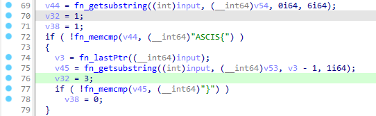

- Đoạn code tiếp theo là kiểm tra nếu giá trị so sánh hai chuỗi là không giống nhau hoặc có ngoại lệ thì tiến hành `deAllocated` và thoát chương trình.

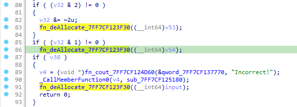

- Đoạn code tiếp đếm ký tự `"-"` nằm trong nội dung của flag (`ACSIS{nội dung flag}`) và ngay đoạn code bên dưới có đoạn so sánh số lượng có bằng 6 đoạn hay không nên mình đoán input đúng có dạng `ASCIS{abcde-12345-efghi-67891-xyzqp-23456789}` (từ đây có thể debug chương trình với đoạn input trên xem sự khác biệt cũng cách chương trình xử lý và so sánh).

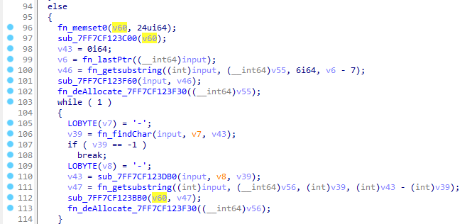

- `0.` Đoạn code này chương trình lấy mảnh thứ 5 của chương trình ra để kiểm tra sau đó `xor 0x69` với từng ký tự rồi so sánh với mảng byte `[0x5A, 0x5B, 0x0B, 0x0A, 0x5E, 0x5F]`.

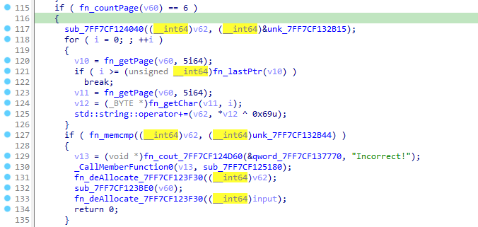

- `1.` Đoạn code này chương trình lấy mảnh thứ 4 của chương trình ra để kiểm tra sau đó xor từng ký tự với mảng thứ 5 rồi so sánh với mảng byte `[0x05, 0x01, 0x06, 0x5B, 0x05, 0x02]`.

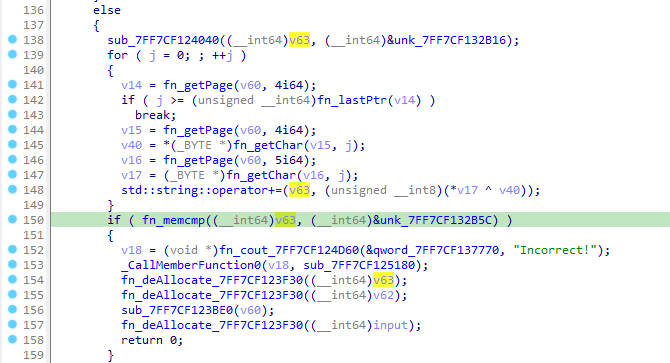

- `2.` Đoạn này nối chuỗi a = page4 + page5 và b = page2 + page3 sau đó dùng a làm key và b làm text để tạo cipher text từ thuật toán rc4 và so sánh ciphertext với mảng byte `[0x60, 0xE0, 0xE4, 0x2D, 0xFF, 0x97, 0xDD, 0x13, 0xEE, 0xA0, 0x55, 0xF4]`.

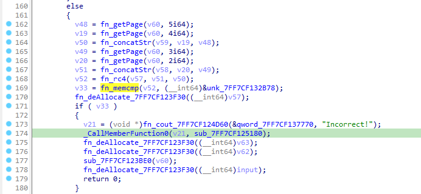

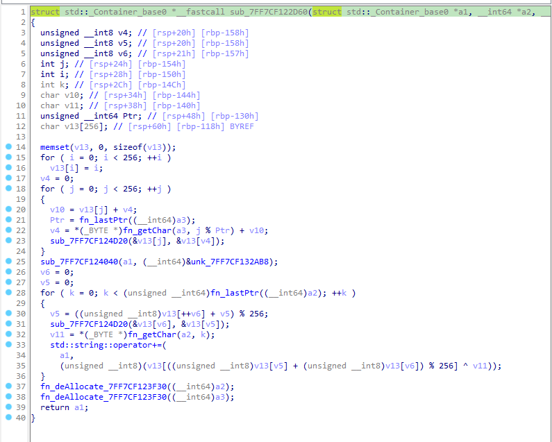

- `3.` Đoạn này lấy từng giá trị của mảnh 2 cộng với từng giá trị của mảnh 1 sau đó so sánh giá trị với mảng byte `[0x95, 0xC8, 0x95, 0x9D, 0x69, 0x68]`.

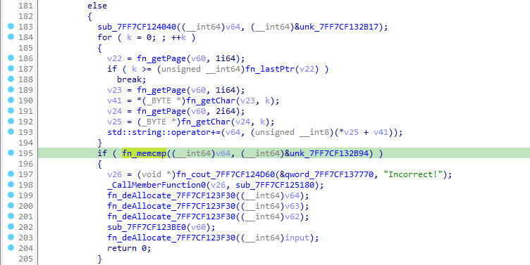

- `4.` Đoạn này lấy từng giá trị của mảnh 0 trừ đi từng giá trị của mảnh 3 sau đó so sánh giá trị với mảng byte `[0x01, 0xFA, 0x06, 0xD2, 0xFF, 0xCE]`.

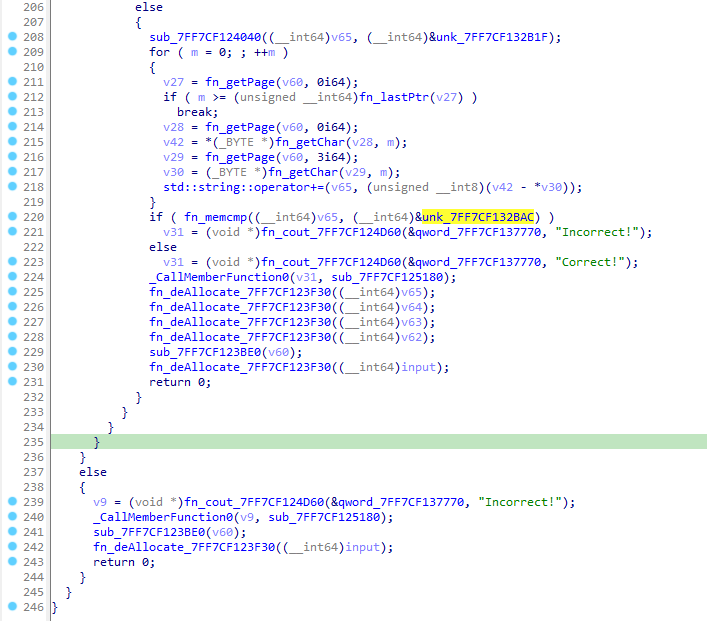

## [1]. Solve Idea

- Từ 5 bước được sử dụng để xử lý và so sánh 6 mảnh flag mình có thể viết script solve để tìm flag của chương trình.

```python
def string_to_ascii_hex_array(input_string):
    return [ord(char) for char in input_string]

def decrypt1(input_str, key):
    result = ""
    for char in input_str:
        xor_result = char ^ key
        result += chr(xor_result)
    return result

def decrypt2(input_str, key):
    result = ""
    for i in range(0, 6):
        xor_result = ord(input_str[i]) ^ key[i]
        result += chr(xor_result)
    return result

def decrypt3(ciphertext, key):
    # rc4_decrypt
    S = list(range(256))
    j = 0
    out = []

    # KSA (Key Scheduling Algorithm)
    for i in range(256):
        j = (j + S[i] + key[i % len(key)]) % 256
        S[i], S[j] = S[j], S[i]

    # PRGA (Pseudo-Random Generation Algorithm)
    i = j = 0
    for char in ciphertext:
        i = (i + 1) % 256
        j = (j + S[i]) % 256
        S[i], S[j] = S[j], S[i]
        out.append(chr(char ^ S[(S[i] + S[j]) % 256]))

    return ''.join(out)

def decrypt4(input_str, key):
    result = ""
    for i in range(0, 6):
        xor_result = int(input_str[i]) - ord(key[i])
        result += chr(xor_result)
    return result

def decrypt5(input_str, key):
    result = ""
    for i in range(0, 6):
        xor_result = int(input_str[i]) + ord(key[i])
        result += chr(xor_result & 0xff)
    return result


enc_5 = [0x5A, 0x5B, 0x0B, 0x0A, 0x5E, 0x5F]
enc_4 = [0x05, 0x01, 0x06, 0x5B, 0x05, 0x02]
enc_3 = [0x60, 0xE0, 0xE4, 0x2D, 0xFF, 0x97, 0xDD, 0x13, 0xEE, 0xA0, 0x55, 0xF4]
enc_2 = [0x95, 0xC8, 0x95, 0x9D, 0x69, 0x68]
enc_1 = [0x01, 0xFA, 0x06, 0xD2, 0xFF, 0xCE]


result5 = decrypt1(enc_5, 0x69)
print("[+] Result-5: ", result5)

result4 = decrypt2(result5, enc_4)
print("[+] Result-4: ", result4)

a = result4 + result5
print("\n[!] Rc4 key:     ", a)
a = string_to_ascii_hex_array(a)

b = decrypt3(enc_3, a)
print("[!] Rc4 decrypt: ", b)

result2 = b[:6]
result3 = b[-6:]
print("\n[+] Result-2: ", result2)
print("[+] Result-3: ", result3)

result1 = decrypt4(enc_2, result2)
print("[+] Result-1: ", result1)

result0 = decrypt5(enc_1, result3)
print("[+] Result-0: ", result0)


result = "ASCIS{" + result0 + "-" + result1 + "-" + result2 + "-" + result3 + "-" + result4 + "-" + result5 + "}"
print("\nFlag: ", result)
```

- Ở bước decrypt giải thuật toán Rc4 mình có thể sử dụng trực tiếp tools cyberchef vì đã biết key và ciphertext (Do thuật toán Rc4 là thuật toán mã hóa đối xứng).

- Flag `ASCIS{829872-bccd38-3e2960-783f8d-63d824-32bc76}`.

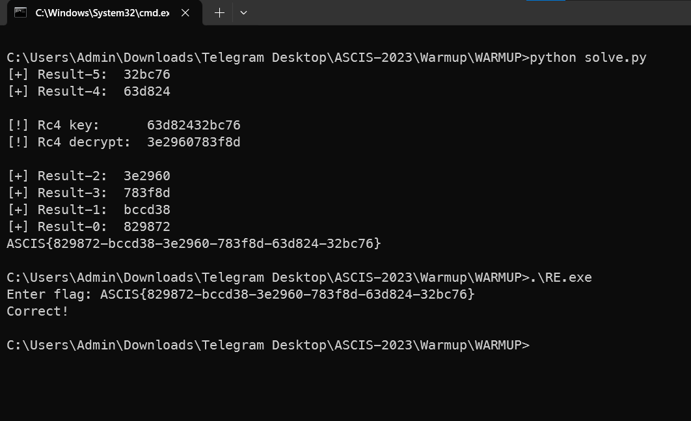
