# ASCIS2023_BABY-4

> Challenge: Baby_4

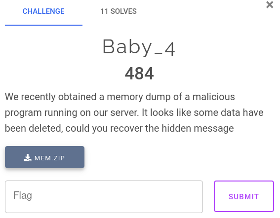

- Challenge cung cấp cho chúng ta một file `mem.DMP`, nhiệm vụ được mô tả là cần phải lấy thông điệp bị ẩn từ file memory dump của 1 malicious program đang chạy trên server.

## [0]. Digital Forensics

- Bước đầu mở WinDBG (`!analyze -v`) để phân tích file.dmp, ta xác định được file được dump ra từ process `CobaltStrike.exe`

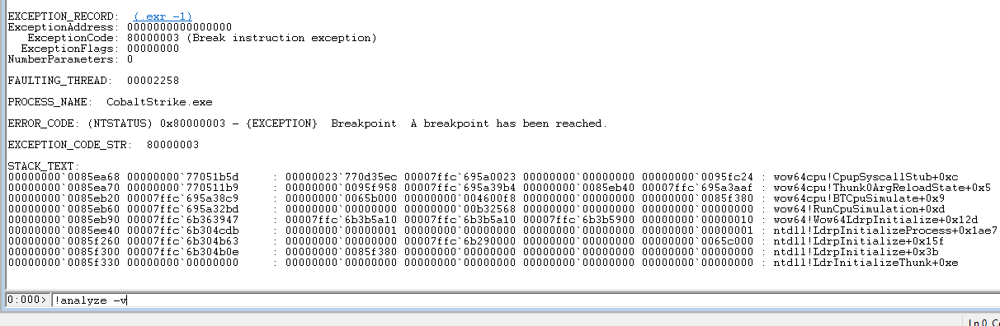

- Sau khi đi hỏi thì mình biết rằng IDA Pro cũng có thể phân tích được file.dmp nên phân tích tiếp theo hướng đó.

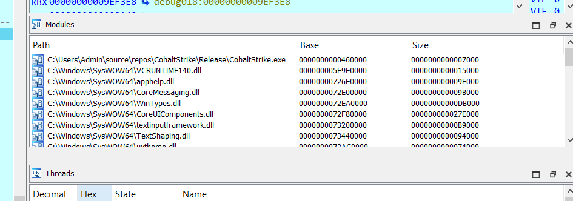

- Ta dễ dàng thấy được các modules được load trong file.dmp, từ đó xác định được address base và offset của file CobaltStrike.exe ta sẽ extract nó để lấy file.exe để phân tích.

- Run script python để lấy file malicious

```python
open("payload.bin", "wb").write(get_bytes(0x460000, 0x7000, 1))
```

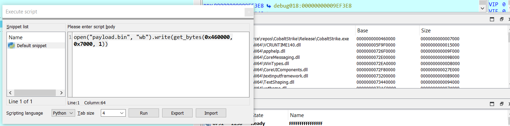

- Hiện tại ta có được 1 file payload.bin là file của process CobaltStrike.exe nhưng bị lỗi format PE do kết xuất làm sai info file, sử dụng tools https://github.com/skadro-official/PE-Dump-Fixer/releases/tag/v1.0 để sửa cho đúng format định dạng file PE (Mình phát hiện nó sai format là do sử dụng CFFExplorer).

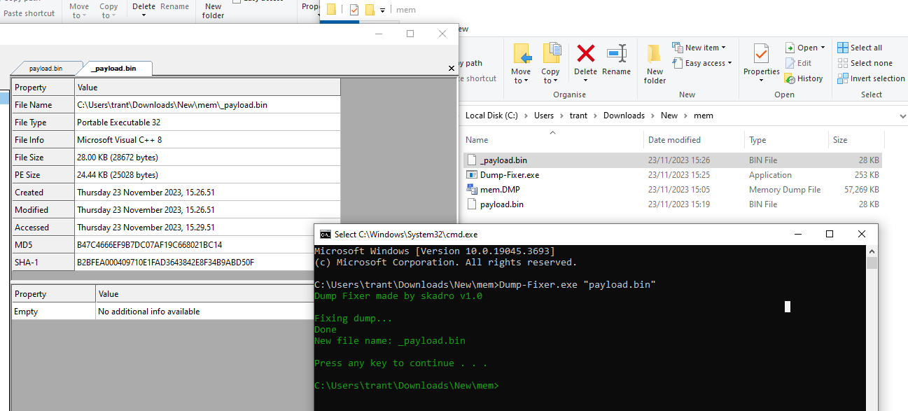

## [1]. Reverse Engineering

- Sử dụng IDA Pro 32-bit để tiếp tục phân tích file, sửa file \_payload.bin thành CobaltStrike.exe và run file.

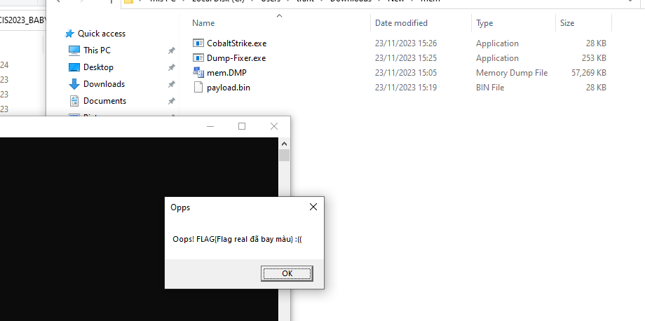

- Đúng follow chương trình thì nó sẽ in ra màn hình và thoát nhưng phân ta cần chương trình thực thi là ở dưới để có được flag.

```c
  Size = 16;
  v3 = (UCHAR *)calloc(0x1Cu, 1u);
  v4 = v3;
  if ( dword_4644F8 )
  {
    MessageBoxW(0, Text, L"Opps", 0);
    ExitProcess(0xFFFFFFFF);
  }
  if ( !v3 )
    return -1;
  v6 = Size;
  v7 = 0;
  *(_DWORD *)v4 = 1296188491;
  *((_DWORD *)v4 + 1) = 1;
  *((_DWORD *)v4 + 2) = v6;
  do
    *(&pbBinary + v7++) ^= 0x69u;
  while ( v7 < v6 );
  memcpy(v4 + 12, &pbBinary, v6);
  v8 = BCryptOpenAlgorithmProvider(&phAlgorithm, L"AES", 0, 0);
  v9 = BCryptSetProperty(phAlgorithm, L"ChainingMode", (PUCHAR)L"ChainingModeECB", 0x20u, 0);
  v10 = BCryptImportKey(phAlgorithm, 0, L"KeyDataBlob", &phKey, 0, 0, v4, 0x1Cu, 0);
  Size = 128;
  if ( (v9 & v10 & v8) == 0 && !BCryptDecrypt(phKey, &byte_4643F8, cbInput, 0, 0, 0, pbOutput, 0x40u, &Size, 0) )
  {
    Parameter[2] = 0;
    Parameter[0] = (int)pbOutput;
    Parameter[1] = Size;
    Thread = CreateThread(0, 0, StartAddress, Parameter, 0, 0);
    WaitForSingleObject(Thread, 0xFFFFFFFF);
  }
  return 0;
}
```

- Ta dễ dàng nhận ra ở đây chương trình sử dụng mã háo AES mode ECB để giải mã chuỗi nhằm lấy flag.
- Ban đầu mình chỉ sửa byte đoạn nhảy vào in ra "Opps" khi chạy chương trình từ jz thành jnz để follow chương trình đi tiếp xuống bên dưới và run lại chương trình (74 1C => 75 1C).

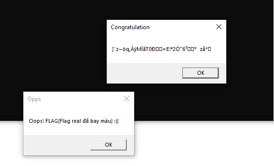

- Nhưng có cái gì đó đang bị sai ở đây, sau khi check lại mình nhận ra đoạn code này

```c
  *(_DWORD *)v4 = 1296188491;
  *((_DWORD *)v4 + 1) = 1;
  *((_DWORD *)v4 + 2) = v6;
  do
    *(&pbBinary + v7++) ^= 0x69u;
  while ( v7 < v6 );
  memcpy(v4 + 12, &pbBinary, v6);
```

- Biến v4 được sử dụng nhằm tạo KeyDataBlob ở đoạn code phía sau nhưng giá trị khi biến pbBinary được copy vào biến v4 đang bị XOR với 0x69 nên mình patch tiếp 0x69 => 0x00. Sau đó run lại chương trình.

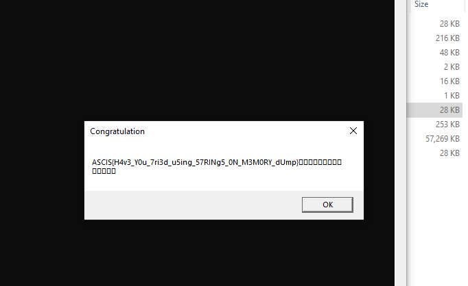

- Đó là cách dễ nhất để lấy được flag nhưng mình cũng có thể lấy các giá trị hex từ chương trình và viết script python để lấy flag.

```c
  if ( !v3 )
    return -1;
  v6 = Size;
  v7 = 0;
  *(_DWORD *)v4 = 1296188491;
  *((_DWORD *)v4 + 1) = 1;
  *((_DWORD *)v4 + 2) = v6;
  do
  {
    *(&Src + v7) = *(&Src + v7);
    ++v7;
  }
  while ( v7 < v6 );
  memcpy(v4 + 12, &Src, v6);
  v8 = BCryptOpenAlgorithmProvider(&phAlgorithm, L"AES", 0, 0);
  v9 = BCryptSetProperty(phAlgorithm, L"ChainingMode", (PUCHAR)L"ChainingModeECB", 0x20u, 0);
  v10 = BCryptImportKey(phAlgorithm, 0, L"KeyDataBlob", &phKey, 0, 0, v4, 0x1Cu, 0);
  Size = 128;
  if ( (v9 & v10 & v8) == 0 && !BCryptDecrypt(phKey, &byte_4643F8, cbInput, 0, 0, 0, pbOutput, 0x40u, &Size, 0) )
  {
```

- Đọc docs của hàm [BCryptDecrypt function (bcrypt.h)](https://learn.microsoft.com/en-us/windows/win32/api/bcrypt/nf-bcrypt-bcryptdecrypt) ta cần hai giá trị &byte_4643F8 và phkey (&phkey <= v14 <= &Src), sử dụng các hàm hỗ trợ từ `pycryptodome` để viết script solve.py

```python
from Crypto.Util.number import *
from Crypto.Cipher import AES

# ciphertext from IDA [shift + E]
ciphertext = [0x21, 0x57, 0x99, 0x4c, 0xde, 0x82, 0x72, 0x94, 0x8f, 0x6b, 0xd,
0xaf, 0xa6, 0x83, 0xcb, 0xa3, 0xb6, 0xbb, 0x5e, 0x9e, 0xca, 0xf9, 0x42, 0xe7,
0x47, 0x9c, 0xb7, 0x6, 0xb0, 0x1a, 0xd2, 0xc3, 0x7b, 0xb7, 0xcb, 0xcf, 0x96,
0xc3, 0x97, 0xb9, 0x65, 0xd5, 0x35, 0xfc, 0x2c, 0x2, 0xcc, 0x70, 0x4e, 0x7a,
0xc2, 0x37, 0x1, 0x45, 0xa1, 0xa2, 0x2f, 0x4c, 0xfc, 0xaa, 0x3e, 0x3e, 0x9f,
0x99]

# convert list to bytes
ciphertext = bytes(ciphertext)
pbBinary = 0x8CBBE5F15134EEF7B5297BD92BA76B01
pb = long_to_bytes(pbBinary)
print(pb)
# reformat to little endianess
pb = list(pb)[::-1]
print(pb)
pb = bytes(pb)

# Decrypt :)
AES_ECB = AES.new(pb, AES.MODE_ECB)
plaintext = AES_ECB.decrypt(ciphertext)
print(plaintext)
```

- `Flag`: ASCIS{H4v3_Y0u_7ri3d_u5ing_57RINg5_0N_M3M0RY_dUmp}

## [2]. Writeup References

- Đề cho chúng ta 1 file minidump của 1 chương trình đang chạy mà đề bài nói là `"malicious"`. Mình sử dụng `windbg` để bắt đầu phân tích dump này.

- Trên CLI của windbg, ta có thể tìm xem tên process gốc của dump này bằng command `!analyze -v`:

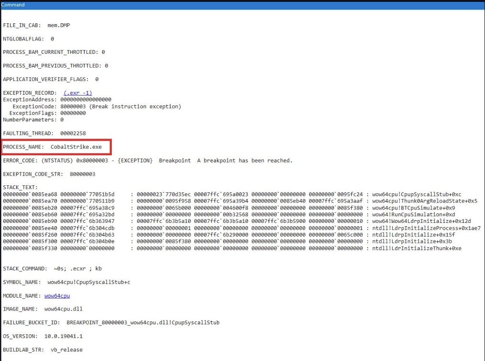

- Tiếp tới, để xem cái `"malicious"` mà process này đang làm là gì, mình dùng command `lm` để xem toàn bộ module được load vào process:

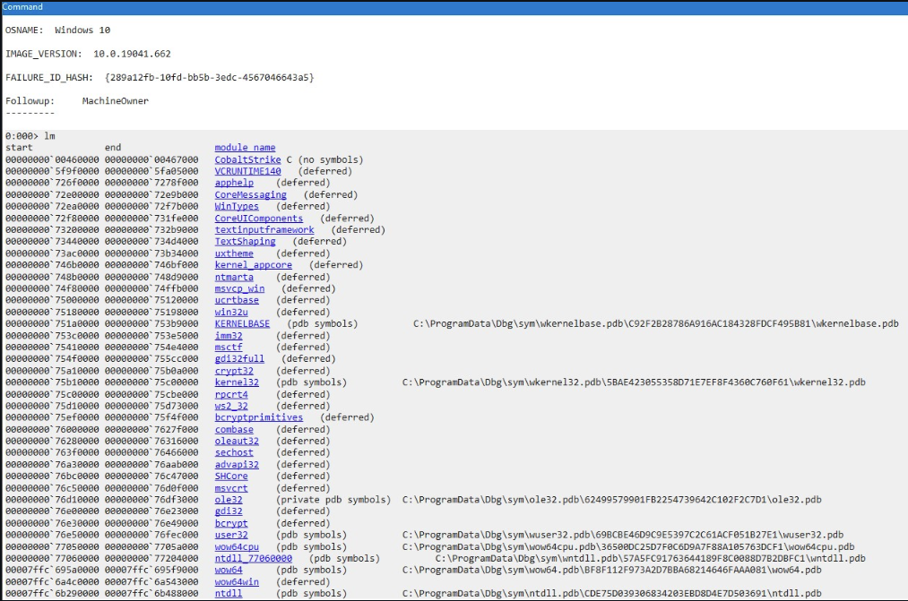

- Để ý module đầu tiên được load vào là CobaltStrike, chính là file thực thi khởi chạy tạo thành process này. Bởi khi file thực thi khởi chạy thì tiến trình sẽ load nó vào đầu tiên, sau đó mới load các dll cần thiết mà file đó gọi tới.

- Có thể dễ dàng nhìn thấy full path của module đầu tiên:

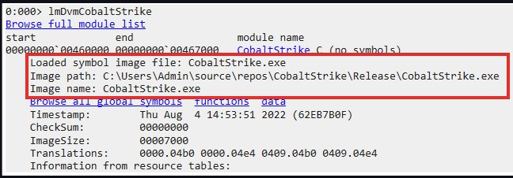

- Mình sẽ extract file thực thi ra khỏi dump để phân tích:

  - Đầu tiên nhìn offset của module CobaltStrike, mình extract dãy bytes theo offset đó bằng command `.writemem C:\Users\theon\OneDrive\Desktop\CobaltStrike.exe 00460000 L?00467000-00460000`:
    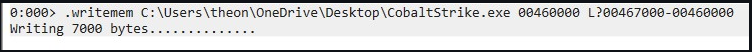
  - Tiếp theo, dùng [PE Dump Fixer](https://github.com/skadro-official/PE-Dump-Fixer) để áp offset ban đầu của module trong virtual space vào file ta dump ra ở trên:

    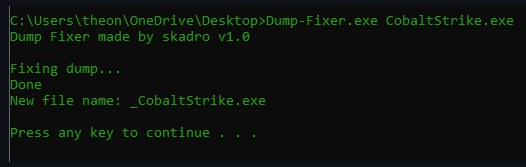

  - Cuối cùng là unmap địa chỉ ảo khỏi file bằng [PE Unmapper](https://github.com/hasherezade/pe_unmapper):
    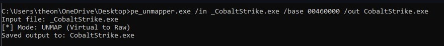

- Ta đã dump thành công file thực thi từ minidump, load vào ida:

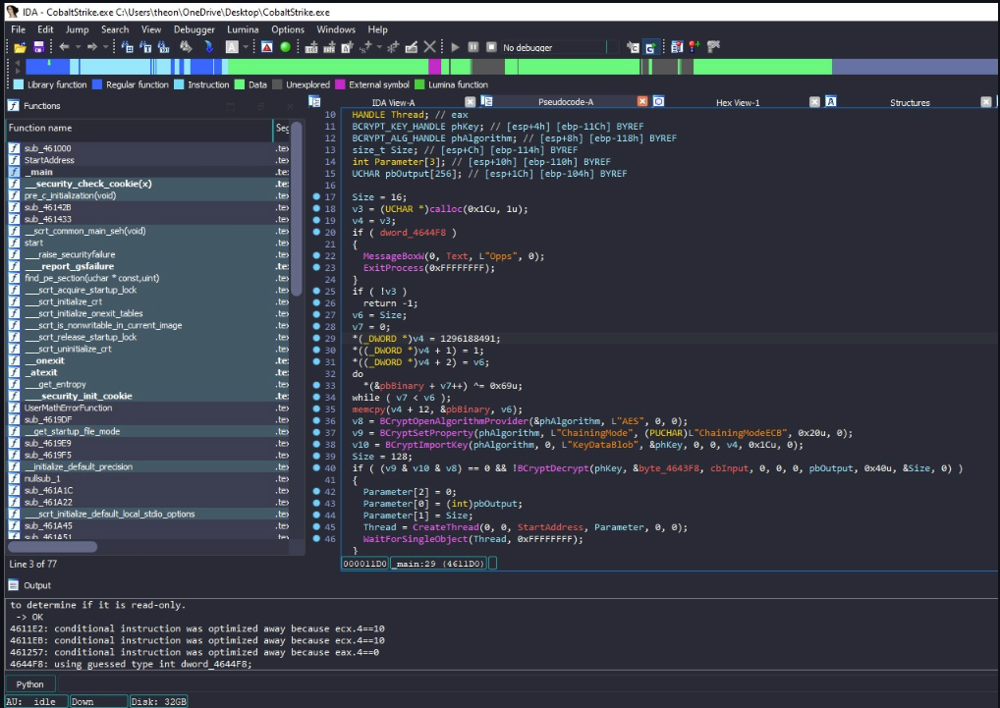

- Đại khái là code sẽ thực hiện decrypt AES-ECB-128 với key là `pbBinary`:

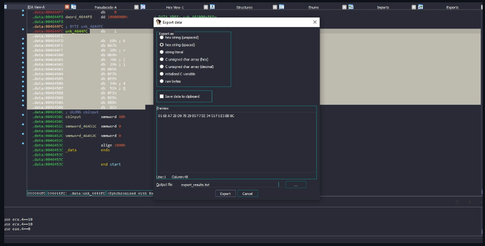

- Và ciphertext là `byte_4643f8`:

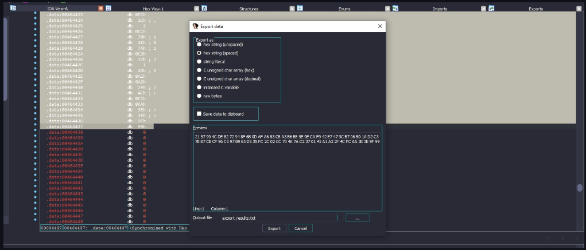

- Mình decrypt bằng `Cyberchef` - flag `ASCIS{H4v3_Y0u_7ri3d_u5ing_57RINg5_0N_M3M0RY_dUmp}`:

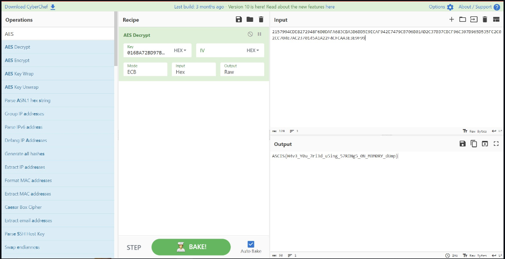
