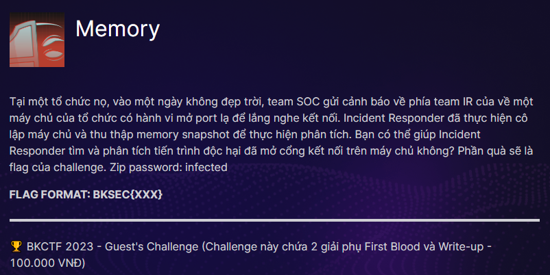
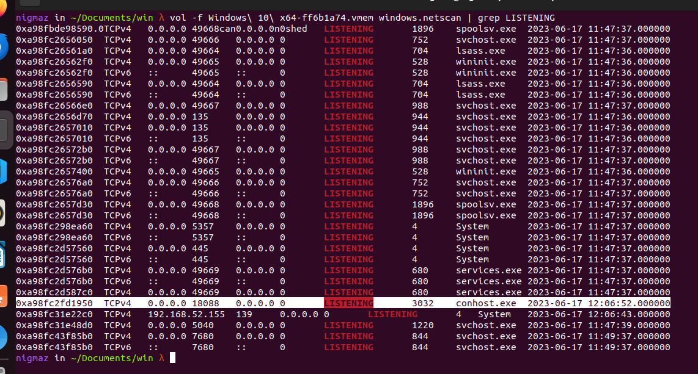
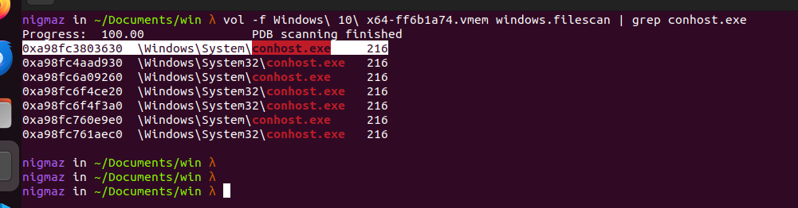
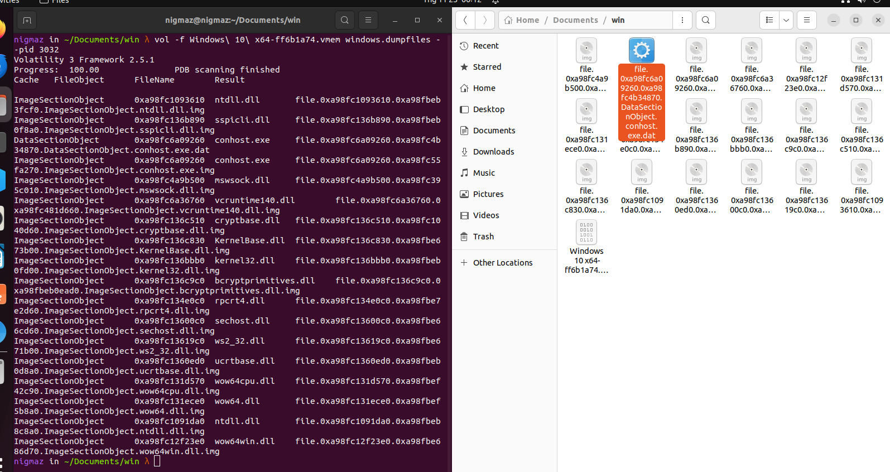
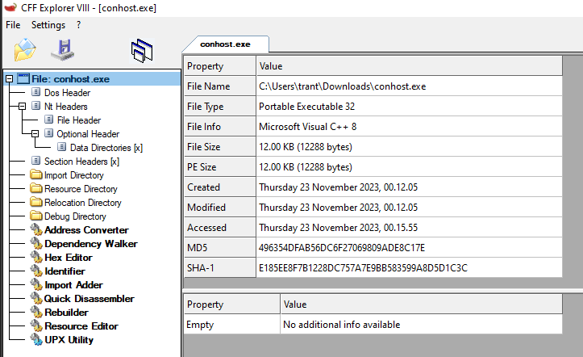

# BKSEC-CTF2023_Memory

> Challenge: [Memory](https://battle.cookiearena.org/arenas/bkctf-2023/battle/memory).



- Challenge cung cấp cho chúng ta một `file.vmem`, nhiệm vụ được mô tả là cần phải phân tích memory snapshot của image Windows được cung cấp để tìm và phân tích tiến trình độc hại đã mở cổng kết nối đến máy chủ.

## [0]. Digital Forensics

- Đầu tiên mình sử dụng tools Volatility để tìm các tiến trình khả nghi, theo như tình huống giả định là máy chủ mở port lạ để listening kết nối từ bên ngoài nên mình sử dụng plugin `netscan` của volatility tìm các process có mở port để listening.

- Ở đây có 1 process của `conhost.exe` bất thường khi mở port 3032 để `LISTENING`, đó là một process khả nghi.

```bash
vol -f Windows\ 10\ x64-ff6b1a74.vmem windows.netscan | grep LISTENING
```



- Có khả năng là file `conhost.exe` (nằm ở C:\Windows\System32) đã bị thay thế nên mình đi sâu vào kiểm tra theo hướng này, tiếp tục sử dụng plugin `filescan` của volatility kiểm tra file `conhost.exe`.

```bash
vol -f Windows\ 10\ x64-ff6b1a74.vmem windows.filescan | grep conhost.exe
```



- Vậy là nhận định của mình đúng khi có 1 file fake `conhost.exe` nằm ở đường dẫn C:\Windows\System khác so với đường dẫn mặc định của file conhost.exe trên Windows, mình tiến hành lấy processID của process đang chạy file conhost.exe fake (processID của file conhost.exe đang LISTENING) và dump process để lấy file sử dụng plugin `dumpfiles` của Volatility.

```bash
vol -f Windows\ 10\ x64-ff6b1a74.vmem windows.pslist | grep conhost.exe

vol -f Windows\ 10\ x64-ff6b1a74.vmem windows.dumpfiles --pid 3022
```



- Kết quả dump được từ process bao gồm các dll và file conhost.exe, kiểm tra nhanh file conhost.exe bằng VirusTotal thì thấy file bị gán 13 cảnh báo và 1 flag sandbox. Mình dịch ngược file theo hướng kiểm tra xem port lạ tìm được ban đầu được sử dụng như nào.

## [1]. Reverse Engineering

- Sử dụng `CFF Explorer` để kiểm tra qua thuộc tính file thì đây là file 32-bit.



- Tiếp tục dùng IDA để tạo peseudocode rồi phân tích, đầu tiên sẽ tìm string theo port được LISTENING `18808` và xác định được hàm tạo `bindShell()`.

```c
SOCKET sub_4010D0()
{
  struct WSAData WSAData; // [esp+8h] [ebp-1B8h] BYREF
  struct sockaddr name; // [esp+198h] [ebp-28h] BYREF
  struct sockaddr addr; // [esp+1A8h] [ebp-18h] BYREF
  int addrlen; // [esp+1B8h] [ebp-8h] BYREF

  if ( WSAStartup(0x202u, &WSAData) )
    return 0;
  s = WSASocketW(2, 1, 6, 0, 0, 0);
  name.sa_family = 2;
  *(_WORD *)name.sa_data = htons(18088u);       // port
  *(_DWORD *)&name.sa_data[2] = inet_addr("0.0.0.0");// ip
  if ( bind(s, &name, 16) )
    return 0;
  if ( listen(s, 2) )
    return 0;
  memset(&addr, 0, sizeof(addr));
  addrlen = 16;
  return accept(s, &addr, &addrlen);
}
```

- Sau khi tạo bindShell thì chương trình gửi đi 1 link youtube để kiểm tra kết nối mạng.

```c
int __cdecl sub_401000(SOCKET s)
{
  char buf[52]; // [esp+18h] [ebp-38h] BYREF

  strcpy(buf, "https://www.youtube.com/watch?v=ftwsVu_wP5c&t=5s\n");
  return send(s, buf, strlen(buf) + 1, 0);
}
```

- Sau đó có 1 vòng lặp `do{}while()` lắng nghe request được gửi tới server, đây là các yêu cầu được gửi từ attacker -> victim và chương trình sẽ thực hiện các hành động cụ thể tùy thuộc vào các yêu cầu.

```c
do
  {
    while ( 1 )
    {
      while ( 1 )
      {
        memset(buf, 0, sizeof(buf));
        recv((SOCKET)s, buf, 256, 0);
        v3 = strlen(buf);
```

- Ở đây mình thấy có tất cả là 4 yêu cầu CloseHandle, RegSetValue, CreateProcessA, RegQueryValueExA sẽ được xử lý. Trong đó với yêu cầu CloseHandle thì chương trình chỉ đơn giản là close socket và thoát chương trình.

- Cả 3 chức năng RegSetValue, CreateProcessA, RegQueryValueExA khi được xử lý thì đều gọi tới hàm handleBuffer_401080() (Hàm này mình đã đổi tên lại cho dễ nhìn nhưng vẫn giữ địa chỉ ở cuối). Khác biệt nằm trong đối số thứ nhất là biến gồm dãy các byte được xử lý trong hàm.

```c
// case-1 - "RegSetValue"
handleBuffer_401080(&unk_404018, buf, 29, &buf[strlen(buf) + 1] - &buf[1], NewFileName);
CopyFileA(Filename, NewFileName, 0);
memset(TargetFileName, 0, 0x4Bu);
handleBuffer_401080(&unk_404038, buf, 73, &buf[strlen(buf) + 1] - &buf[1], TargetFileName);

// case-2 - "RegQueryValueExA"
handleBuffer_401080(&unk_404084, buf, 39, &buf[strlen(buf) + 1] - &buf[1], valueQuery);

// case-3 - "CreateProcessA"
handleBuffer_401080(&unk_4040AC, buf, 27, v6, ApplicationName);
```

- Tiến hành phân tích hàm handleBuffer_401080() thì đây là một hàm mã hóa dùng thuật toán XOR, chuỗi byte được lưu trong chương trình xor với từng ký tự trong yêu cầu của hacker ( RegSetValue, CreateProcessA, RegQueryValueExA) theo quy tắc và kết quả lưu vào đối số thứ 5.

```c
// handleBuffer_401080(&unk_404038, buf, 73, len(buf), TargetFileName);
int __cdecl sub_401080(int a1, int a2, int a3, int a4, int a5)
{
  int result; // eax
  int i; // [esp+0h] [ebp-4h]

  for ( i = 0; i < a3; ++i )
  {
    *(_BYTE *)(i + a5) = *(_BYTE *)(a2 + i % a4) ^ *(_BYTE *)(i + a1);// a5[i] = a2[i % len(a2)] ^ key
    result = i + 1;
  }
  return result;
}
```

- Vậy việc mình cần làm bây giờ là viết lại hàm giải mã bằng python và lấy giá trị từ các biến gồm các byte và các yêu cầu của hacker bao gồm ( RegSetValue, CreateProcessA, RegQueryValueExA) để giải mã ra tìm kết quả.

```python
def handleBuffer(byte_array, buf, a3, len_buf):
    a5 = ""
    for i in range(a3):
        a5 += chr(ord(buf[i % len_buf]) ^ byte_array[i])
    return a5

# case-1
buf = "RegSetValue"
unk_404018 = b"\x11_;\x04\x0c\x1a2\x0e\x1b\x069\x01\x1c\x14'\x00\x19\n\x02\x03\x1b\r=\x16\x13}\x00\x0c3\x00\x00\x00"
print(handleBuffer(unk_404018, buf, 29, len(buf)))

unk_404038 = b'\x11_;\x03\x17\x1b1\x13\r\x18!3\x11\x06\x0f(\x1d5\x13\x03\x06\n4\x11;\x04\x0c\x1a2\x0e\x1b\x069\x01\x11\x06!\x11T\x1b\x04\x02\x009\x02\x17\x084\x17\x15;\x120&\x113\x17\x13\x06\x15(\x03\x0f\x05\x1e\x00++3}\t\x1a=\x00\x00\x00'
print(handleBuffer(unk_404038, buf, 73, len(buf)))

# case-2
buf = "RegQueryValueExA"
unk_404084 = b'\x10.4\x146\x1e\x11\x188>\x15\x1a\x10\x1a\r27:1>\x19\x04\x06\x10:\x08\x18\x0cZ\x1a\x1eqbUP2E\x07\x0f\x00'
print(handleBuffer(unk_404084, buf, 39, len(buf)))

# case-3
buf = "CreateProcessA"
unk_4040AC = b'\x00H96\x1d\x0b4\x1d\x18\x109 \n27\x17\x08RF93\x1f\x0bM\x00\x0b\x16\x00'
print(handleBuffer(unk_4040AC, buf, 27, len(buf)))
```

- Kết quả:

```cmd
C:\Windows\System\conhost.exe
C:\ProgramData\Microsoft\Windows\Start Menu\Programs\StartUp\UnikeyNT.lnk
BKSEC{can_you_use_Volatility?_f0007c0b}
C:\Windows\System32\cmd.exe
```
