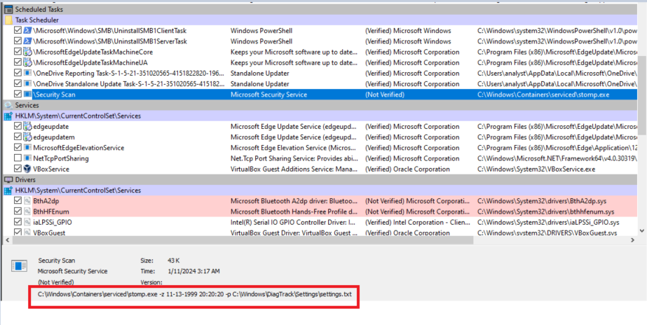

# UofTCTF2024_Hourglass

> No EDR agent once again, we imaged this workstation for you to find the evil !

- File được cung cấp là `vm.ova` nên sử dụng VirtualBox để mở file nhằm chạy một máy ảo.

- Sử dụng `Autoruns (Sysinternals)` để check thì có một entry không được verified trong `Task Scheduler`.



- Câu lệnh được thực thi của dịch vụ được đăng ký trong `Task Scheduler`:

```ps1
C:\Windows\Containers\serviced\stomp.exe -z 11-13-1999 20:20:20 -p C:\Windows\DiagTrack\Settings\settings.txt
```

- Tìm theo thì thấy nội dung của file `C:\Windows\DiagTrack\Settings\settings.txt` là 1 dòng ký tự mã hóa ở dạng base64.

```ps1
Ky0tCiB1b2Z0Y3Rme1Q0c0tfU2NoM0R1bDNyX0ZVTn0KKy0t
```

- Decrypt đoạn mã trên sử dụng `kt.gy` thu được flag:

```ps1
+--
 uoftctf{T4sK_Sch3Dul3r_FUN}
+--
```
