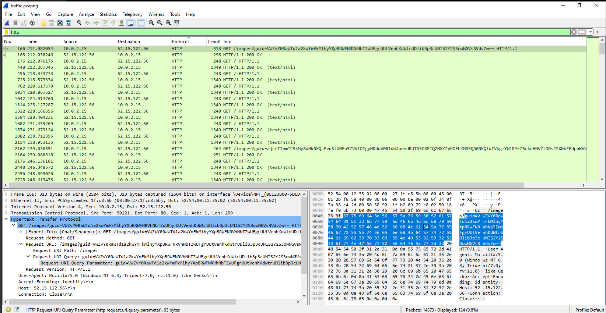

# UofTCTF2024_Illusion

> Good Luck.

- Challenge cung cấp một file tên là `traffic.pcapng`. Sau khi phân tích sử dụng wireshark chúng ta có thể thấy một điều bất thường trong lưu lượng truy cập http, đó là các `GET HTTP` request. Nó chứa một đường dẫn và tham số có tên `/images?guid=` và dữ liệu nối tiếp được mã hóa base64.



- Dữ liệu truy vấn được mã hóa bằng base64, khi tiến hành giải mã dữ liệu của 1 truy vấn bất kỳ sử dụng `kt.gy` thì thu được chuỗi ký tự không có nghĩa.


- Tiến hành `export objects` lưu lượng truy cập HTTP và mở file bất kỳ thì thấy giao diện trang web truy cập giống như 1 công cụ search.


- Có thể thấy lưu lượng qua lại giống mô hình máy chủ c2 (command & control) và khi search cùng với từ kháo tìm kiếm `/images?guid=` thì nó giống với mô hình [TrevorC2 traffic](https://github.com/trustedsec/trevorc2). Định nghĩa như sau:
  - Bài viết tham khảo: https://nasbench.medium.com/understanding-detecting-c2-frameworks-trevorc2-2a9ce6f1f425

> TrevorC2 is a client/server model for masking command and control through a normally browsable website. Detection becomes much harder as time intervals are different and does not use POST requests for data exfil.

- Vì vậy, ta xác định được `the C2 conversation` ẩn chứa hai điều:

  - Phía máy chủ ẩn các lệnh của nó trong `<!-- oldcss=>`.
  - Phía khách hàng ẩn dữ liệu của nó trong `/images?guid=`.

- Hãy trích xuất dữ liệu phía khách hàng. bạn có thể sử dụng tshark để trích xuất dữ liệu:

```bash
tshark -r traffic.pcapng -Y "http.request" -T fields -e http.request.uri > clientdata.txt
```

- Bây giờ chúng ta có thể giải mã dữ liệu, để giải mã dữ liệu chúng ta có thể kiểm tra repo TrevorC2 để xem phương pháp giải mã.


- Chúng ta vẫn cần khóa mã hóa, hãy thử khóa mặc định là `Tr3v0rC2R0x@nd1s@w350m3#TrevorForget` để xem nó có hoạt động không.


- Script giải mã các command:

```python
ct=["VWZvY0RaWTd1a2kwYmFkMlhyYXpBRWFNRVhNbTZwUFgrUUtVenhKdWtrUDlib3p3cUNIS2Y2S3owNGVsRVdvZw==","ajcrT1pmTC9kMy8xNkRXQzFvdStUWFo5ZVV1OTgyMDduV0R1dWJoemdRUTN5OXFIQ2NXY2VKOFhKM3FQRGRKQldIVkgzYW1RYkZ5ckdHNVZtOGs4SXNkZEdpaHhVeGR2aFdYN3dLMUF6RjZOM1FRc2trYkdjZFYrb1RLR3ZPb2puQUEzTUpLakRQd1FlREg1ZlFZdmp3PT0=","WkN0eTk1TGdFb1JrZWZIL29VU0hhV0t0VjJocmJnTjVDUDR4eWU1OU8vSEppeVp6QnJqS1IvcUprOVZPUVpHYnk2RjArZFQ0K25BTUkreEFtM2xxK00zVEZyQk1DQ3k4MFUwNHVaSCszSUVCaDBrZ3ZDVWo4Tk0wMGNQblNZdDlqOTVBVzRCelBNYXV4cE9wbUViamN4N042QzBPckhNcVFtR2MybjBOTVh6Q0NmZlAzWXQ4dThkN0ozeWtYK0hEZmkrSTdQTmdBRlA2RTJKblRNVGdZOGVVUGU3enJmYzVEb0RydG9ETVhWZ2dPMElZQUF3b3pDUEN3eUZTdmxHeU5iV3VpYVpaSVR2TVNnOW9leW9RZU10bVBRZXQ2ejV4Zm4rZDQ0eHFNdkhRR1llNXJZVERQSzYwYUJUbDMrNmRhUUlzbXRieXpwaW1nQjlQWmV1dVdDUytYVmhQNXlCcHh1cjJ3L1BZTzRsLzVFTFFYa3JUblF3eTRxc25yMlR4YW9idk1LN3FzaGtFVGZsbkZwMktxY09SUTZMTlo4bEVUOTdxQ2tHaDNkTGdjTVFMc2E0M3ZLdVp4YzdBOUcwOFFRUjBjMHlLK3ptaVNnUCtjM2djeEg3UzVweU1NNlJNakd5Nk9neHcvbTB0QTJEcjJRWDBBTU9YRm53MEpYbzhNcTVwWUhndGw2R0laak5OcUtWdG5JcnVpb0RTcW1iSmF1T295bngrbjNNdjVrWVZ1QXVQbDB4YXU1Q2ZOZERrWnRJaVZZUW1JZmpsZU1CaHM1emRKWVREVXhhK2JwOXB3UHkxR21UZW4rK2QwZks4VGFEdXB3eWdqSnRTc1pydXV6eDZ3RVliWG95dnUrQlhHcFE5Y1NCRWpnN2FmcWxzbGtmbDJ4R1FTWi9Sdy96ZGxKeFA4SEZKc3oweE5PTC9CV3QzVUVMLzViZjljQ1Vva2tETFFQV2hHajJPZmYvU2xoU0o0eUx4TCtNPQ==","UzltSmsxK2RQM0ROWWJoWGwyWC9mSnZBY1VkSkJVeUVDS0hzNXZMOXoxYz0=","ZTcreEtlMzFSamMrRGNsMVloWDJyVmJuTFJIdzY5VGFZZWNqbzlxb1IvcjVsQnpIMU1YS2YrbFZEZWdiQzM1M3I0QVpqSUY5UHF3ck15LzF4R3ZjLzFINWRxeFdWRVk4NWdLclUxM0VBeEM1U3lxSU8xMnlrRkpNUG1XRTFNWUM=","ME9BMzRkK1I0cFAwc2pmTEFzWFk0N3lPMDBFRjZ1bGVGUnc0RGxlZ1RRdz0=","S2VHSVF1RGVhMjFrTm5vM1hoR052U25yVzZnSy9sWCtnYVN1WTVJSnJSRitmd20xU2x3K2xCeXVsZUNWS3VCUkJxTUJQYjRQWERmV1Zjb29mbUtqRHFSbFU4alZyTzZ2eVhxbkdsdXlINCtxZ0NQQWN2bFBzeUxGbEJOOWk2L2FlS0hhQmJqR0lqL1FPalJWbHFnL21ZRnY2SG1uUGMrK3o3KytKcGdpTlNoQWtJZzM1QzZaZ1VXTXg1ck9qNmduTmQxaDRFTzcxME9PakpnbEpsbVFoOHdSUWpKWkh0cnA1N3ovOUgrblJHR2FZeHp3c1F6YlJxSWx3WVZpOGVmNlBlRlJYMFVIR0h3MittMGkxS1ErQ2lHUlB6ekhhYmIxSDlxRE50cHZMck5hNWhPV1hYblJEVHc1RjQwQTBEUkhVQXV1OWcwT1NZTExtNGk3MGFaWmVUd1FhYk9XQjRucTVIR2hNcHBVS2hEb0V1YnhlMHM3Z2VuR2loVmtaRUo0NVpkYTdnNEFLWjh2L1pjdUxHYkZGZjJhdzNoS3NBemZ3R09wc0JxblA4WTh6amRZbERlQmpqWVMxRkd3NHNOMEpPMWdBeTl4TmI4NlBlYXJORVRBdFlJdGVnaGZDUnpBcHVnODhnR0dHa3h6UVZEakdUbkg3K3VUWWMyMkJQM2I3LzNTNlQxc29KbzBJbGxZbEdwQ2srWHh4QjN5Z0QzbXNicnUzekJuazlDWTh2MFVYcEl4V2FTZUlmWXlGT3Jxa1pqbkoxWTNRU1hGcUhBRmNwNUc5dz09","OVdReUJzZ0MwR3JNRGljNnNqaEdPYzB5b1dTUUpwMkJMcGxzTyszSWJUUT0="]

import hashlib
import base64
from Crypto.Cipher import AES
class AESCipher(object):
    """
    A classical AES Cipher. Can use any size of data and any size of password thanks to padding.
    Also ensure the coherence and the type of the data with a unicode to byte converter.
    """
    def __init__(self, key):
        self.bs = 16
        self.key = hashlib.sha256(AESCipher.str_to_bytes(key)).digest()

    @staticmethod
    def str_to_bytes(data):
        u_type = type(b''.decode('utf8'))
        if isinstance(data, u_type):
            return data.encode('utf8')
        return data

    def _pad(self, s):
        return s + (self.bs - len(s) % self.bs) * AESCipher.str_to_bytes(chr(self.bs - len(s) % self.bs))

    @staticmethod
    def _unpad(s):
        return s[:-ord(s[len(s)-1:])]

    def encrypt(self, raw):
        raw = self._pad(AESCipher.str_to_bytes(raw))
        iv = Random.new().read(AES.block_size)
        cipher = AES.new(self.key, AES.MODE_CBC, iv)
        return base64.b64encode(iv + cipher.encrypt(raw)).decode('utf-8')

    def decrypt(self, enc):
        enc = base64.b64decode(enc)
        iv = enc[:AES.block_size]
        cipher = AES.new(self.key, AES.MODE_CBC, iv)
        return self._unpad(cipher.decrypt(enc[AES.block_size:])).decode('utf-8')

# add cipher key here
CIPHER = ("Tr3v0rC2R0x@nd1s@w350m3#TrevorForget")
cipher = AESCipher(key=CIPHER)


for i in ct:
    print(cipher.decrypt(base64.b64decode(i)))
```

- Kết quả là nó hoạt động:


- Chúng ta đã hiểu được một phía của cuộc trò chuyện. Bây giờ chúng ta cần phần còn lại là phía máy chủ. Để trích xuất dữ liệu `oldcss`, tôi chỉ cần sử dụng phương thức OG của `strings` và `grep` và tôi phân tích dữ liệu theo cách thủ công.

```bash
strings traffic.pcapng | grep "oldcss"
```

- Chỉnh sử lại dữ liệu cần giải mã:

```python
ct=["cFl2gZ64Xe9FdCr2nMGlPPHKr//oqB/bWOaDiLiOLmQ=","KOw3LLlCqO1H0/OzTaSCtdtDQEc1kaUHYDHK3URMinE=","kofJyYXCyx+kuQkUISD8xbS+3wGEninpPGkCfO7cSdk=","pthScpHMvLajfJArnoBOuaJE4qyruZUvV9RH1W1xJglZllVYTUApMAqfCX/Fe0hvq8Ym5FBzjg6aIGGOO5HTBA==","cLLXq0nk9MPX9fcJgK7PdYhjHwrGu6qEkLPMNV7+QQ4=","uMS9CwMZkXrXyXA4LTbRKL6FJkKBxyM9Pi96rGVuHEGyu1h+Qa7UIPej/b2PH1QL","sGpByUYockKmYpDyu84eFIOWENercq7Twup5JVfoh6w=","3unUUEgRnp/Cb5zCdqtNZk10QW1jno8SJ1x5elH408U=","TJMEJ6awBY5OJO8R/DuIj1oQNItQ6QvaBkpb0vsGT6Cmj2DOIIhgAkVOw6M9xrey","IkMrNxaUs4zRtjU81TvQAaLFGe2L9wp3lowIDxexlEg=","seiTsoy2I3arpIXH3DhPqLWDq3Q5VyFfTSPg4FLgJnwzBNJwnFKoQmpit2Bihe7+","noJvVRGs/silHFz2oPTldiey+XvgYNsutIOo4xVi2i4=","C9XqWpYeqCIn8Dk8gCVtpdg47vm8e8peFqkfQJ6WVbUvL7ucvQ0ayWnKRBF2GI+ltFBWNMa+wawqeuvFK61RGvKVWogAqAVg4J7qmScn+HRF0QZFgEunXlAduM+16nnf","0uVBecny+wd0QC7IC2UV0O/5itgE4ZMSRKBkaeNvLbM="]

import hashlib
import base64
from Crypto.Cipher import AES
class AESCipher(object):
    """
    A classical AES Cipher. Can use any size of data and any size of password thanks to padding.
    Also ensure the coherence and the type of the data with a unicode to byte converter.
    """
    def __init__(self, key):
        self.bs = 16
        self.key = hashlib.sha256(AESCipher.str_to_bytes(key)).digest()

    @staticmethod
    def str_to_bytes(data):
        u_type = type(b''.decode('utf8'))
        if isinstance(data, u_type):
            return data.encode('utf8')
        return data

    def _pad(self, s):
        return s + (self.bs - len(s) % self.bs) * AESCipher.str_to_bytes(chr(self.bs - len(s) % self.bs))

    @staticmethod
    def _unpad(s):
        return s[:-ord(s[len(s)-1:])]

    def encrypt(self, raw):
        raw = self._pad(AESCipher.str_to_bytes(raw))
        iv = Random.new().read(AES.block_size)
        cipher = AES.new(self.key, AES.MODE_CBC, iv)
        return base64.b64encode(iv + cipher.encrypt(raw)).decode('utf-8')

    def decrypt(self, enc):
        enc = base64.b64decode(enc)
        iv = enc[:AES.block_size]
        cipher = AES.new(self.key, AES.MODE_CBC, iv)
        return self._unpad(cipher.decrypt(enc[AES.block_size:])).decode('utf-8')

# add cipher key here
CIPHER = ("Tr3v0rC2R0x@nd1s@w350m3#TrevorForget")
cipher = AESCipher(key=CIPHER)


for i in ct:
    print(cipher.decrypt(i))
```

- Thu được flag `uoftctf{Tr3V0r_C2_1s_H4rd_T0_D3t3c7}`.
