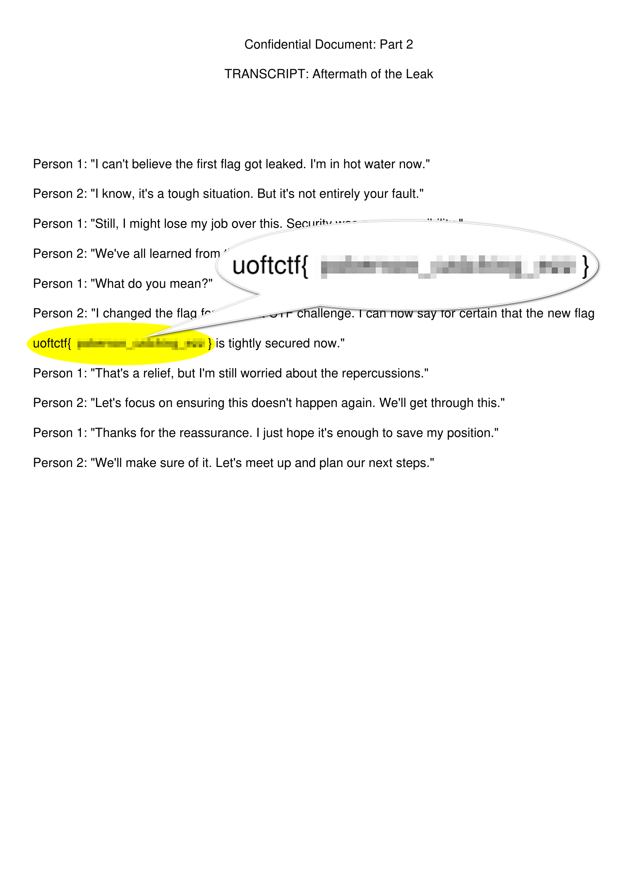
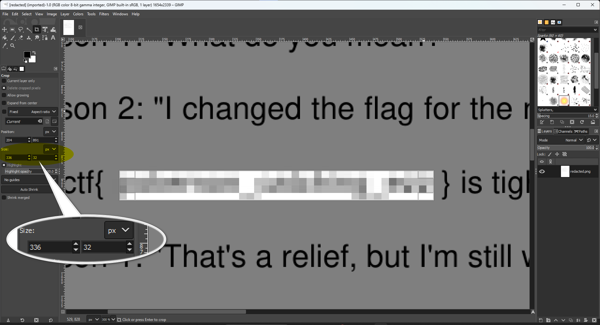
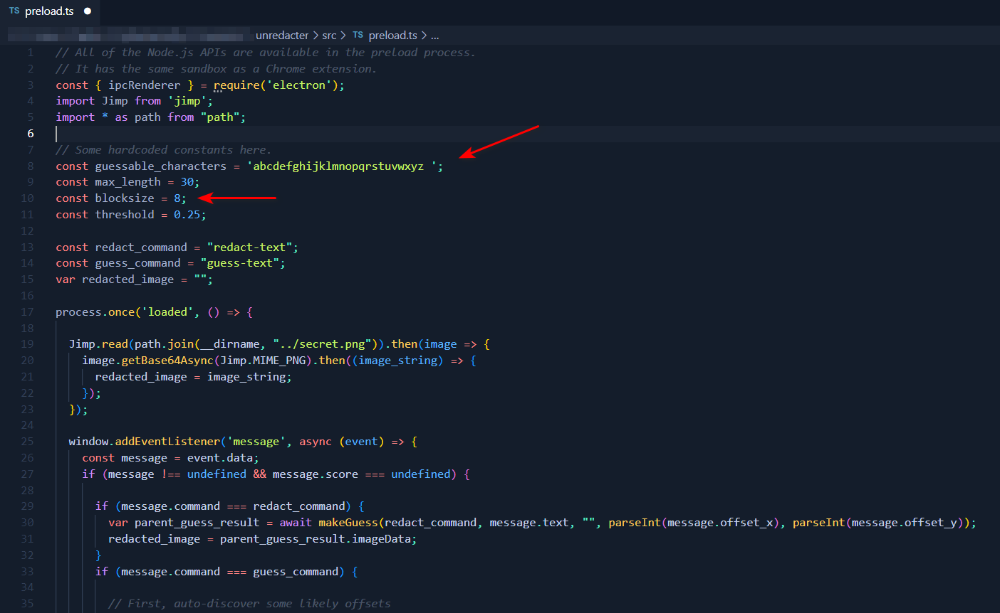
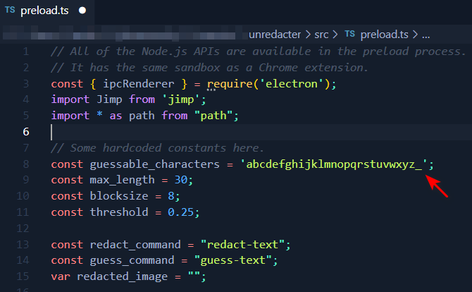
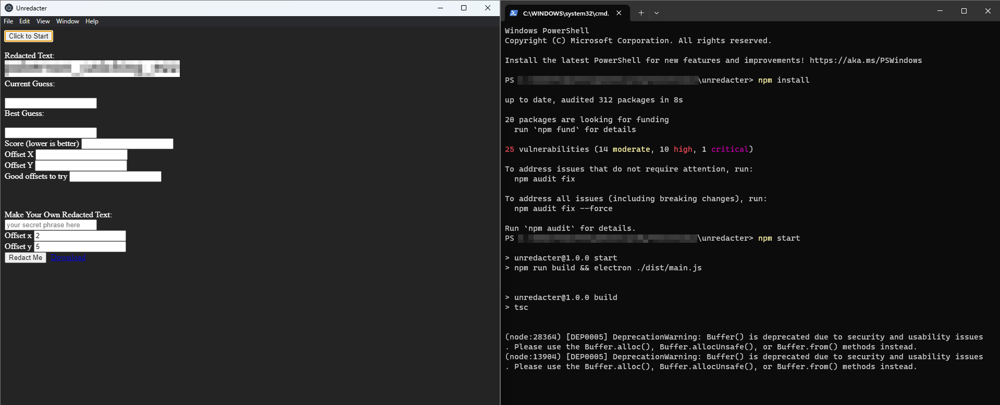
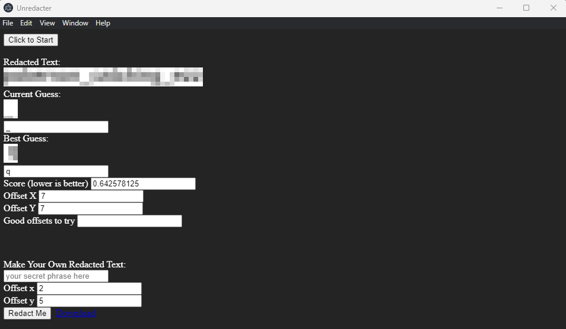
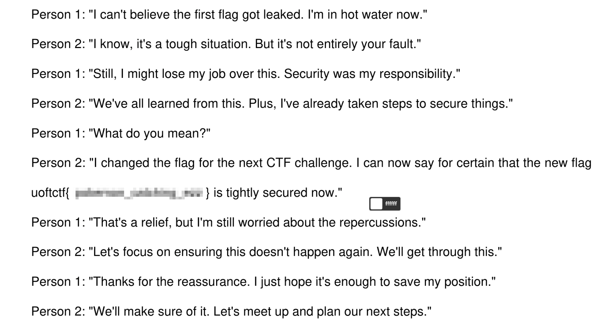
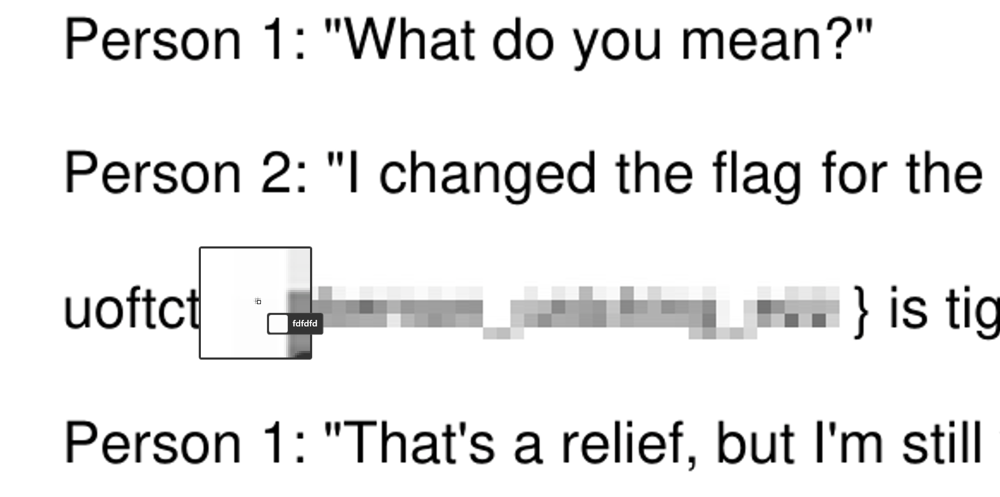
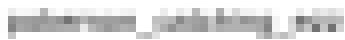
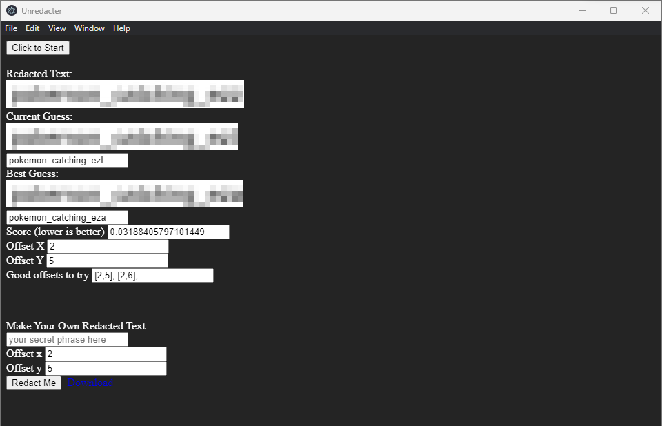

# UofTCTF2024_Secret-Message-2

> The super secret organization changed their flag again. Can you work your magic again? `Hint: The flag characters contain abcdefghijklmnopqrstuvwxyz\_`

## Solution

When we look at the given `png` file, we notice the redacted, pixelated text.

There is a tool called **[Unredacter](https://github.com/bishopfox/unredacter)** that can uncover redacted, pixelated text to reveal the original text.

This blog provides extensive information about the tool: https://bishopfox.com/blog/unredacter-tool-never-pixelation.

I'll follow the tool manual on how to use it.

## Cropping the image

I'll be using GIMP as recommended in the tool repo; we need to crop the image down to just the pixelated area.

Notice that each pixelated block size is `8x8 px'.

## Editing the tool configurations

Let's take a look at the character set the tool uses in the `preload.ts` file.

It's `abcdefghijklmnopqrstuvwxyz `

Going back to the challenge description, the hint states that there is an underscore in the flag characters, so let's add it to `guessable_characters` to make it look like this:

## Running the tool

We are now ready to start the tool. Run `npm start` and the tool GUI will pop up.

Hit the **Click to start** button.

The tool is stuck on the first character :(

## Troubleshooting

I spent some time on this. The problem is with our cropped image. I noticed a small difference in colors using a color selector in the block before and upward of the pixelated area. The whole page white color is `#ffffff`:

But the block before and upward of the pixelated area contains some other white shades like `#fefefe` and `#fdfdfd`, which means that it's a part of the pixelated area.

So I cropped the image again with one block before and upward of the previous pixelated area, so it looks like this:

### Getting the Flag

Now let's run the tool again:

**uoftctf{pokemon_catching_ezz}**
