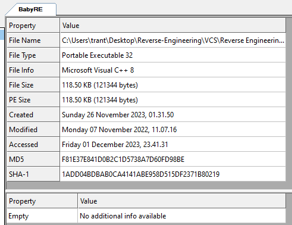
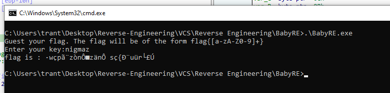
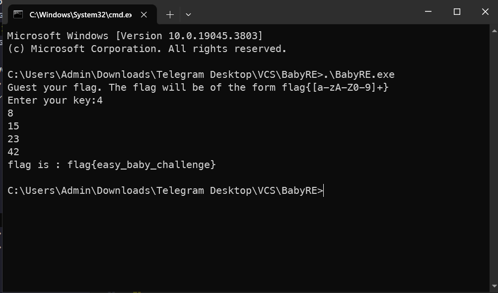

# BabyRE

> Just find the flag!

## [0]. Analysis Challenge

- File được cung cấp là file PE32 và bị sửa mất `file name extensions .exe` nên ta cần sửa lại đúng định dạng để chạy file.



- Sau khi thêm file name extensions .exe, thực thi file ta có được nhận xét đầu tiên đây là 1 chương trình yêu cầu nhập key, nếu key đúng thì flag sẽ được in ra.



- Tiến hành sử dụng IDA để đọc pseudocode của chương trình, đây là code hàm main sau khi mình đã rename và comment 1 số câu lệnh.

```c
int __cdecl main(int argc, const char **argv, const char **envp)
{
  unsigned int i; // esi
  int j; // edi
  char *tmp_ptr; // esi
  int tmp_idx; // ecx
  __int128 v8; // [esp+0h] [ebp-28h] BYREF
  int v9; // [esp+10h] [ebp-18h]
  int v10; // [esp+14h] [ebp-14h]
  __int16 v11; // [esp+18h] [ebp-10h]
  char key[8]; // [esp+1Ch] [ebp-Ch] BYREF
                                                // flag_encode
  v8 = xmmword_AFB6E0;			// 'gunmifun|iaQpndb'
  v9 = 1182494304;              // 'F{n'
  v10 = 1919444577;             // 'rhfa'
  v11 = 1111;                   // '\x04W'
                                // v8 -> v11 = 25 char
                                                // flag_encode
  _printf((int)"Guest your flag. The flag will be of the form flag{[a-zA-Z0-9]+}\n");
  _printf((int)"Enter your key:");
  for ( i = 0; i < 5; ++i )
    _scanf("%hhd", &key[i]);
  for ( j = 0; j < 26; j += 2 )
  {
    tmp_ptr = (char *)&v8 + j;
    *tmp_ptr ^= key[j % 5u];
    tmp_idx = j;
    tmp_ptr[1] ^= key[tmp_idx - 5 * ((unsigned int)&tmp_ptr[1 - (_DWORD)&v8] / 5) + 1];//
                                                // xor [esi+1], al ; al = key[(j+1)%5]
  }
  _printf((int)"flag is : %s\n", (const char *)&v8);
  return 0;
}
```

- Kiểm tra giá trị của 4 biến v8, v9, v10, v11 là một chuỗi **flag_encode[] = "bdnpQai|nufimnug`n{FafhrW"**.
- Tổng quan thì khi chạy chương trình, chuỗi trên được khởi tạo bằng cách gán giá trị vào 4 biến v8, v9, v10, v11 trên stack (đây được hiểu là chuỗi flag_encode), sau đó chương trình yêu cầu nhập key gồm 5 chữ số và flag là kết quả khi XOR key với flag_encode. `Quan trọng ở đây là cách hai chuỗi flag_encode và key được XOR với nhau để sinh ra flag`.
- Qui tắc là XOR flag_encode[] với key trong đó key được lặp lại 5 giá trị số đến khi hết chuỗi flag_encode[].

```asm

esi = &flag_encode[j]
-----------------------------------
xor     [esi], al     ; al = key[j%5]
…
xor     [esi+1], al   ; al = key[(j+1)%5]
…
flag_encode  [0] [1] [2] [3] [4] [5] [6] [7] [8] [9] [10] [...]
key          [0] [1] [2] [3] [4] [0] [1] [2] [3] [4] [0] [...]

```

## [1]. Solve Idea

- Ta sẽ tìm key dựa trên form flag là `flag{`, với 5 ký tự đầu của flag thật và flag_encode ta dễ dàng tìm được key đúng của challenges.

```python
Microsoft Windows [Version 10.0.19045.3803]
(c) Microsoft Corporation. All rights reserved.

C:\Users\Admin>python
Python 3.11.3 (tags/v3.11.3:f3909b8, Apr  4 2023, 23:49:59) [MSC v.1934 64 bit (AMD64)] on win32
Type "help", "copyright", "credits" or "license" for more information.
>>> flag_encode = "bdnpQ"
>>> flag = "flag{"
>>> for i in range(5):
...     print(ord(flag_encode[i])^ord(flag[i]))
...
4
8
15
23
42
>>>
```

- Key đúng là [4, 8, 15, 23, 42], nhận được flag: `flag{easy_baby_challenge}`


