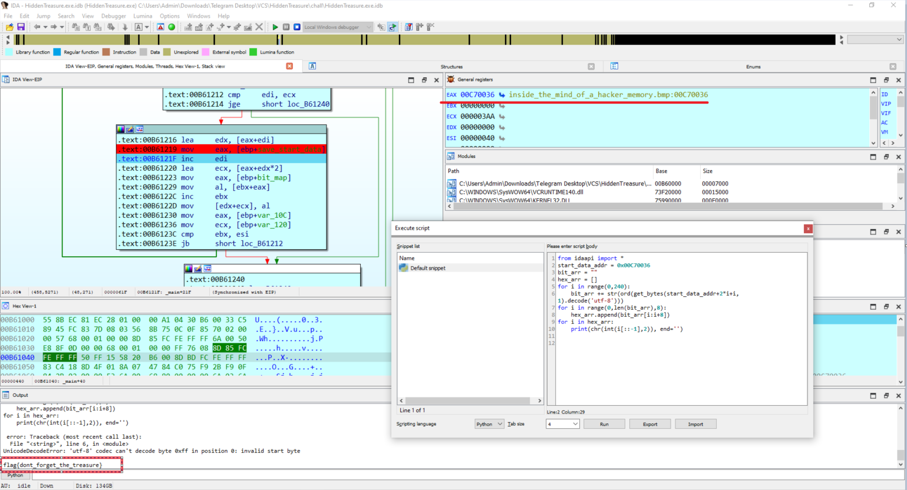

# Hidden Treasure

> There is more treasure in books than in all the pirate's loot on Treasure Island.

## [0]. Analysis Challenge

- File được cung cấp là file PE32 và đi cùng là một ảnh `.bmp`.


```ps1
./HiddenTreasure.exe inside-the-mind-of-a-hacker-memory.bmp stringSample
```

- Tổng quan về challenge thì mình thấy chương trình là file thực thi sẽ lấy input từ hai đối số là file ảnh `(file.bmp)` và chuỗi ký tự đầu vào `(string argv[2])` để chèn thông tin và giấu vào ảnh.

```c
 if ( argc == 3 )
  {
    memset(Dest, 0, sizeof(Dest));
    wcstombs(Dest, (const wchar_t *)argv[2], 0x100u);
    len_argv2 = strlen(Dest);
    if ( len_argv2 )
    {
      handle_FileW = CreateFileW((LPCWSTR)argv[1], 0xC0000000, 1u, 0, 3u, 0x80u, 0);// open image file.bmp
      ptr_v5 = handle_FileW;
      handle_v23 = handle_FileW;
      if ( handle_FileW != (HANDLE)-1 )
      {
        FileSize = GetFileSize(handle_FileW, 0);
        if ( FileSize == -1
          || (handle_FileMappingW = CreateFileMappingW(
                                      ptr_v5,
                                      0,
                                      4u,
                                      0,
                                      0,
                                      0),       // create file mapping file.bmp
              ptr_v8 = handle_FileMappingW,
              (handle_hObject = handle_FileMappingW) == 0) )
        {
          CloseHandle(ptr_v5);
          return 0;
        }
        ptr_lpBaseAddress = (char *)MapViewOfFile(handle_FileMappingW, 6u, 0, 0, 0);// mapping into memory process

```

- Đầu tiên là chương trình xử lý chuỗi muốn ẩn vào biến `Dest` và thực hiện mở và ánh xạ file ảnh `.bmp` vào process của chương trình đang chạy.

```c
        if ( ptr_lpBaseAddress )                // handle via pointer this
        {
          ptr_v9 = malloc(8 * len_argv2);
          v10 = 0;
          bit_map = ptr_v9;
          bit_cnt = 0;
          v32 = 0;
          do
          {
            v12 = Dest[v10];
            ptr_v9[bit_cnt] = v12 & 1;
            ptr_v9[bit_cnt + 1] = (v12 >> 1) & 1;
            ptr_v9[bit_cnt + 2] = (v12 >> 2) & 1;
            ptr_v9[bit_cnt + 3] = (v12 >> 3) & 1;
            ptr_v9[bit_cnt + 4] = (v12 >> 4) & 1;
            ptr_v9[bit_cnt + 5] = (v12 >> 5) & 1;
            ptr_v9[bit_cnt + 6] = (v12 >> 6) & 1;
            v10 = v32 + 1;
            ptr_v9[bit_cnt + 7] = (v12 >> 7) & 1;
            bit_cnt += 8;
            v32 = v10;
          }
          while ( v10 < len_argv2 );            // split string to single bit and mapping bit from string argv2 -> array in heap
```

- Chương trình tách chuỗi muốn ẩn vào trong ảnh thành các bit đơn và lưu nó vào mảng được cấp phát trên heap.

```c
         if ( *(_WORD *)ptr_lpBaseAddress == 0x4D42 && FileSize >= *(_DWORD *)(ptr_lpBaseAddress + 2) )// 0x4D42 signature file.bmp
          {
            v14 = *(_DWORD *)(ptr_lpBaseAddress + 10);
            if ( v14 < FileSize && bit_cnt < *(_DWORD *)(ptr_lpBaseAddress + 34) )
            {
              cnt = 0;
              width = *(_DWORD *)(ptr_lpBaseAddress + 18);
              height = *(_DWORD *)(ptr_lpBaseAddress + 22);
              ptr_v17 = &ptr_lpBaseAddress[v14];
              c_height = 0;
              v25 = width;
              save_start_data = ptr_v17;
              *((_WORD *)ptr_lpBaseAddress + 3) = bit_cnt;
              v33 = 0;
              if ( bit_cnt )
              {
                v19 = 0;
                v31 = 0;
                do
                {
                  if ( c_height >= height )
                    break;
                  v20 = 0;
                  if ( cnt < bit_cnt )
                  {
                    do
                    {
                      if ( v20 >= width )
                        break;
                      v21 = v19 + v20++;
                      bit_value = bit_map[cnt++];
                      save_start_data[2 * v21 + v21] = bit_value;// save bit to image
                                                // ptr_v26 = &ptr_lpBaseAddress[v14]
                      v19 = v31;
                      width = v25;
                    }
                    while ( cnt < bit_cnt );
                    c_height = v33;
                  }
                  ++c_height;
                  v19 += 3 * width;
                  v33 = c_height;
                  v31 = v19;
                }
                while ( cnt < bit_cnt );
                ptr_v13 = ptr_lpBaseAddress;
              }
              ptr_v9 = bit_map;
            }
          }
          free(ptr_v9);
          UnmapViewOfFile(ptr_v13);
          CloseHandle(handle_hObject);
          CloseHandle(handle_v23);
        }
```

- Chương trình kiểm tra file header (check signature 0x4D42 của file.bmp và kiểm tra FileSize) và tiến hành xử lý ẩn thông điệp do ta truyền vào trong file.

- Thông điệp sẽ được ẩn vào các byte không nằm liền kề nhau trong file ảnh và các byte đó tuân theo quy tắc như sau `save_start_data[2 * v21 + v21] = bit_value` với điều kiện `while(cnt < bit_cnt)` và `*((_WORD *)ptr_lpBaseAddress + 3) = bit_cnt;`, như vậy nếu có địa chỉ của biến `save_start_data` (lấy được khi debug) và `bit_cnt` (theo như đoạn code tham chiếu đến là byte thứ 6 trong ảnh) thì mình code 1 đoạn script theo quy tắc trên và có thể dễ dàng truy vấn thông tin được ẩn.

- Flag của bài này chính là chuỗi có sẵn trong ảnh trước lần ẩn thông điệp đầu tiên của mình (bạn có thể thấy ảnh dưới mình ẩn vào 1 thông điệp ngắn và nó không ghi đè hết flag ban đầu dẫn đến ở cuối là 1 chuỗi có ý nghĩa).


## [1]. Solve Idea

- Lấy giá trị của `bit_cnt` để code lại đoạn script truy vấn thông tin được ẩn.


- Lấy địa chỉ bắt đầu của thông điệp bị ẩn trong ảnh thông qua debug (địa chỉ này thay đổi tương ứng với mỗi lần chạy chương trình).


- Lấy flag `flag{dont_forget_the_treasure}`:

```python
from idaapi import *
start_data_addr = 0x01610036
bit_arr = ""
hex_arr = []
for i in range(0,240):
    bit_arr += str(ord(get_bytes(start_data_addr+2*i+i, 1).decode('utf-8')))
for i in range(0,len(bit_arr),8):
    hex_arr.append(bit_arr[i:i+8])
for i in hex_arr:
    print(chr(int(i[::-1],2)), end='')
```


