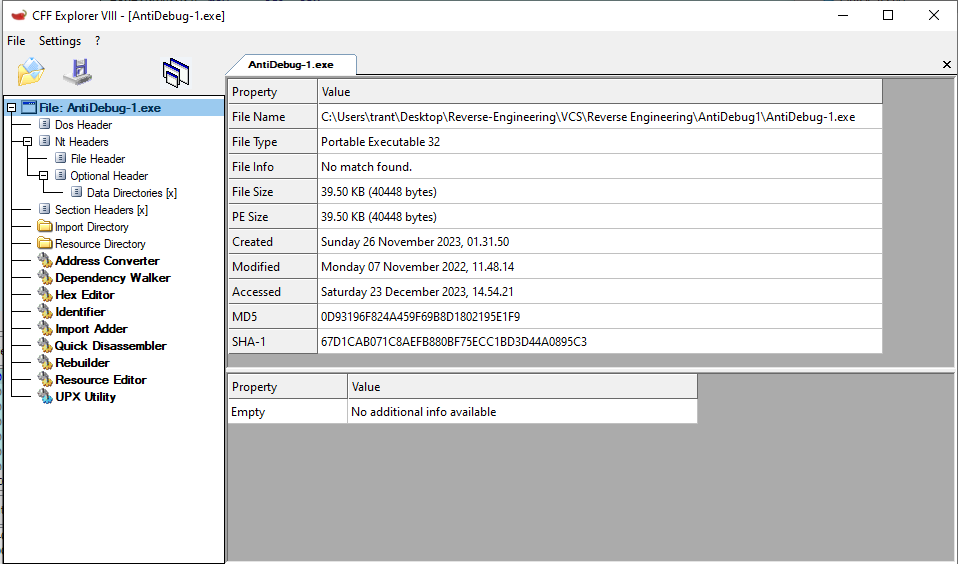
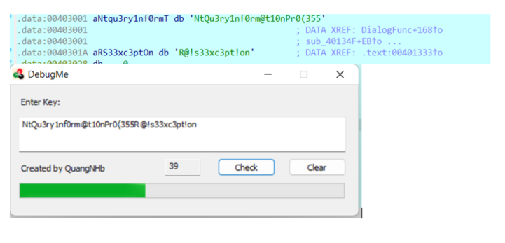
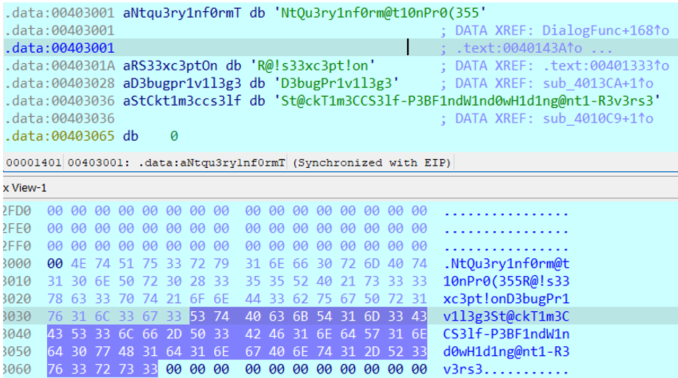

# Anti Debug 1->9

> Lưu ý: File chỉ chạy được trên môi trường Windows XP.

## [0]. Analysis Challenge

- File được cung cấp là file PE32 và yêu cầu là chỉ run được trên hệ điều hành WindowsXP.

- `WM_INITDIALOG`: Hàm `sub_401757()`

### [+] Stage-1: WinAPI SetUnhandledExceptionFilter()

- Sử dụng IDA để decompile chương trình bắt đầu từ hàm `_start()`, chương trình sử dụng win API SetUnhandledExceptionFilter để xử lí ngoại lệ nếu chạy dưới debugger, khi debug câu lệnh div eax báo lỗi lí do là eax = 0 thì ko thể chia cho 0.

- `Bypass`: Patch thành byte `NOPs` toàn bộ phần xử lý exception.

### [+] Stage-2: WinAPI IsDebuggerPresent()

- Tiếp tục phân tích hàm `DialogFunc()` được gọi khi sử dụng WM_INITDIALOG từ syntax `DialogBoxParamA`, kỹ thuật anti-debug được sử dụng `IsDebuggerPresent` kiểm tra flag BeingDebugged của PEB struct có được đặt giá trị là đang debug hay không:
  - NtGlobalFlag : offset 0x68 trong PEB
  - ProcessHeap :
    - Flags (offset 0x0C ) set HEAP_GROWABLE(2) nếu debug.
    - ForceFlags (offset 0x10) set 0 nếu debug.

- `Bypass`: Ta thấy có các lệnh nhảy dẫn tới các luồng thực thi kết thúc chương trình khi kiểm tra các trường giá trị trong struct => ko cho thực hiện các lệnh nhảy đó.

### [+] Stage-3: WinAPI NtQueryInformationProcess()

- Sử dụng NtQueryInformationProcess để kiểm tra debugger. với trường ProcessInformationClass = 7 ProcessDebugPort ( kĩ thuật tương tự trong bài simple antidebug).

- `Bypass`: Nếu phát hiện debugger thì giá trị dword_303714 sẽ khác không giá trị dword_4010A4 sẽ bị thay đổi ảnh hưởng tới flag sinh ra sau này, bypass nop dòng này.

### [+] Stage-4: WinAPI NtSetInformationThread()

- Tiếp tục chương trình có hàm sub_401284 hàm này có vẻ IDA phân tích sai (do anti-disassembly), ta define lại code dòng này.

- Hàm `sub_401284()` -> `sub_401290()` -> `call loc_40129c()` -> call hàm `sub_401525()`

- Đây là 1 kỹ thuật anti-debug, NtSetInformationThread có thể ẩn 1 luồng khỏi debugger (ThreadInformationClass = 0x11) sau khi ẩn thì ctrinh tiếp tục thực thi nhưng ko nhận được các sự kiện liên quan tới luồng đã ẩn. nếu ta đặt breakpoint trong luồng đã ẩn chương trình sẽ bị lỗi.

- `Bypass`: Nops mã assembly của dòng call api.

### [+] Stage-5: WinAPI CheckRemoteDebuggerPresent()

- Tiếp tục thì chương trình lại gọi tới hàm sub_401525 (giống hàm phía trên) hàm này sẽ cho ta được đoạn flag tiếp theo.

- Nếu phát hiện debugger thì tham số pbDebuggerPresent giá trị khác 0 => chương trình nhảy vào luồng kết thúc.

- `Bypass`: Bypass bỏ qua lệnh jump tới ExitProcess.

### [+] Stage-6: WinAPI CreateToolhelp32Snapshot()

- Tiếp tục decompile chương trình:

- Lấy ra tên tiến trình con và ID tiến trình con, Ở đây chương trình kiểm tra nhưng ở đây chương trình kiểm tra xem tên các tiến trình có tồn tại, "Antidebug.exe;exp; csrss" (hàm này được gọi 3 lần).

- `Bypass`:

### [+] Stage-7: WinAPI GetTickCount()

- Tiếp theo chương trình sử dụng hàm GetTickCount hàm này sẽ kiểm tra xem chương trình nếu như đã chạy lâu bất thường thì có khả năng đây là debugger làm cho tiến trình bị thoát.

- `Bypass`: Ở đây sửa thành jmp short loc_401095 đây cũng là hàm cho ra đoạn flag cuối.

## [1]. Solve Idea

- Sau Stage-4 hàm này cũng show ra đoạn flag đầu tiên

- Tiếp tục thì chương trình lại gọi tới hàm sub_401525 (giống hàm phía trên) hàm này sẽ cho ta được đoạn flag tiếp theo

- Sau Stage-7 thì có được flag hoàn chỉnh là `NtQu3ry1nf0rm@t10nPr0(355R@!s33xc3pt!onD3bugPr1v1l3g3St@ckT1m3CCS3lf-P3BF1ndW1nd0wH1d1ng@nt1-R3v3rs3`.

> `NOTE`: Bài này nó sẽ tự decrypt bytecode lúc chạy để check input, có 1 cách khác nữa thay vì lấy flag thông qua debug là đọc hiểu code, lúc đấy thì phải biết cách viết script tự decrypt để phân tích tĩnh rồi tìm chỗ nào quan trọng để debug.

## [2]. References

- https://hackmd.io/@AWXkSundSBCbyTFFTFC98Q/rkN0ktSjo
