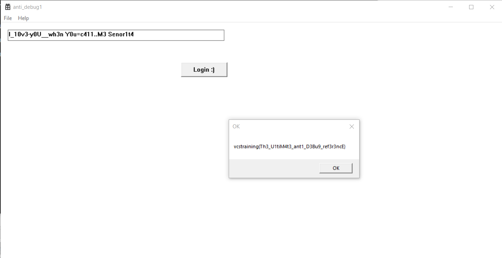

# Simple Anti Debug

> Just find the flag!

## [0]. Analysis Challenge

- File được cung cấp là file PE32 và `yêu cầu thực thi chương trình sử dụng quyền Administrator`, nhìn tên của challenge ta đoán được bài sử dụng kỹ thuật anti-debug.


- Chạy chương trình ta có đánh giá đầu tiên đây là chương trình yêu cầu nhập key và nếu key đúng thì sẽ có được flag -> mục đích là cần tìm key đúng.


### [+] Stage-1:

- Phân tích code chương trình, có hàm `TlsCallback_0()` nên kiểm tra trước vì:

  - TLS (Thread Local Storage) CallBack là 1 cơ chế của cho phép hàm này được gọi khi 1 luồng được tạo. Đây là 1 mẹo để chống debug Code trong hàm này sẽ được thực thi trước thời điểm tệp thực thi được thực hiện nó sẽ kiểm tra sự hiện diện của debugger.
  - Tóm tắt là các kỹ thuật kiểm tra xem chương trình có đang ở trạng thái debug không được đặt ở hàm TlsCallback thay vì main (hoặc WinMain) do chương trình sẽ gọi hàm TLSCallback trước khi đến entrypoint của chương trình.


- Hàm `TLSCallback()` gọi hai hàm để resolve địa chỉ của hàm `NtQueryInformationProcess()` và tương ứng với cách setup argument thì kỹ thuật được sử dụng là `NtQueryInformationProcess - ProcessDebugPort`.

  - Vậy hướng chạy khi thực thi của chương trình sẽ không đi qua label being_debug.
  - Nếu chương trình đang được debug thì dữ liệu tại unk_685018+0Ah sẽ mang giá trị 74h. Đổi tên thành g_data để xem chương trình làm gì với dữ liệu này.

### [+] Stage-2:

- Luồng thực thi chương trình WinMain có đoạn yêu cầu chạy dưới quyền Administrator.


- Hàm `mainFollow()` định nghĩa struct `WNDCLASSEXW` làm đối số gọi hàm `RegisterClassExW`, từ đây ta xác định follow thực thi chính của chương trình.


- Trong hàm `mainHandle` đầu tiên xử lý dữ liệu, tiếp đó là gọi các hàm ứng với các case được xử lý (các case là tùy vào mảng global option) trong đó cả ba case đều có điểm chung là xử lý dữ liệu tại 2 biến `dword_703360` và `dword_7033F8`.

### [+] Stage-3:

- Chỉnh sửa giá trị của eax để jump đến case xử lý và phân tích code của từng case.

- `Case-1: NtGlobalFlag`:

  - https://anti-debug.checkpoint.com/techniques/debug-flags.html#manual-checks-ntglobalflag

  

  - Chương trình check có nằm trong môi trường debug hay không ? nếu có `NtGlobalFlag` được đặt giá trị là 0x70 và dl = 1.
  - Hàm `handleChar()` được gọi và nếu phát hiện debug thì tham số thứ nhất là dl = 1.
  - `Giá trị của tham số thứ nhất khi chương trình không debugger là 0`.

- `Case-2: HeapFlag | Flags`:

  - https://anti-debug.checkpoint.com/techniques/debug-flags.html#manual-checks-heap-flags

  

  - Chương trình kiểm tra debugger bằng field `Flags` có offset 0xC so với heapbase.
  - Nếu phát hiện debug v11 = 0x40000062 hay v11!= 1073741922 => false => tham số thứ nhất có giá trị là 0.
  - `Giá trị của tham số thứ nhất khi chương trình không debugger là 1`.

- `Case-3: HeapFlag | ForceFlags`:

  - https://anti-debug.checkpoint.com/techniques/debug-flags.html#manual-checks-heap-flags

  

  - Chương trình kiểm tra debugger bằng field `Force Flags` có offset 0x10 so với heapbase.
  - Nếu phát hiện debug != 0x40000060 => false => tham số thứ nhất có giá trị là 0.
  - `Giá trị của tham số thứ nhất khi chương trình không debugger là 1`.

- `Case-4: The heap`:

  - https://anti-debug.checkpoint.com/techniques/debug-flags.html#manual-checks-heap-protection

  

  - Kiểm tra debug bằng cách kiểm tra nếu cờ HEAP_TAIL_CHECKING_ENABLED được đặt thì sẽ thêm 2 chuỗi 0xABABABAB (tổng cộng 8 AB) vào cuối heap được phân bổ .

  ```
  Tại sao đặt ABABABAB
  0xabababab là mẫu bit cho khối bảo vệ sau khi bộ nhớ được cấp phát bằng HeapAlloc(), LocalAlloc(LMEM_FIXED), GlobalAlloc(GMEM_FIXED) or CoTaskMemAlloc()
  Nếu thấy mẫu bit 0xabababab, điều đó có nghĩa là đang đọc bộ nhớ sau một khối bộ nhớ đã được cấp phát bởi HeapAlloc(), LocalAlloc(LMEM_FIXED), GlobalAlloc(GMEM_FIXED) hoặc CoTaskMemAlloc().

  ```

  - Nếu phát hiện debug thì check = 1 => tham số thứ nhất có giá trị là 1.
  - `Giá trị của tham số thứ nhất khi chương trình không debugger là 0`.

- `Case-5: CreateToolhelp32Snapshot`:

  - https://anti-debug.checkpoint.com/techniques/misc.html#parent-process-check-createtoolhelp32snapshot

  

  - Lấy id tiến trình gốc và tên tiến trình gốc và kiểm tra nếu debug thì giá trị tham số thứ nhất là 1.
  - `Giá trị của tham số thứ nhất khi chương trình không debugger là 0`.

- `Case-6: BlockInput`:

  - https://anti-debug.checkpoint.com/techniques/interactive.html#blockinput

  

  - Gọi BlockInput 2 lần với tham số đầu vào đều là 1 (true). v7 sẽ trả về true (mặc định) còn v8 nếu có debug thì v8 sẽ trả về true (bình thường sẽ trả về false) => `ngăn chặn debug bằng cách thực hiện BlockInput 2 lần`.
  - Ở đây byte_7355B8 = 0 nên ko thực hiện dòng 13->17 -> Vì vậy nếu có debug thì v7 == v8 hay tham số đầu thứ nhất có giá trị là 0.
  - `Giá trị của tham số thứ nhất khi chương trình không debugger là 1`.

- `Case-7: NtQueryInformationProcess | ProcessDebugFlags`:

  - https://anti-debug.checkpoint.com/techniques/debug-flags.html#using-win32-api-ntqueryinformationprocess

  

  - Với trường ProcessInformation = 0x1F 1 cấu trúc EPROCESS được gọi đến. Trong cấu trúc này có trường NoDebugInherit giá trị của trường này được trả về tại ProcessInformation nếu giá trị trả về tại đây khác 0 báo hiệu chương trình đang chạy dưới debugger.
  - Chương trình sẽ đặt giá trị tham số thứ nhất = 0 nếu như đang debug.
  - `Giá trị của tham số thứ nhất khi chương trình không debugger là 1`.

- `Kết luận`:
  - Sau tất cả các case chúng ta thấy rằng chương trình sẽ đều gọi hàm `handleChar()` và trả về giá trị để xor với cipher nhằm sinh key. Hàm `handleChar()` nhận đầu vào là ba tham số:
    - Thứ nhất là checkDbeug: gái trị này là 0 hoặc 1 tùy với từng case.
    - Thứ hai là data: giá trị của mảng này được khởi tạo ở đầu hàm chekcDebugging, ta có thể lấy giá trị này khi debug.
      
    - Thứ ba là biến `g_const` nằm ở 0x703360.

## [1]. Solve Idea

- Ta sẽ lấy nguyên hàm `handleChar()` của chương trình và code lại các switch case tương ứng nhằm xử lý dữ liệu để lấy được key đúng.

- Biến cipher ...

```c
#include<stdio.h>

#define _DWORD unsigned __int32
#define _WORD unsigned __int16

char gen_const(char a1, unsigned __int8 *a2, int a3)
{
  int v4; // esi
  char v6; // bl
  int v7; // ecx
  unsigned __int16 v8; // dx
  unsigned int v9; // edx
  char v10; // cl
  unsigned int v11; // edx
  unsigned __int8 v12; // al
  bool v13; // zf
  unsigned __int8 *v14; // ecx
  int v15; // esi
  char v16; // dl
  int v18; // [esp+14h] [ebp+8h]

  v4 = a3 - 1;
  v18 = 171;
  v6 = 0;
  do
  {
    if ( v4 <= 5 )
    {
      if ( *(_DWORD *)&a2[4 * v4 + 16] )
        v8 = *(_WORD *)&a2[4 * v4 + 16];
      else
        v8 = *(_WORD *)&a2[4 * v4];
      v7 = (v8 >> 1) | (unsigned __int16)(((unsigned __int16)(32 * v8) ^ (v8 ^ (unsigned __int16)(4 * (v8 ^ (2 * v8)))) & 0xFFE0) << 10);
      *(_DWORD *)&a2[4 * v4 + 16] = v7;
    }
    else
    {
      v7 = 0;
    }
    v9 = v7 & 0x7FF;
    v10 = v7 & 7;
    v11 = v9 >> 3;
    if ( a1 )
      v12 = a2[v11 + 44];
    else
      v12 = ~a2[v11 + 44];
    v13 = v18-- == 1;
    a2[v11 + 44] = v12 ^ (1 << v10);
  }
  while ( !v13 );
  v14 = a2 + 46;
  v15 = 64;
  do
  {
    v16 = *(v14 - 2);
    v14 += 4;
    v6 ^= *(v14 - 4) ^ *(v14 - 3) ^ *(v14 - 5) ^ v16;
    --v15;
  }
  while ( v15 );
  return v6;
}

int main(){
 	unsigned __int32 index_table[] = {9, 18, 15, 3, 4, 23, 6, 7, 8, 22, 10, 11, 33, 13, 14, 27, 16, 37, 17, 19, 20, 21, 5, 34, 24, 25, 26, 2, 12, 29, 30, 31, 32, 28, 0, 35, 36, 1};
	unsigned __int32 g_const[] = {1, 3, 1, 1, 2, 1, 3, 1, 2, 2, 4, 4, 1, 3, 4, 4, 4, 1, 2, 1, 4, 1, 4, 3, 1, 2, 4, 4, 2, 2, 1, 3, 4, 2, 1, 2, 2, 3};
	unsigned __int8 default_const[] = {54,236,0,0,54,237,0,0,54,187,0,0,54,140,0,0,0,0,0,0,0,0,0,0,0,0,0,0,0,0,0,0,95,0,0,0,0,0,0,0,0,0,0,0,0,0,0,0,0,0,0,0,0,0,0,0,0,0,0,0,0,0,0,0,0,0,0,0,0,0,0,0,0,0,0,0,0,0,0,0,0,0,0,0,0,0,0,0,0,0,0,0,0,0,0,0,0,0,0,0,0,0,0,0,0,0,0,0,0,0,0,0,0,0,0,0,0,0,0,0,0,0,0,0,0,0,0,0,0,0,0,0,0,0,0,0,0,0,0,0,0,0,0,0,0,0,0,0,0,0,0,0,0,0,0,0,0,0,0,0,0,0,0,0,0,0,0,0,0,0,0,0,0,0,0,0,0,0,0,0,0,0,0,0,0,0,0,0,0,0,0,0,0,0,0,0,0,0,0,0,0,0,0,0,0,0,0,0,0,0,0,0,0,0,0,0,0,0,0,0,0,0,0,0,0,0,0,0,0,0,0,0,0,0,0,0,0,0,0,0,0,0,0,0,0,0,0,0,0,0,0,0,0,0,0,0,0,0,0,0,0,0,0,0,0,0,0,0,0,0,0,0,0,0,0,0,0,0,0,0,0,0,0,0,0,0,0,0,0,0,0,0,0,0,0,0,0,0,0,0,0,0,0,0,0,0,0,0,0,0,0,0,0,0,0,0,0,0,0,0,0,0,0,0,0,0,0,0,0,0,0,0,0,0,0,0,0,0,0,0,0,0,0,0,0,0,0,0,0,0,0,0,0,0,0,0,0,0,0,0,0,0,0,0,0,0,0,0,0,0,0,0,0,0,0,0,0,0,0,0,0,0,0,0,0,0,0,0,0,0,0,0,0,0,0,0,0,0,0,0,0,0,0,0,0,0,0,0,0,0,0,0,0,0,0,0,0,0,0,0,0,0,0,0,0,0,0,0,0,0,0,0,0,0,0,0,0,0,0,0,0,0,0,0,0,0,0,0,0,0,0,0,0,0,0,0,0,0,0,0,0,0,0,0,0,0,0,0,0,0,0,0,0,0,0,0,0,0,0,0,0,0,0,0,0,0,0,0,0,0,0,0,0,0,0,0,0,0,0,0,0,0,0,0,0,0,0,0,0,0,0,0,0,0,0,0,0,0,0,0,0,0,0,0,0,0,0,0,0,0,0,0,0,0,0,0,0,0,0,0,0,0,0,0,0,0,0,0,};
	unsigned __int8 cipher[] = {14,235,243,246,209,107,167,143,61,145,133,43,134,167,107,219,123,110,137,137,24,149,103,202,95,226,84,14,211,62,32,90,126,212,184,16,194,183,0,0};
	unsigned __int32 program[] = {6, 1, 7, 1, 3, 2, 4, 3, 6, 3, 7, 6, 1, 4, 7, 4, 1, 5, 7, 6, 7, 5, 6, 4, 5, 1, 7, 5, 2, 3, 1, 2, 3, 2, 1, 6, 2, 4};

 	unsigned char tmp;
  	unsigned char key[40];

	for(int i=0;i<38;i++){
		switch(program[i]){
			case 1:
				tmp = gen_const(0,default_const,g_const[i]);
				key[index_table[i]] = cipher[i]^tmp;
				break;
			case 2:
				tmp = gen_const(1,default_const,g_const[i]);
				key[index_table[i]] = cipher[i]^tmp;
				break;
			case 3:
				tmp = gen_const(1,default_const,g_const[i]);
				key[index_table[i]] = cipher[i]^tmp;
				break;
			case 4:
				tmp = gen_const(0,default_const,g_const[i]);
				key[index_table[i]] = cipher[i]^tmp;
				break;
			case 5:
				tmp = gen_const(0,default_const,g_const[i]);
				key[index_table[i]] = cipher[i]^tmp;
				break;
			case 6:
				tmp = gen_const(1,default_const,g_const[i]);
				key[index_table[i]] = cipher[i]^tmp;
				break;
			case 7:
				tmp = gen_const(1,default_const,g_const[i]);
				key[index_table[i]] = cipher[i]^tmp;
				break;
			default:
				break;

		}
	}
	printf("%s",key);
	return 1;
}
```

- Run chương trình ta lấy được key `I_10v3-y0U__wh3n Y0u=c411..M3 Senor1t4`, nhập key lấy được flag `vcstraining{Th3_U1tiM4t3_ant1_D3Bu9_ref3r3ncE}`.



## [2]. References

- https://hackmd.io/@AWXkSundSBCbyTFFTFC98Q/ryaDxt-wi
