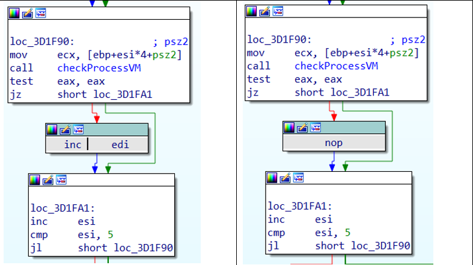

# antix1

> What is the flag?

## [0]. Analysis Challenge

- File được cung cấp là file PE32.


- Dùng IDA phân tích file, chương trình có hai luồng thực thi và ở đây ta sẽ tiến hành phân tishc luồng thực thi thứ 1 để tìm key đầu vào của chương trình.

- `Luồng thực thi với không có tham số đầu vào argc == 1`: Chương trình sẽ dùng hàm antiVM để kiểm tra xem có VM hay không nếu có thì sẽ thay đổi giá trị của v10 => làm cho chương trình giải mã ra kết quả bị sai. Cần phải làm cho v10 có giá trị chính xác việc giải mã ra v11 chính xác.


- Tiến hành phân tích hàm antiVM: có tất cả 10 key và key này sẽ ảnh hưởng tới giá trị trả về của hàm.

### [+] Stage-1:

- `Key[0] checkRegisterKey`: Kiểm tra bằng `RegOpenKeyExW` và `RegQueryValueExW`.
  - RegOpenKeyExW mở register key được chỉ định.
  - RegQueryValueExW truy xuất loại và dữ liệu được liên kết với giá trị của khóa register key được chỉ định.


- Hai hàm này nếu thành công sẽ trả về ERROR_SUCCESS (0x0) => cả 2 câu lệnh if đều đúng => giá trị trả về là của hàm checkRegisterKey = 1 => giá trị v[0] tăng lên => key[0] bị sai.


- `Bypass`: Vá Nops hoặc bỏ qua lệnh nhảy có điều kiện mã ASM của câu lệnh v0++ => làm cho giá trị v0 không đổi và = 4.


### [+] Stage-2:

- `Key[1] checkRegisterKey`: Kiểm tra VM bằng cách check register key của VMware tool.

- Kiểm tra `SOFTWARE\\VMware, Inc.\\VMware Tools` nếu mở được thì v3 = 14 và key[1]=byte_403B28[14] nếu ko mở được thì key[1]=byte_403B28[13]. (Ở đây key là v2).


- `Bypass`: Cả hai trường hợp đều để giá trị của v13 = 13.


### [+] Stage-3:

- `Key[2] GetFileAttributesW`: Kiểm tra trong `system32\\drivers\\` có `drivers virtual machine` hay ko bằng hàm GetFileAttributesW.

  - `GetFileAttributesW` truy xuất các thuộc tính hệ thống tệp cho 1 tệp hoặc thư mục chỉ định.
  - Nếu thất bại trả về `INVALID_FILE_ATTRIBUTES` và ngược lại nếu chức năng thành công, giá trị trả về chứa các thuộc tính của tệp hoặc thư mục đã chỉ định. Nếu thành công và trả về `FILE_ATTRIBUTE_DIRECTORY` 16 (0x10) thì xác định đây là một thư mục.


- `Bypass`: Sửa giá trị mã ASM dù drivers vm tồn tại thì cũng không tăng giá trị v7.


### [+] Stage-4:

- `Key[3] GetFileAttributesW`: Dùng `GetFileAttributesW` tương tự Key[2] kiểm tra tệp tin `C:\Program Files (x86)\VMWare\` có tồn tại hay không.


- `Bypass`: bằng cách cho v12=86 =>(key[3]= 86).


### [+] Stage-5:

- `Key[4] GetAdaptersInfo`: Dùng GetAdaptersInfo (dùng để truy xuất thông tin Adapter của máy) để kiểm tra địa chỉ MAC của máy.


- `Bypass`: bằng cách bỏ qua dòng 167 làm cho v8 ko bị thay đổi và v8 = 0.


### [+] Stage-6:

- `Key[5] GetAdaptersInfo`: Tương tự Key[4] nhưng là kiểm tra thông tin Adapter.


- `Bypass`: bằng cách đặt giá trị v23 luôn bằng 19.


### [+] Stage-7:

- `Key[6] CreateFileW`: Sử dụng CreateFileW để kiểm tra sự tồn tại của VMWare Host Guest File System (HGFS), VMWare Virtual Machine Communication Interface (vmci).
  - Với dwCreationDisposition = 3 OPEN_EXISTING hàm sẽ thực hiện chức năng mở tệp nếu tệp tồn tại nếu thành công trả về 1 handle. Nếu không thành công thì trả về INVALID_HANDLE_VALUE và trong trường hợp dwCreationDisposition = 3 OPEN_EXISTING khi nhận thông tin mở rộng về lỗi ERROR_FILE_NOT_FOUND (2).


- `Bypass`: bằng cách cho v23 ko đổi.


### [+] Stage-8:

- `key[7]  CreateToolhelp32Snapshot - Process32FirstW- Process32NextW`: Kiểm tra sự tồn tại của các process Vmware.


- `Bypass`: bằng cách cho v25 ko đổi.



### [+] Stage-9:

- `key[8]`: Hàm thực hiện gọi hàm `sub_401890()` liên tục gọi các hàm như `EnumSystemFirmwareTables`, `GetNativeSystemInfo`, `GetProductInfo`, `GetSystemFirmwareTable`, `IsWow64Process`, `LdrEnumerateLoadedModules` để kiểm tra thông tin máy có đang được sử dụng là máy ảo hay không.


- `Bypass`: Bằng cách cho v25 luôn bằng 10.


### [+] Stage-10:

- `key[9]` thì luôn mặc định bằng 0 nên không phải làm gì.

- `Bypass`:


- Cuối cùng là kết thúc chương trình.

## [1]. Solve Idea

- Sau khi vượt qua các kĩ thuật anti VM ở luồng thực thi này ta chạy chương trình có được:


- Key là BROKENVM ta sẽ sử dụng key này để phân tích luồng thực thi còn lại và tìm ra flag:

  - `Nếu argc==2` tức là có tham số đầu vào: Chương trình tiền hành biển đổi dựa trên key nhập vào và chuỗi aN đã được cấp phát tiến hành tạo ra flag. Nếu key nhập vào đúng thì sẽ in ra flag đúng. Nếu phân tích hàm này thì hàm này sử dụng mã RC4 để biến đổi mảng aN với key là `BROKENVM` để ra flag (Ở đoạn này cần vá `jnz     short loc_982320` -> `jz     short loc_982320` trong luồng thực thi này do có anti-vm `CPUID` được sử dụng ở đây).
  - Ở đoạn này ta có thể lấy được flag của chương trình khi đã có được `secretkey` và các yếu tố khác bằng cách code lại 1 chương trình.

- `FLAG`: `vcstraining{Running_in_VM_is_ridiculous}`.


- Code C:

```c
#include <iostream>
#include <cstring> // Thêm thư viện này để sử dụng hàm strlen và malloc
using namespace std;

// Định nghĩa hàm KSA và PRGA ở đây
void KSA(unsigned char s[], unsigned char key[], unsigned int keyL) {
    // Thực hiện việc khởi tạo S-box theo thuật toán KSA
    // ...
}

unsigned char* PRGA(unsigned char s[], unsigned int messageL) {
    // Thực hiện việc tạo keystream theo thuật toán PRGA
    // ...
    return nullptr; // Thay bằng giá trị cụ thể của keystream
}

unsigned char* RC4(unsigned char* plaintext, unsigned char* ciphertext, unsigned char* key, unsigned int keyL, unsigned int messageL) {
    unsigned char s[256]; // Khai báo biến s ở đây
    unsigned char* keystream;
    KSA(s, key, keyL);
    keystream = PRGA(s, messageL);

    for (unsigned int i = 0; i < messageL; i++) {
        ciphertext[i] = plaintext[i] ^ keystream[i];
    }
    return ciphertext;
}

int main() {
    unsigned char aN[] = {
        241, 6, 180, 254, 70, 231, 220, 160, 113, 103,
        145, 43, 72, 230, 135, 149, 58, 45, 163, 15,
        140, 193, 68, 176, 134, 200, 31, 105, 9, 197,
        144, 134, 51, 59, 143, 163, 154, 94, 66, 143,
        25, 0, 0, 0
    };

    unsigned char* plaintext = aN;
    unsigned char* key = (unsigned char*)"BROKENVM";
    unsigned int plaintextLength = sizeof(aN) / sizeof(aN[0]); // Độ dài của plaintext

    unsigned char* ciphertext = new unsigned char[plaintextLength]; // Sử dụng new để cấp phát bộ nhớ động
    RC4(plaintext, ciphertext, key, strlen((const char*)key), plaintextLength);

    // In ra từng byte của ciphertext
    for (unsigned int i = 0; i < plaintextLength; i++) {
        cout << static_cast<int>(ciphertext[i]) << " ";
    }
    cout << endl;

    delete[] ciphertext; // Giải phóng bộ nhớ sau khi không cần sử dụng nữa
    return 0;
}

```
