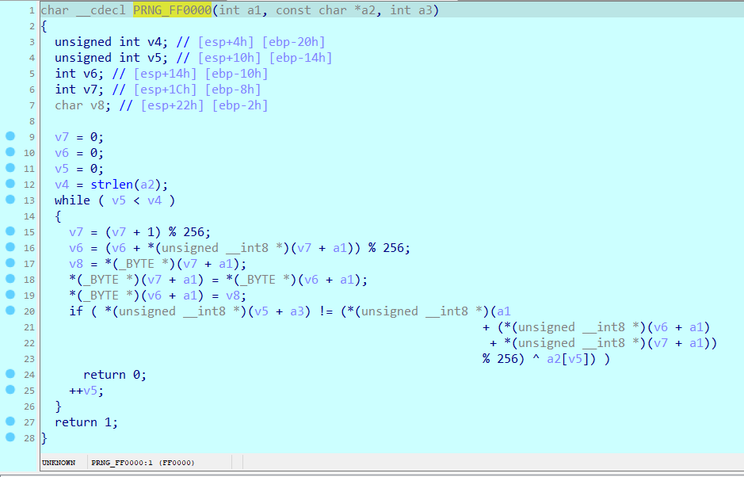

# crackme1

> Can you crack me?

## [0]. Analysis Challenge

- File được cung cấp là file PE32, thực thi chương trình thì có nhận xét ban đầu đây là chương trình yêu cầu nhập password và nếu password đúng thì sẽ in ra flag.


- Tiến hành sử dụng IDA để đọc pseudocode của chương trình, đây là code hàm main sau khi mình đã rename và comment 1 số câu lệnh.

```c
int __cdecl main(int argc, const char **argv, const char **envp)
{
  char Format[160]; // [esp+8h] [ebp-2C4h] BYREF
  char passwd; // [esp+A8h] [ebp-224h] BYREF
  char v6[299]; // [esp+A9h] [ebp-223h] BYREF
  char key[200]; // [esp+1D4h] [ebp-F8h] BYREF
  void *ptr_v8; // [esp+29Ch] [ebp-30h]
  int flag_len; // [esp+2A0h] [ebp-2Ch]
  int len_passwd_var2; // [esp+2A4h] [ebp-28h]
  char *ptr_v11; // [esp+2A8h] [ebp-24h]
  int len_passwd_var1; // [esp+2ACh] [ebp-20h]
  char *ptr_v13; // [esp+2B0h] [ebp-1Ch]
  int tmp_len_passwd; // [esp+2B4h] [ebp-18h]
  int v15; // [esp+2B8h] [ebp-14h]
  char *ptr_v16; // [esp+2BCh] [ebp-10h]
  char *ptr_v17; // [esp+2C0h] [ebp-Ch]
  int i; // [esp+2C8h] [ebp-4h]

  passwd = 0;
  memset(v6, 0, sizeof(v6));
  flag_len = 335;
  memset(key, 0, sizeof(key));
  strcpy(
    Format,
    "Do you remember the good old days?! I don't know how about you,but I don't. Please help me to recover my memory, it'"
    "s password protected, and that's sad :(\n");
  ptr_v8 = &data_404BE8;
  _printf_401560(Format);
  _printf_401560("Enter password: ");
  _scanf_4014D0("%300[^\n]s", &passwd);
  ptr_v17 = &passwd;
  ptr_v13 = v6;
  ptr_v17 += strlen(ptr_v17);
  len_passwd_var1 = ++ptr_v17 - v6;
  tmp_len_passwd = ptr_v17 - v6;
  ptr_v16 = &passwd;
  ptr_v11 = v6;
  ptr_v16 += strlen(ptr_v16);
  len_passwd_var2 = ++ptr_v16 - v6;
  if ( (unsigned int)(ptr_v16 - v6) >= 294 )    // length password > 0x126
  {
    if ( checkPassword_4011D0(&passwd) )
    {
      v15 = tmp_len_passwd / 3;
      for ( i = 0; i < tmp_len_passwd; ++i )
        key[i % v15] ^= v6[i - 1];              // A = A ^ 0
      for ( i = 0; i < flag_len; ++i )
        flag_enc_404020[i] ^= key[i % v15];
      _printf_401560("\n\nCongratulation! Here is your memo :> \n\n");
      _printf_401560("%s", flag_enc_404020);
    }
    else
    {
      _printf_401560("\nInvalid password\n");
    }
    getchar();
    getchar();
    return 0;
  }
  else
  {
    _printf_401560("oh, no!");
    return 0;
  }
}
```

- Hàm `main()` cho nhập vào `&passwd` và xử lý chuỗi được nhập vào với hai điều kiện:

  - Điều kiện đầu tiên là độ dài của passwd >= 294 ký tự.
  - Điều kiện thứ hai là chuỗi được nhập vào được xử lý thông qua hàm `checkPassword_4011D0(&passwd)`.

- Nếu hai điều kiện trên thỏa mãn thì `passwd` sẽ được lưu vào `key` và sử dụng thuật toán XOR để giải mã biến `flag_enc` thành flag.

```c
//  if ( (unsigned __int8)checkPassword_4011D0(&passwd) )
char __cdecl checkPassword_4011D0(const char *a1)
{
  int i; // [esp+14h] [ebp-10h]
  int *ptr_v3; // [esp+18h] [ebp-Ch]

  ptr_v3 = (int *)&data_404BE8;
  if ( (int)strlen(a1) < 55 )
    return 0;
  for ( i = 0; i < 122; ++i )
  {
    if ( !handle_Character_401080(*ptr_v3, (int)&a1[ptr_v3[1]], (int)(ptr_v3 + 2)) )//
                                                // struct{
                                                // option (1->4)
                                                // idx (idx handle &passwd)
                                                // byte-data
                                                // }
      return 0;
    ptr_v3 += 3;
  }
  return 1;
}
```

- Hàm `checkPassword()` sẽ xử lý các ký tự trong chuỗi `passwd` được nhập vào theo 1 chuỗi byte (&data_404BE8), hàm tiếp theo được gọi là `handle_Character_401080(*ptr_v3, (int)&a1[ptr_v3[1]], (int)(ptr_v3 + 2))` với ba đối số tương ứng từ chuỗi byte -> mình đoán chuỗi byte ở dạng struct (comment ở code là do đã đọc code của các hàm sau nên biết được các biến trong struct có chức năng gì).

```c
char __cdecl handle_Character_401080(int a1, int a2, int a3)
{
  char v4[4]; // [esp+0h] [ebp-20h] BYREF
  LPVOID v5; // [esp+4h] [ebp-1Ch]
  LPVOID v6; // [esp+8h] [ebp-18h]
  SIZE_T v7; // [esp+Ch] [ebp-14h]
  SIZE_T v8; // [esp+10h] [ebp-10h]
  LPVOID lpAddress; // [esp+14h] [ebp-Ch]
  SIZE_T dwSize; // [esp+18h] [ebp-8h]
  char v11; // [esp+1Fh] [ebp-1h]

  v8 = 221;
  v5 = resolveFunc_711000((int)&unk_714288, 221, 5);// KSA
  v7 = 278;
  v6 = resolveFunc_711000((int)&unk_714170, 278, 6);// PRNG
  if ( !v5 || !v6 )
    return 0;
  switch ( a1 )
  {
    case 1:
      dwSize = 97;
      lpAddress = resolveFunc_711000((int)&unk_714B80, 97, 1);
      break;
    case 2:
      dwSize = 142;
      lpAddress = resolveFunc_711000((int)&unk_714AF0, 142, 2);
      break;
    case 3:
      dwSize = 1685;
      lpAddress = resolveFunc_711000((int)&unk_714458, 1685, 3);
      break;
    case 4:
      dwSize = 235;
      lpAddress = resolveFunc_711000((int)&unk_714368, 235, 4);
      break;
    default:
      return 0;
  }
  if ( !lpAddress )
    return 0;
  v11 = ((int (__cdecl *)(int, int, char *))lpAddress)(a2, a3, v4);
  VirtualFree(lpAddress, dwSize, 0x8000u);
  VirtualFree(v5, v8, 0x8000u);
  VirtualFree(v6, v7, 0x8000u);
  return v11;
}
```

- Hàm `handle_Character_401080()` xử lý theo logic sau:

  - Ba đối số truyền vào được xử lý từ biến `&data_404BE8` được hiểu như 1 struct gồm 3 variable, mỗi variable dài 4 byte được định nghĩa như sau:
    - `option`: biến này tương ứng với case sẽ được chọn để xử lý ký tự cụ thể trong `switch case`.
    - `idx`: biến này được sử dụng làm index của ký tự trong chuỗi passwd được chọn ra để handle.
    - `data-const`: biến này là dữ liệu chưa được xử lý.
  - Có tất cả là 4 case xử lý khác nhau được gọi để handle chuỗi password thành 1 chuỗi key đúng, điều đặc biệt là code của 4 hàm được gọi tới nằm ở dạng shellcode đã bị mã hóa ứng với từng case và sẽ được hàm `resolveFunc_711000()` giải mã và resolve ra các function khi chương trình chạy.

- Tóm lại thì biến `data-const` được xử lý ứng với từng case và sau quá trình đó ta sẽ có key đúng, key đó được compare với chuỗi `&passwd` nếu đúng thì ta có flag.


- Mình dùng IDA để debug và resolve các hàm trong quá trình chạy chương trình, cách thực hiện là đặt `breakpoint` ở dòng lệnh call hàm resolve ứng với mỗi case sau đó f8 (step over) đến lệnh ngay sau, giá trị trả về của hàm resolve là địa chỉ của hàm được tạo ra lưu trong thanh ghi eax.
- Sau đó chuột phải vào giá trị trong thanh ghi eax, jmp đến địa chỉ đó, nhấn C (Make code) rồi nhấn P (Create Function) và f5 để đọc pseudocode của function được tạo ra.
- Cơ bản thì 4 hàm là 4 thuật toán mã hóa được xử dụng để xử lý ký tự trong chuỗi passwd.


- Kiểm tra kí tự a[i] tại vị trí idx bằng cách XOR với 0x20 nếu chẵn hoặc 0x52 nếu lẻ sau đó so sánh với BYTE trong data.


- Kiểm tra kí tự a[i] và a[i+1] tại vị trí idx bằng cách dịch bit nhiều lần và xor với 0x1693 sau đó so sánh với WORD trong data.


- SỬ dụng thuật toán base64 để giải mã nhưng là với chuỗi base64 đã được custom.

```python
    base64_custom = "ABDCEHGFIJKLUNOPYRTSMVWXQZajcdefohibkmlngpqrstuv4xzy8123w56709+0"
    base64_real   = "ABCDEFGHIJKLMNOPQRSTUVWXYZabcdefghijklmnopqrstuvwxyz0123456789+/"
```


- SỬ dụng thuật toán rc4 với secretkey = 'susan' và bảng mã đã được khởi tạo ở đầu hàm `handle_Character_401080()` (Hai hàm tạo bảng mã cho thuật toán rc4 là KSA và PRNG cũng được sinh ra dựa trên phương pháp decrypt shellcode nên để đọc pseudocode sử dụng phương pháp tương tự với 4 hàm).




## [1]. Solve Idea

- Ta viết 1 chương trình python mô phỏng lại 4 function trên và lấy chuỗi byte từ biến `&data_404BE8` để sinh ra key đúng.

- Run đoạn mã python trong IDA sau để đọc lấy data từ con trỏ `*ptr_v3` được khởi tạo từ chương trình trong hàm `checkPassword_4011D0()`.

```python
data = []
addr = 0x714BE8 # v3
# addr = 0x444be8
index = 0
for i in range(366//3):	# 0x00A5519F – 0x00A54BE8 = (1463 / 4) = 365 => 366 // 3
    t1 = idc.get_wide_dword(addr+index+0*4)
    t2 = idc.get_wide_dword(addr+index+1*4)
    t3 = idc.get_wide_dword(addr+index+2*4)
    data.append((t1,t2,t3))
    index+=3*4
print(data)
```

- Run file [solve.py](./chall/solve.py) lấy key -> nhập key lấy flag `vcstraining{Aw3s0me_D4ta_tran5Form4t1oN_Kak4}`:


