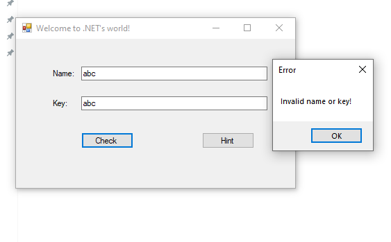

# Basic DotNet

> Find the flag

## [0]. Analysis Challenge

- File được cung cấp là file PE32, thực thi chương trình thì có nhận xét ban đầu đây là chương trình yêu cầu đăng nhập Name và key nếu đúng thì sẽ in ra flag.

- Chương trình có chức năng `hint` sẽ hiển thị một chuỗi key.

- Sử dụng `dnSpy` để phân tích chương trình có hai hàm `button1_Click()`, `button2_Click()` tương ứng với button Check và Hint.

- Hàm `Button1()`:
  - Mảng `array2` có được bằng cách mã hóa chuỗi nhập vào ở `textBox1` - là `Name` với key `c-sharp` sử dụng thuật toán RC4 sau đó tiến hành so sánh với mảng array là chuỗi nhập vào ở `textBox2` - là `Key`.

- Hàm `Button2()` chỉ đơn giản là show ra key dưới dạng đã được mã hóa `a0-d3-57-17-e2-17-98-82-ae-42-0b-df-2a-80-ec-d0-1b-f2-2e-62-67-96-f3-ba`.

- Hàm `Encode()`:

- Hàm `Encode()` sử dụng thuật toán RC4 để mã hóa dữ liệu đầu vào là đối số biến `byte[] data` với `key secret` là đối số thứ hai `byte[] key`.

## [1]. Solve Idea

- Ta đã biết được mảng array (là Key) có giá trị `a0-d3-57-17-e2-17-98-82-ae-42-0b-df-2a-80-ec-d0-1b-f2-2e-62-67-96-f3-ba` cũng đồng nghĩa là biết được mảng `array2` là kêt quả của quá trình encode sử dụng thuật toán RC4, ngoài ra ta cũng biết được `secret key` được sử dụng là `c-sharp` -> ta có thể biết được giá trị của `Name`.

- Sử dụng `cyberchef` để decode lấy trường giá trị `Name` cũng chính là flag = `trainingctf{b4s1c_C++++}`:

