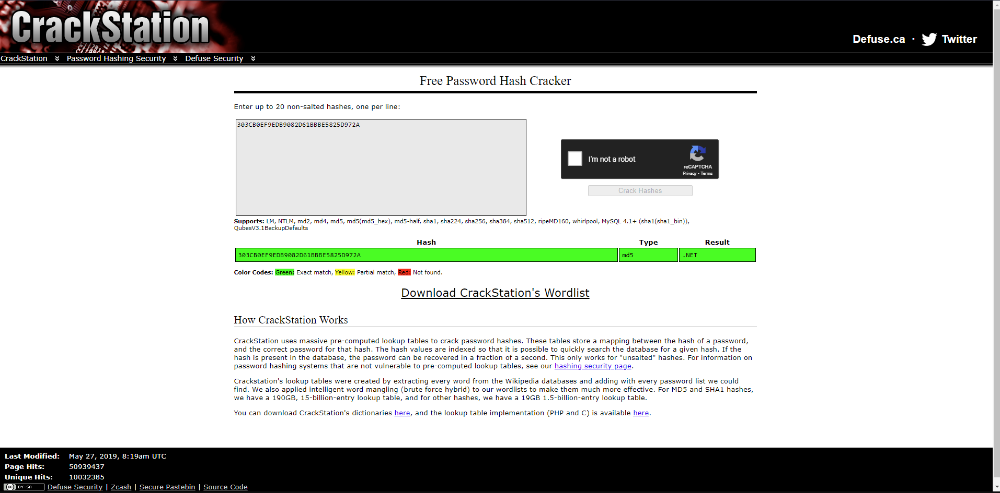

# Imposter Dotnet

> Find the flag

## [0]. Analysis Challenge

- File được cung cấp là file PE32, chương trình cho nhập vào textBox và ấn Vote thì hiển thị thông báo.

- Phân tích code chương trình bằng `dnSpy` thì có một vấn đề là tên hàm, các object đều đã bị obfuscation.

- Tiến hành tìm đoạn xử lý dữ liệu được nhập vào từ textBox để bắt đầu phân tích từ đó.

- Hàm `button1_Click()` xử lý `array` là kết quả khi mã hóa bằng RC4 với key là `among-us` và chuỗi được nhập vào sau khi đã mã hóa md5 chuỗi đó, chương trình sẽ in ra flag nếu kết quả array = array2 = `40-72-b1-25-9e-ff-83-f3-07-c4-e8-d6-8a-a6-0c-e0-ef-9f-a6-3f-e2-fc-0b-81-2a-47-dd-8b-1a-a3-4c-32`.

- Thuật toán mã hóa Hash MD5.

- Thuật toán mã hóa RC4.

## [1]. Solve Idea

- Ta dễ dàng có được chuỗi hash khi đã biết được `secret key` = `among-us` và kết quả sau khi mã hóa RC4.

- Chuyển dữ liệu về dạng bytes=[0x33,0x30,0x33,0x63,0x62,0x30,0x65,0x66,0x39,0x65,0x64,0x62,0x39,0x30,0x38,0x32,0x64,0x36,0x31,0x62,0x62,0x62,0x65,0x35,0x38,0x32,0x35,0x64,0x39,0x37,0x32,0x61] và ta có chuỗi mã hóa băm của input đúng là `303CB0EF9EDB9082D61BBBE5825D972A`.

- Thuật toán mã hóa hash MD5 không thể giải mã ngược nhưng nhờ vào cơ sở dữ liệu có sẵn ta tìm được chuỗi input đúng là `.NET`.

- Ta có được flag: `trainingctf{.NET_is_imposter!}`.

