# unpackme1

> Password Un7Zip: infected

## [0]. Analysis Challenge

- File được cung cấp là file PE32 và đã được pack bằng cách sử dụng packer `UPX`.

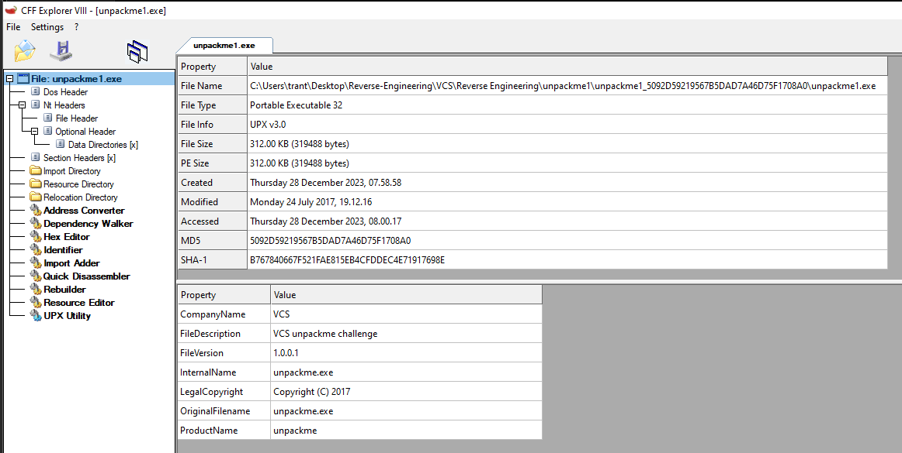

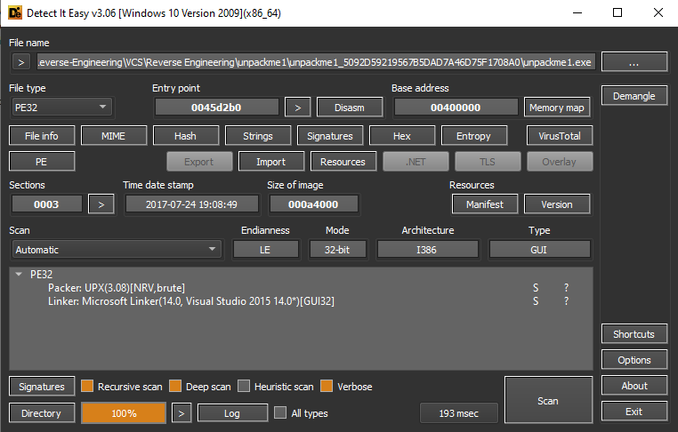

- Tổng quan về `packer UPX`:
  - `Cách UPX pack 1 file`: Sử dụng các thuật toán để nén dữ liệu (LZMA > phiên bản 2.9; UCL: nhanh hơn đơn giản hơn LZMA) bằng cách thêm code mới vào cuối tệp (mục đích là để giải nén code ban đầu trước khi chương trình thực thi).
  - `Cách 1 file đã được pack bằng UPX thực thi`:
    - File sẽ thực thi phần tại code đã được thêm vào.
    - Lưu trạng thái của các thanh ghi hiện tại bằng lệnh `pushad`.
    - Giải nén phần code gốc trước khi được nén.
    - Khôi phục lại IAT (Import Address Table - LoadLibraryA, GetProcessAddress), Sau khi khôi phục xong sử dụng VirtualProtect : thay đổi quyền truy cập (hàm này sử dụng sau để đảm bảo code sau khi khôi phục sẽ được bảo vệ).
    - Khôi phục trạng thái thanh ghi bằng popad.
    - Jump tới OEP gốc của file.
    - Thực thi chương trình bình thường.

## [1]. Solve Idea

- Quá trình unpack hoàn tất khi chương trình thực thi bình thường và phân tích bằng IDA sẽ có thể đọc được hàm main (Dễ nhận thấy là khi load bằng IDA sẽ có nhiều hàm hơn khi mà phân tích file đã bị packed).

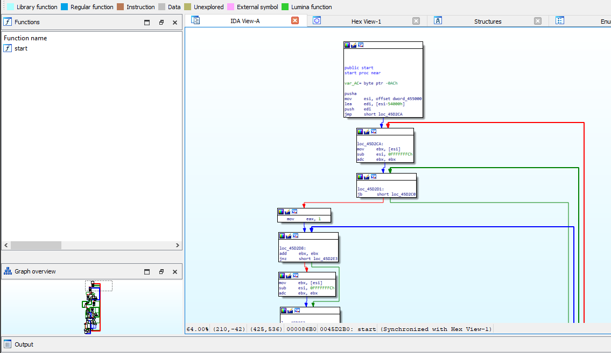

- Sử dụng x32dbg để unpack file, F9 để nhảy tới entry point (EP) - ở đây ta thấy câu lệnh `pushad` là điểm bắt đầu lưu lại giá trị của các thanh ghi trước khi tiến hành unpack đoạn code đã bị pack của chương trình gốc (Đây là một dấu hiệu tốt khi EntryPoint chính là instruction `pushad`).

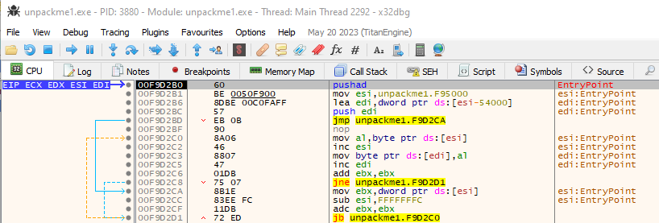

- Tiếp theo ta cần tìm lệnh `popad` đúng của chương trình - đây là lệnh mà trả lại các giá trị đã lưu từ lệnh `pushad`, vì sau lệnh `popad` sẽ xuất hiện lệnh jmp đến original entry point (OEP) của chương trình.

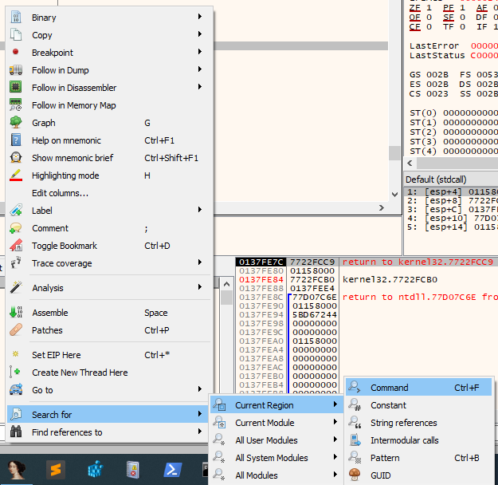

- Tìm kiếm theo instruction `popad` (có thể sẽ có nhiều hơn 1 kết quả cho việc tìm kiếm nên mẹo ở đây là đến từng kết quả tìm kiếm và kiểm tra các instrucion tiếp theo xem có lệnh jmp hoặc ret tới một địa chỉ nào đó thuộc phần .text của chương trình), đặt breakpoint và tiến hành debug.

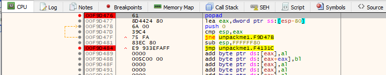

- Sau khi thực thi lệnh jmp chính là đến địa chỉ của original entry point.

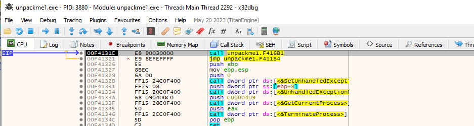

- Tiến hành sử dụng plugin Scylla để tìm Import Address Table và dump file từ trên memory đang được debug (IAT Autosearch -> Get Imports).

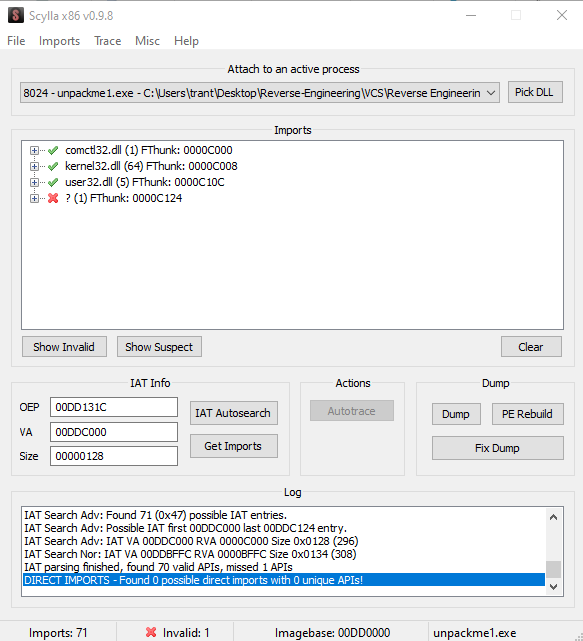

- Delete Tree Node

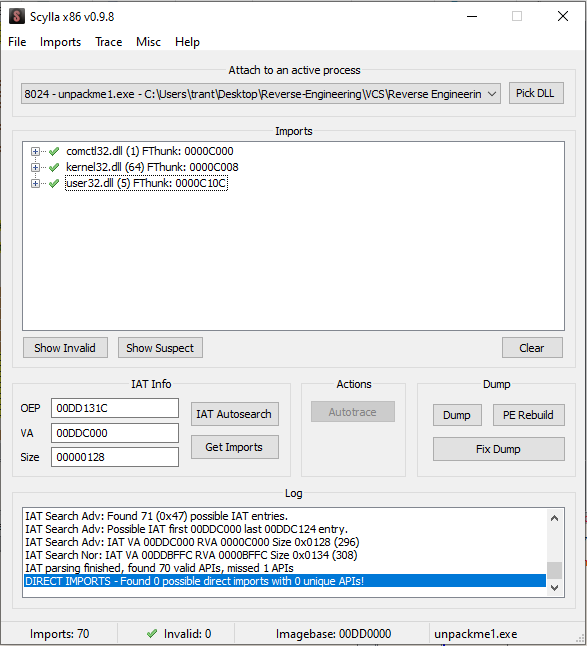

- Dump

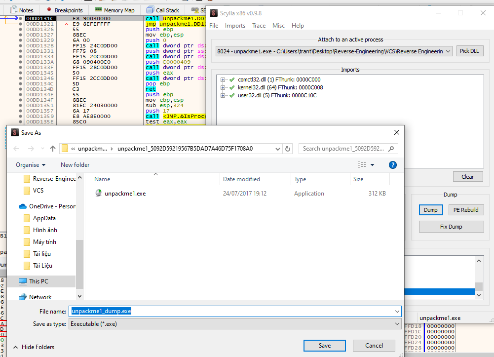

- Fix Dump

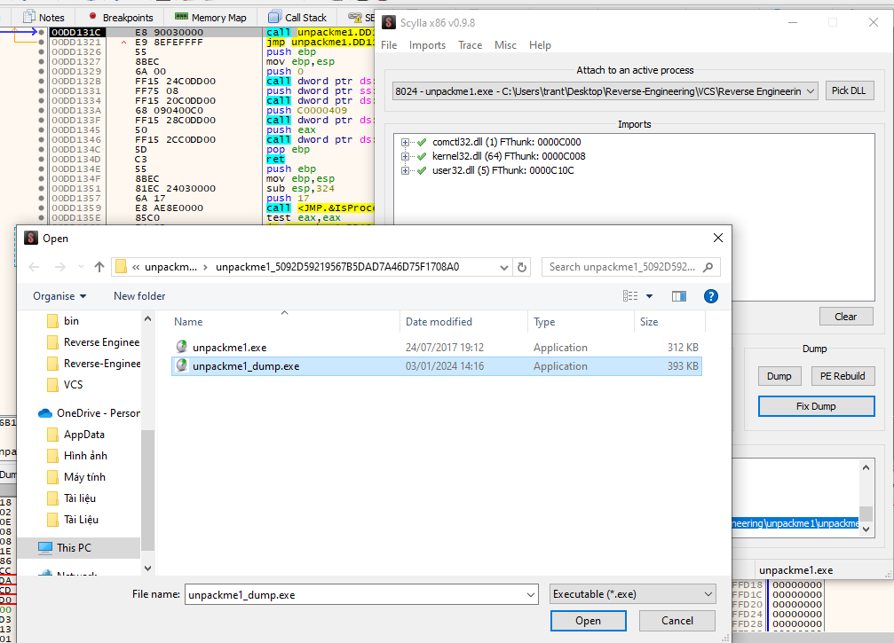

- Khi đó file dump từ trên memory là file `unpackme1_dump_SCY`.

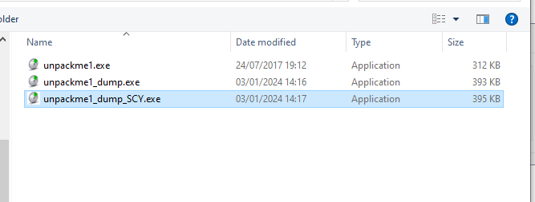

- Load vào IDA ta sẽ đọc được hàm `WinMain`.

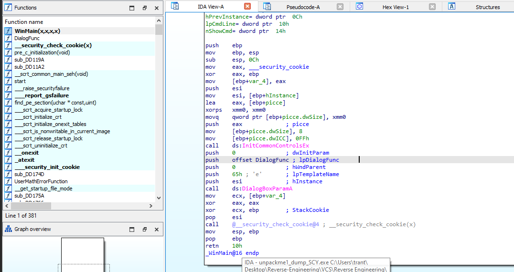

## [2]. References

- https://www.youtube.com/watch?v=7AiG1aluelU&list=PL2YJKKcudhJ1v3vHCPRXHBZJKRcRN5UAD&index=9

- https://www.youtube.com/watch?v=Npm5tuy1Pp4&t=52s

- Ở bước đặt breakpoint sau khi tìm lệnh `popad` ta có thể thay thế bằng là không đi tìm lệnh `popad` nữa mà đặt thẳng breakpoint lên trên stack `(đặt 1 memory breakpoint on access tại ESP)`, khi truy cập vào địa chỉ bộ nhớ này được thực hiện, chương trình sẽ dừng lại (đây là dựa vào nguyên lý của pushad và popad để đtặ bp).

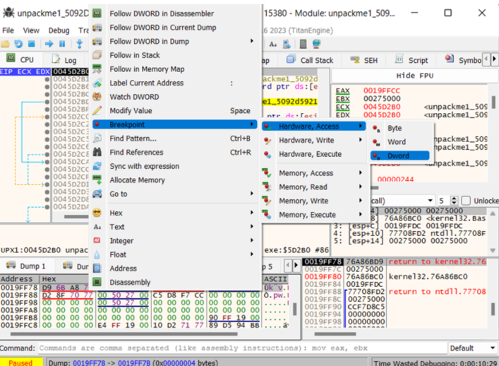

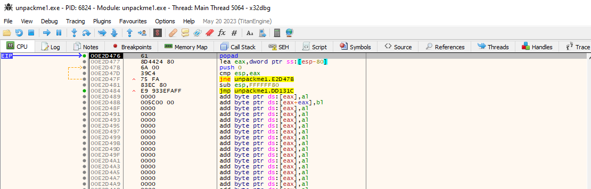
