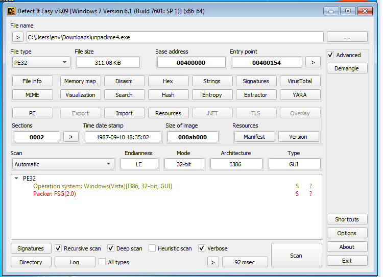
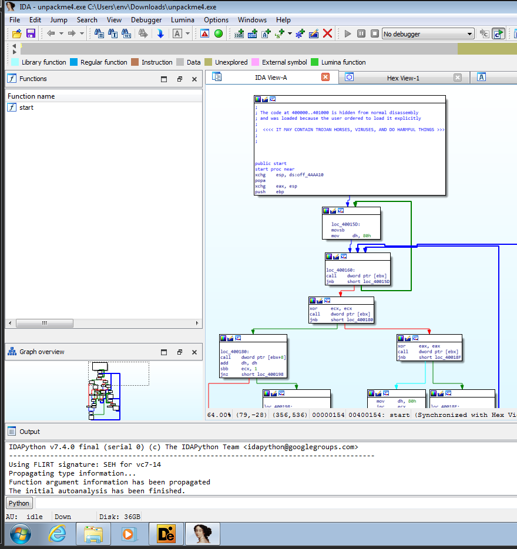
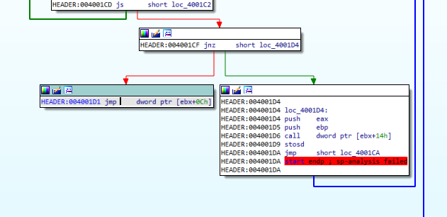
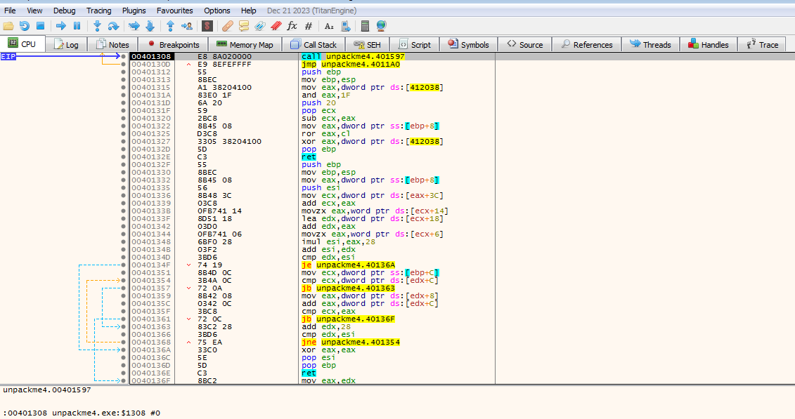
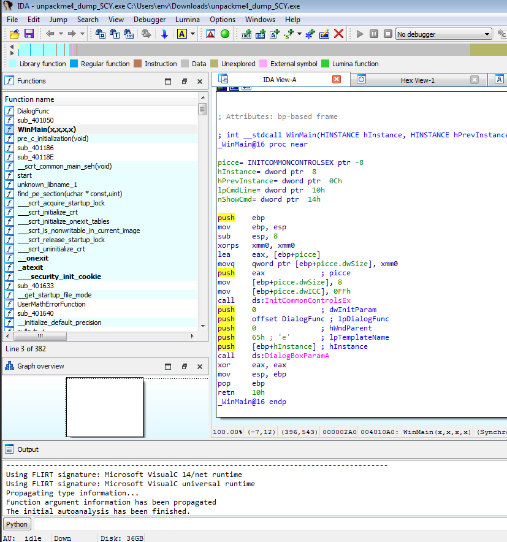

# unpackme4

> Password Un7Zip: infected

## [0]. Analysis Challenge

- File được cung cấp là file PE32 và đã được pack bằng cách sử dụng packer `ASPack`.



- Tổng quan về packer `FSG`:

  - `1.` File sẽ thực thi phần tại code đã được thêm vào.
  - `2.` Lưu trạng thái của các thanh ghi hiện tại bằng lệnh `pushad`.
  - `3.` Giải nén phần code thực thi gốc trước khi được nén.
    - Dựa vào thuật toán nén để khôi phục ngoài các câu lệnh cơ bản còn sử dụng các API.
    - GetModuleHandleA
    - GetProcAddress
    - Từ 2 hàm trên lấy được 3 con trỏ hàm của
    ```
    VirtualAlloc   : cấp phát bộ nhớ ảo
    VirtualFree    : giải phóng
    VirtualProtect : thay đổi quyền truy cập (hàm này sử dụng sau để đảm bảo code sau  khi khôi phục sẽ được bảo vệ)
    ```
  - `4.` Khôi phục lại IAT.

    - GetModuleHandleA
    - GetProcAddress
    - Có 1 số hàm API không được gọi trực tiếp mà gọi bằng lệnh ret (đẩy giá trị vào đỉnh ngăn xếp xong ret).

  - `5.` Khôi phục trạng thái thanh ghi bằng popad.
  - `6.` Jump tới OEP của file thưc thi ban đầu.

## [1]. Solve Idea

- Quá trình unpack hoàn tất khi chương trình thực thi bình thường và phân tích bằng IDA sẽ có thể đọc được hàm main (Dễ nhận thấy là khi load bằng IDA sẽ có nhiều hàm hơn khi mà phân tích file đã bị packed).

- Chương trình load vào ida thì check thấy có lệnh `popad` ở ngay đầu của code start.



- Bài này không có dấu hiệu đặc biệt để tìm oep, thử load file bằng ida chuyển ta quan sát thấy các lệnh nhảy `jmp dword ptr [ebx+0Ch]` là nhảy tới vùng dữ liệu khác các lệnh nhảy còn lại ko có gì đặc biệt.



- Đặt `breakpoint` ở lệnh asm đó và F9 đến sau đó F7 `step into` thì thấy chương trình gọi tới OEP.



- Tiến hành sử dụng plugin Scylla để tìm Import Address Table và dump file từ trên memory đang được debug.

  - IAT Autosearch -> Get Imports
  - Delete Tree Node
  - Dump
  - Fix Dump

- Khi đó file dump từ trên memory là file `unpackme4_dump_SCY` và load vào IDA ta sẽ đọc được hàm `WinMain`.


