# unpackme6

> Password Un7Zip: infected

## [0]. Analysis Challenge

- File được cung cấp là file PE32 và đã được pack bằng cách sử dụng packer `VMProtect`.

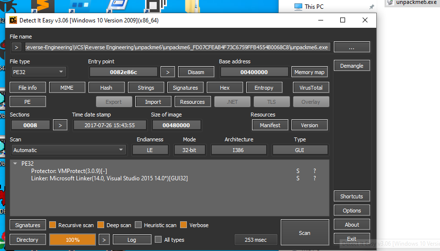

- Packer này ko sử dụng pushad như những packer trước nên ko thể lần theo phương pháp cũ để tìm OEP

- Phải dựa vào các API mà packer sử dụng lúc khôi phục code để tìm code thực thi gốc.

- Đây là các API mà chương trình sử dụng để khôi phục code thực thi gốc và IAT

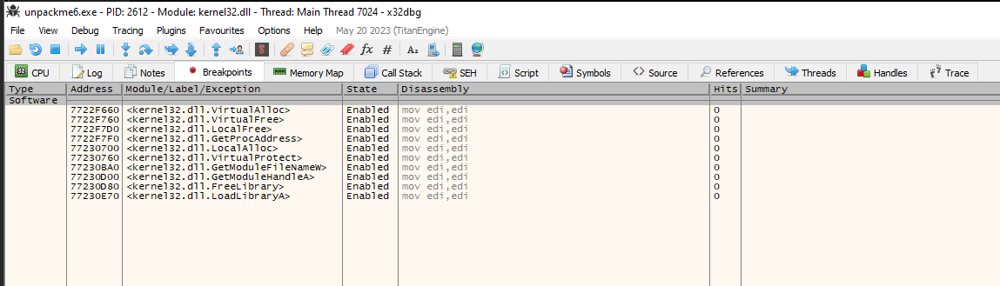

## [1]. Solve Idea

- Quá trình unpack hoàn tất khi chương trình thực thi bình thường và phân tích bằng IDA sẽ có thể đọc được hàm main (Dễ nhận thấy là khi load bằng IDA sẽ có nhiều hàm hơn khi mà phân tích file đã bị packed).

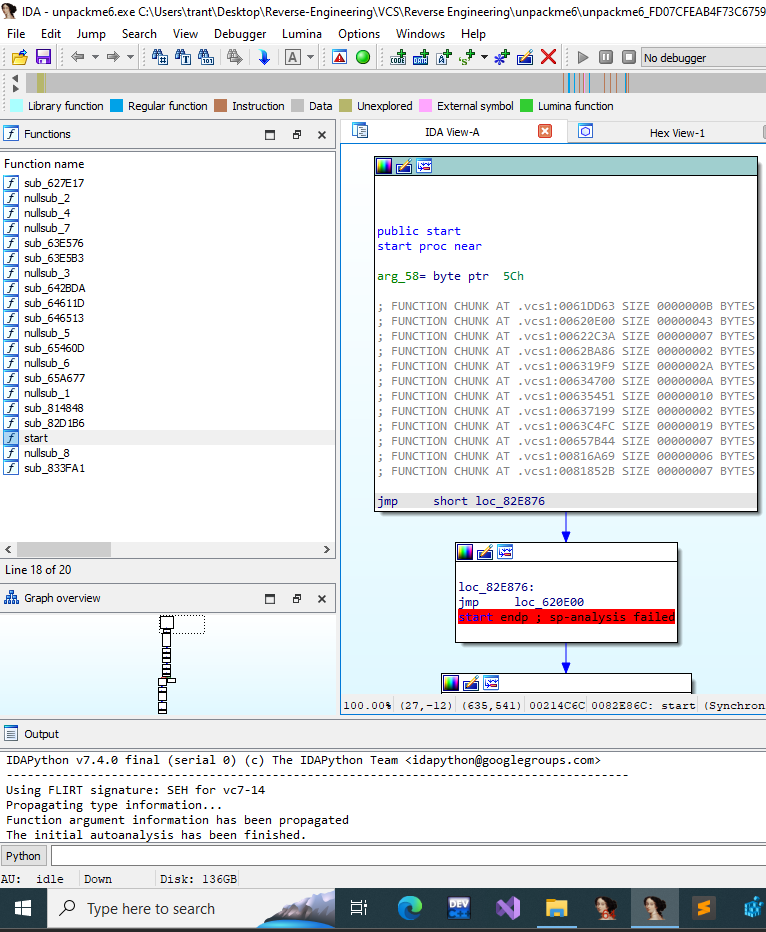

- Bài này ta sẽ unpack bằng cách follow theo các windowsAPI được sử dụng trong quá trình unpack file để thực thi.

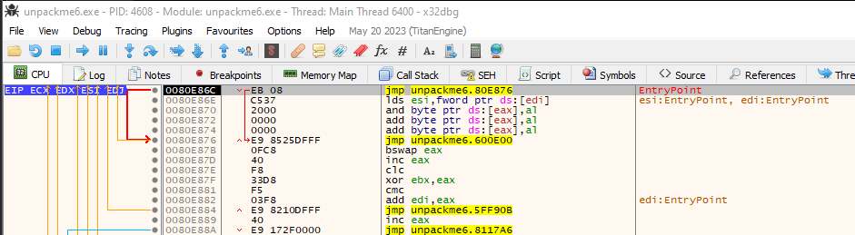

- Đặt `break point` tại VirtualProtect.

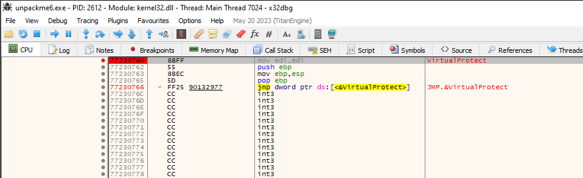

- Ban đầu trong `.text` chưa có code.

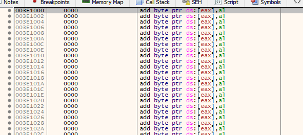

- Sau khi F9 vài lần ta có code trong .text -> chương trình đang khôi phục lại code thực thi ban đầu.

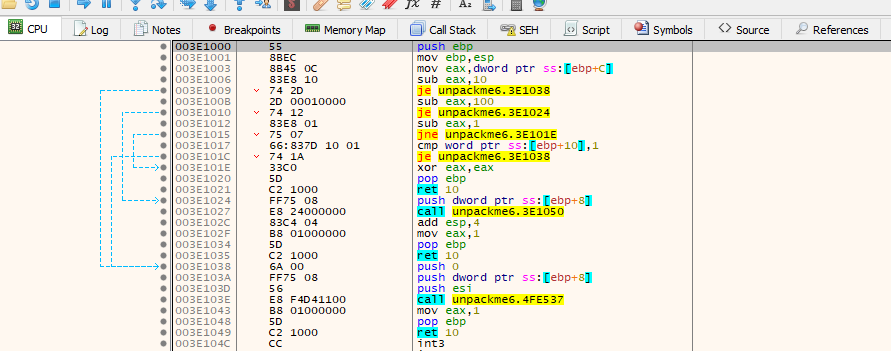

- Tiếp tục F9 sau 17 lần thì F9 1 lần nữa chương trình đã thực thi.

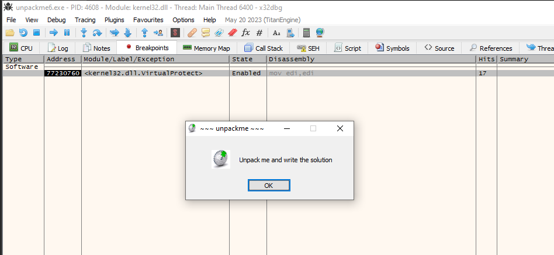

- Load lại chương trình và làm tương tự trên nhưng ta dừng khi VirtualProtect được gọi 17 lần.

- Mục đích là vì lúc đầu ta test thử thì xác định hàm VirtualProtect được gọi tối đa 17 lần lúc này code thực thi mới được khôi phục hoàn toàn và sau khi code thực thi khôi phục hoàn toàn ta mới có thể tìm được OEP gốc của chương trình.

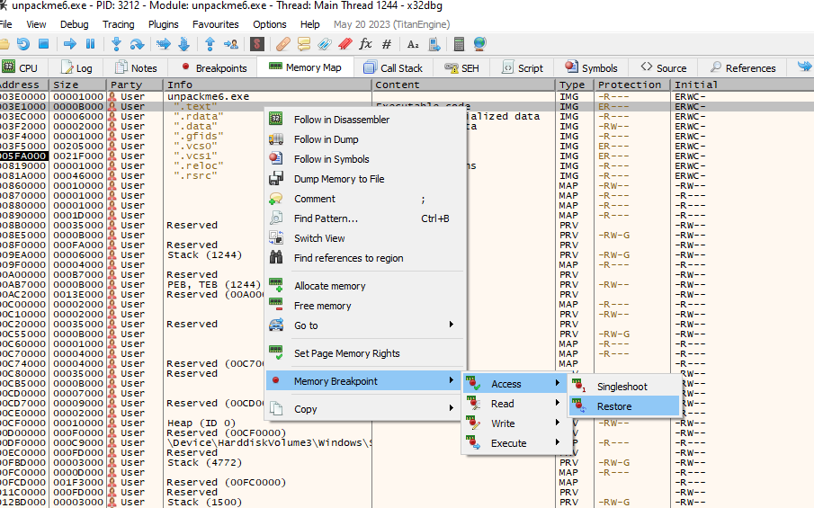

- Set memory break point access (Chuột phải chỗ address và chạy x32dbg quyền administrator) sau đó F9 vài lần ta sẽ nhảy tới OEP đúng (0x1308).

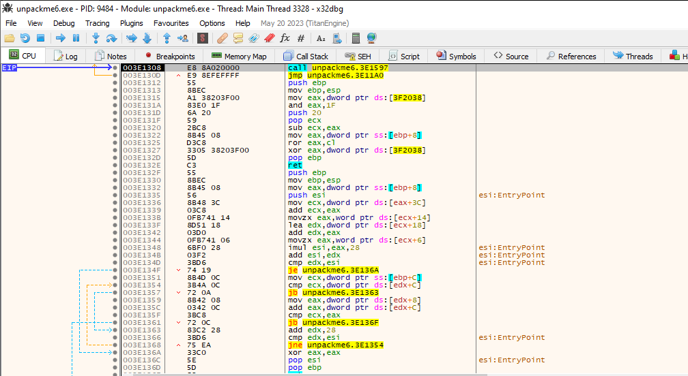

- Tiến hành sử dụng plugin Scylla để tìm Import Address Table và dump file từ trên memory đang được debug.

  - IAT Autosearch -> Get Imports
  - Delete Tree Node
    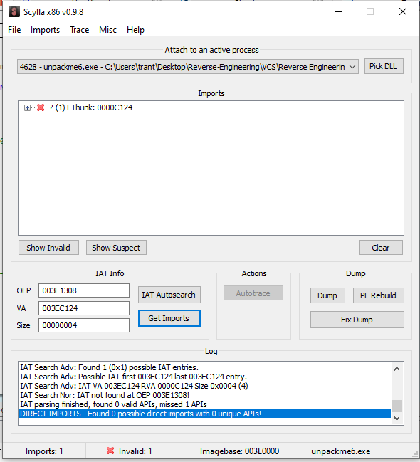
  - Dump

- Khi đó file dump từ trên memory là file `unpackme6_dump` và load vào IDA ta sẽ đọc được hàm `WinMain`.

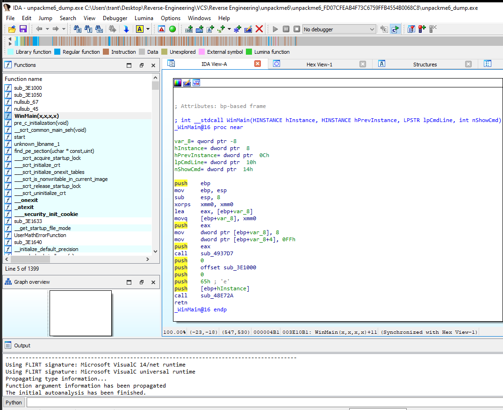
