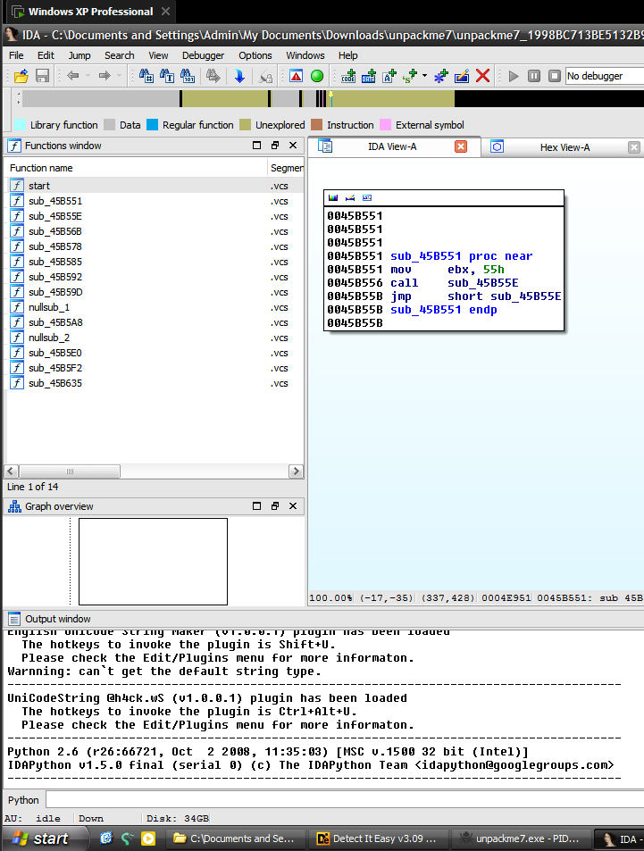

# unpackme7

> Password Un7Zip: infected

## [0]. Analysis Challenge

- File được cung cấp là file PE32 và đã được pack bằng cách sử dụng packer `Yoda's Protecter`.

- Tổng quan về packer `Yoda's Protecter`:

  - Anti debugging: JMP vào giữa một hàm, raise exception INT3, BlockInput(), IsDebuggerPresent(), BlockInput(), CreateToolhelp32Snapshot(), Process32First(), và Process32Next(), GetCurrentProcessId(),...
  - Anti-SoftICE
  - Chống sửa đổi(Checksum Check)
  - Load API khôi phục IAT bằng LoadLibraryA() và GetProcAddress()
  - Tạo các đoạn mã giả gây khó khăn khi phân tích file
  - Chống dump
  - Xóa thông tin Import
  - Xóa PE header
  - (references: https://sanseolab.tistory.com/11)

## [1]. Solve Idea

- Quá trình unpack hoàn tất khi chương trình thực thi bình thường và phân tích bằng IDA sẽ có thể đọc được hàm main (Dễ nhận thấy là khi load bằng IDA sẽ có nhiều hàm hơn khi mà phân tích file đã bị packed).

- File chỉ chạy trên Windows XP. Dùng x32dbg để chạy chương trình sẽ bị thoát ra do chương trình phát hiện debugger. Khắc phục bằng cách đặt breakpoint ở hàm LoadLibraryA(), chạy đến khi chương trình load đầy đủ thư viện:

- Bài này chương trình sử dụng 3 technique anti-debug là `BlockInput()`, `IsDebuggerPresent()` và `GetCurrentProcessId()` vậy nên để bypass:

  - Patch NOPs hàm `BlockInput()`.
  - Patch `xor eax, eax` - `IsDebuggerPresent()`.
  - Patch `mov eax, {pid của x64 dbg}` trong `GetCurrentProcessId()`.

- Hoặc đơn giản hơn là dùng plugin ScyllaHide để debugger không bị phát hiện.

- Khi debug với ScyllaHide, f9 9 lần thì chương trình chạy ra cửa sổ, do vậy OEP được chạy giữa lần f9 thứ 8 và 9.

- Do vậy f9 8 lần đến đây rồi đặt memory access breakpoint tại section không tên đầu tiên (khả năng cao là .text).

- Chương trình dừng tại địa chỉ 0x401308, chính là OEP:

- Tiến hành sử dụng plugin Scylla để tìm Import Address Table và dump file từ trên memory đang được debug.

  - IAT Autosearch -> Get Imports
  - Delete Tree Node
  - Dump
  - Fix Dump

- Khi đó file dump từ trên memory là file `unpackme6_dump` và load vào IDA ta sẽ đọc được hàm `WinMain`.

