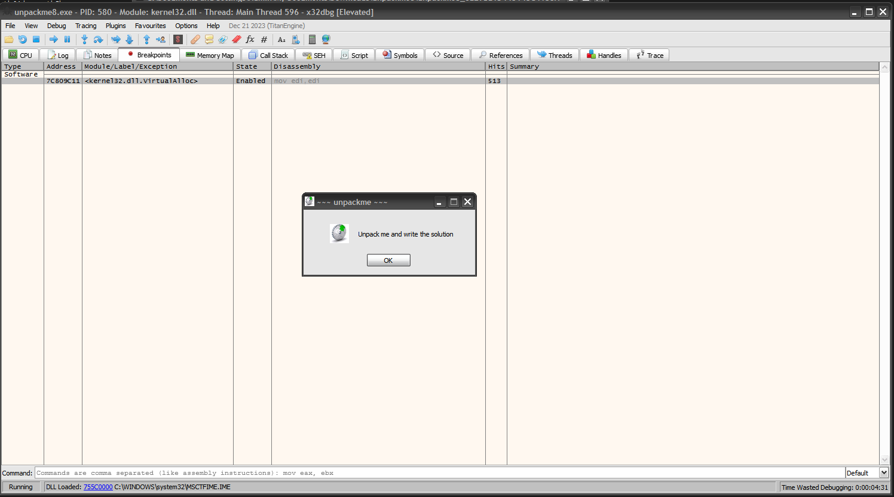

# unpackme8

> Password Un7Zip: infected

## [0]. Analysis Challenge

- File được cung cấp là file PE32 và đã được pack bằng cách sử dụng packer `ASProtect`.

- Sử dụng LoadLibraryA() và GetProcAddress() xác định được con trỏ hàm của

  - RtlAllocateHeap
  - RtlFreeHeap
  - VirtualAlloc

- Sử dụng LoadLibraryA() và GetProcAddress() để khôi phục IAT

## [1]. Solve Idea

- Quá trình unpack hoàn tất khi chương trình thực thi bình thường và phân tích bằng IDA sẽ có thể đọc được hàm main (Dễ nhận thấy là khi load bằng IDA sẽ có nhiều hàm hơn khi mà phân tích file đã bị packed).

- Sử dụng x32dbg để unpack file, F9 để nhảy tới entry point (EP), đặt BP tại `VirtualAlloc` sau đó chạy F9 đến lần thứ 514 thì chương trình chạy hoàn toàn.

- Tiếp tục làm lại như trên nhưng chỉ chỉ chạy 513 lần, sau đó set memory breakpoint access vào section .text và F9.

- F9 để chương trình nhảy vào section text.

- Tiến hành sử dụng plugin Scylla để tìm Import Address Table và dump file từ trên memory đang được debug.

  - IAT Autosearch -> Get Imports
  - Delete Tree Node
  - Dump
  - Fix Dump

- Khi đó file dump từ trên memory là file `unpackme8_dump_SCY` và load vào IDA ta sẽ đọc được hàm `WinMain`.

## [1]. Solve Idea - use OllyDBG:

- Cài OllyDBG Script và dùng script Aspr2.XX_unpacker_v1.15E.osc, tìm được OEP.

- Dump ra và dùng ImpRec fix IAT, sau đó file chạy thành công.
