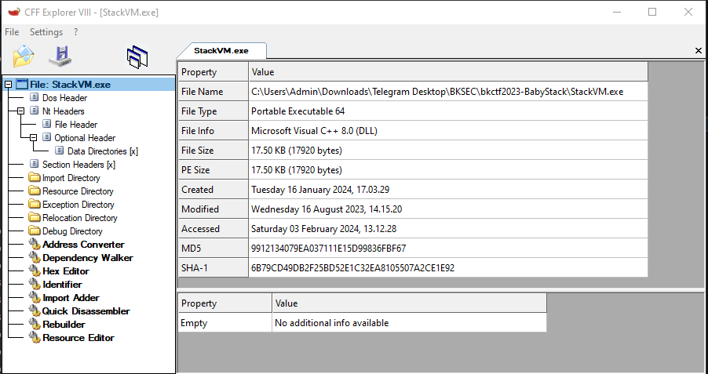
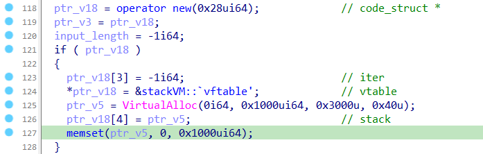
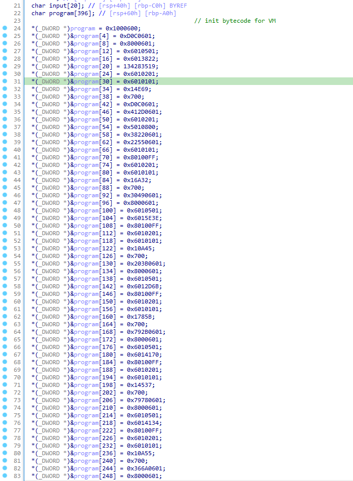
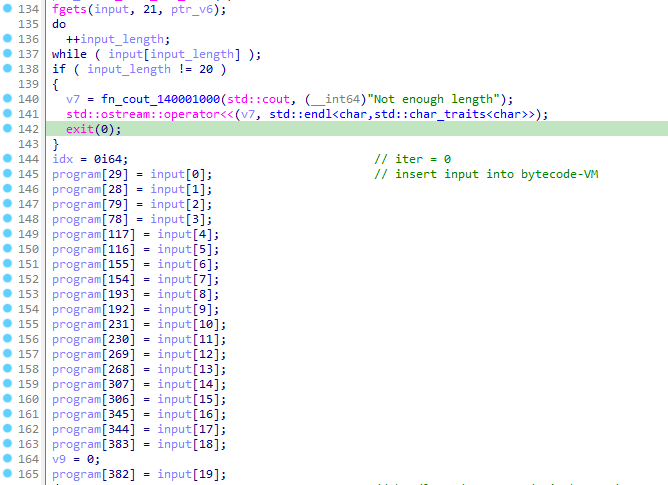
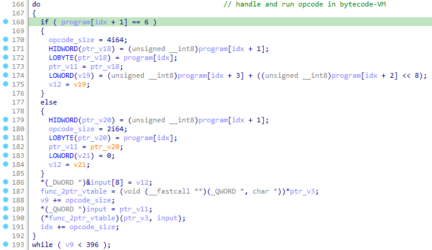
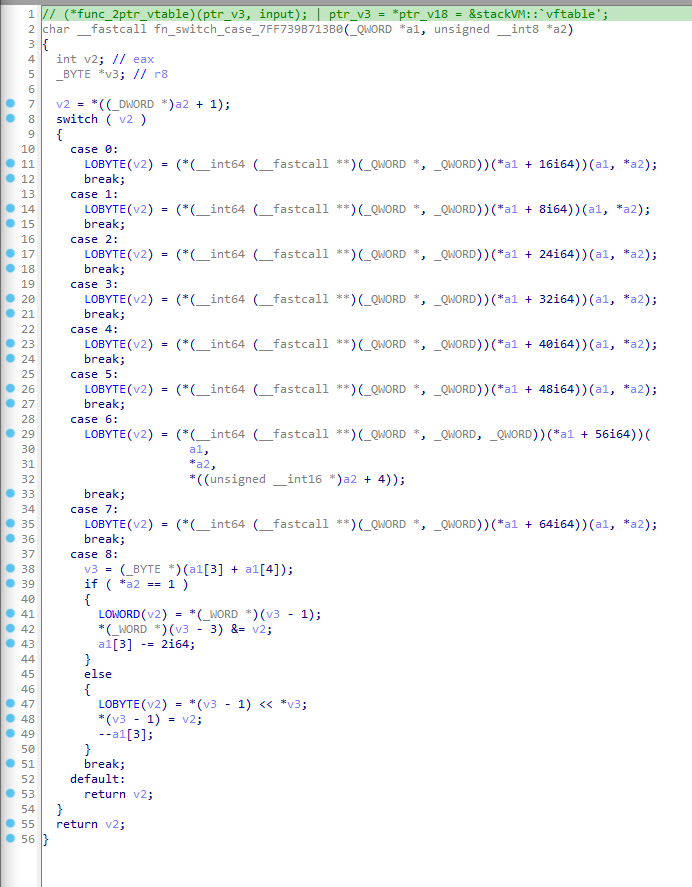
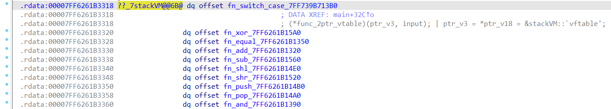

# BabyStack

> Stack up to the moon

## [0]. Analysis Challenge

- Đây là một file PE 64 bit, khi mình mở ra và sau khi nhìn quanh một hồi mình nhận thấy chương trình được viết bằng C++, và vẫn còn các symbol của class.



- Challenge tên là StackVM nên có thể đây sẽ là một bài VM. Khi mở lên đọc nhanh thì ở đây mình thấy có sử dụng tới 1 Vtable, chắc chắn đây là các VM Instruction:



- Những bạn reverse python bytecode đủ nhiều sẽ biết rất rõ về Stack VM. Stack-VM là một dạng VM được thiết kế để thao tác các toán tử trên một ngăn xếp (stack) bằng việc đẩy vào (push), lấy ra (pop) và thao tác các toán tử trên stack. Sơ đồ sau đây để minh họa việc thao tác toán tử cộng trong mô hình stack VM:

```ps1
  PUSH 12345                  PUSH 67890                    ADD                        POP

|             |            |             |            |             |            |             |
+             +            +      |      +            +             +            +             +
|             |            |      |      |            |             |            |             |
+      |      +            +      V      +            +             +            +             +
|      |      |            |             |            |             |            |             |
+      V      +            +-------------+            +             +            +             +
|             |            |    67890    |            |             |            |             |
+-------------+            +-------------+            +-------------+            +             +
|    12345    |            |    12345    |            |    80235    |            |             |
+-------------+            +-------------+            +-------------+            +-------------+
```

- Phép toán cộng sẽ được thực hiện bằng cách đẩy hai giá trị cần cộng vào, thực hiện phép cộng trên hai giá trị đầu tiên của stack và pop kết quả đó ra, và các toán tử khác hầu như đều thực hiện theo các bước tương tự như phép cộng.

- `Phân tích luông thực thi Stack-VM của challenges`, File thực thi của challenge này sẽ thực hiện 3 bước chính:

### 1. Khởi tạo các đoạn bytecode cho VM:



- Ngoài ra sau khi nhập xong input, chương trình sẽ chèn các kí tự vừa nhập từ input vào các bytecode trên:



### 2. Đánh giá các opcode

- Trong bước này, chương trình sẽ lần lượt tìm các opcode, đánh giá xem đó là opcode nào để có thể trích xuất các thông tin phù hợp cho từng opcode đó:



- Ví dụ trong hình trên, chương trình sẽ kiểm xem opcode có phải là 6 hay không (ở đây `program[idx + 1]` sẽ là các opcode). Nếu phải thì chương trình sẽ trích xuất thêm 2 phần tử `program[idx + 2]` và `program[idx + 3]`, tạo một giá trị `WORD` từ 2 thông số này. Và từ đây cũng có thể dễ nhận thấy rằng riêng `opcode 6` này có kích thước là 4 bytes, các opcode còn lại chỉ có kích thước 2 bytes (Ở đây được hiểu opcode 6 tương ứng với instruction push nên giá trị WORD lấy thêm là giá trị được đẩy lên stack).

- Sau khi có đầy đủ thông tin, chương trình sẽ thực thi các opcode vừa tìm được thông qua `vtable`.

### 3. Thực thi các opcode



- Ở bước này, chương trình sẽ đưa các thông tin được giải mã ở bước trên (`DWORD: input[8] = v12` (ở đây là giá trị sẽ được push lên stack nếu là lệnh push còn lệnh khác thì không có gì) | `QWORD: input = ptr_v11` (ở đây là opcode tương ứng sẽ được switch case)), đưa vào cho VM để thực thi phần còn lại của chương trình. Chúng ta có thể thấy có tổng cộng 8 opcodes.

- Đoạn này mình debug để tìm xem chức năng của các function tương ứng với các opcode làm gì và rename lại chúng.



- Đến đây mình đã viết một đoạn script nhỏ bằng python với mục đích để disassemble đoạn VM trên:

```python
program = bytes.fromhex('0006000101060c0d010600080105010622380106ff00010801020106313001010106694e01000007000001060c0d01062d410102010600080105010622380106552201010106ff00010801020106333201010106326a0100000700000106493001060008010501063e5e0106ff00010801020106353401010106450a01000007000001063b2001060008010501066b2d0106ff000108010201063736010101065b7801000007000001062b79010600080105010670410106ff00010801020106393801010106374501000007000001067879010600080105010634410106ff00010801020106626101010106550a01000007000001066a3601060008010501062d010106ff00010801020106646301010106581e0100000700000106751b01060008010501063b170106ff000108010201066665010101060f190100000700000106777c010600080105010645300106ff00010801020106686701010106760301000007000001060f3701060008010401063b23010600ff0108010201066a69010101064a12010000070000')

i = 0

stack = []

while i < len(program):
    step = 0
    word = -1
    byte = -1
    id = hex(i)[2:].ljust(6, ' ')
    print(id, end='')

    if program[i + 1] == 6:
        step = 4
        word = program[i + 3] + (program[i + 2] << 8)
        byte = program[i]
    else:
        step = 2
        byte = program[i]

    match program[i + 1]:
        case 0:
            print(f'EQUAL')
        case 1:
            print(f'XOR')
        case 2:
            print(f'ADD')
        case 3:
            print(f'SUBTRACT')
        case 4:
            print(f'SHL')
        case 5:
            print(f'SHR')
        case 6:
            print(f'PUSH {hex(word)}')
        case 7:
            print(f'POP')
        case 8:
            print(f'AND')

        case _:
            print(f'Invalid opcode {program[i + 1]}')
            break

    i += step
```

- Mình sử dụng input `0123456789abcdefghij` để tiện cho quá trình theo dõi do input sẽ được chèn vào bytecode để tiến hành xử lý. Kết quả thu được như sau:

```asm
0     PUSH 0x1
4     PUSH 0xc0d
8     PUSH 0x8
c     SHR
e     PUSH 0x2238
12    PUSH 0xff00
16    AND
18    ADD
1a    PUSH 0x3130
1e    XOR
20    PUSH 0x694e
24    EQUAL
26    POP
28    EQUAL
2a    PUSH 0xc0d
2e    PUSH 0x2d41
32    ADD
34    PUSH 0x8
38    SHR
3a    PUSH 0x2238
3e    PUSH 0x5522
42    XOR
44    PUSH 0xff00
48    AND
4a    ADD
4c    PUSH 0x3332
50    XOR
52    PUSH 0x326a
56    EQUAL
58    POP
5a    EQUAL
5c    PUSH 0x4930
60    PUSH 0x8
64    SHR
66    PUSH 0x3e5e
6a    PUSH 0xff00
6e    AND
70    ADD
72    PUSH 0x3534
76    XOR
78    PUSH 0x450a
7c    EQUAL
7e    POP
80    EQUAL
82    PUSH 0x3b20
86    PUSH 0x8
8a    SHR
8c    PUSH 0x6b2d
90    PUSH 0xff00
94    AND
96    ADD
98    PUSH 0x3736
9c    XOR
9e    PUSH 0x5b78
a2    EQUAL
a4    POP
a6    EQUAL
a8    PUSH 0x2b79
ac    PUSH 0x8
b0    SHR
b2    PUSH 0x7041
b6    PUSH 0xff00
ba    AND
bc    ADD
be    PUSH 0x3938
c2    XOR
c4    PUSH 0x3745
c8    EQUAL
ca    POP
cc    EQUAL
ce    PUSH 0x7879
d2    PUSH 0x8
d6    SHR
d8    PUSH 0x3441
dc    PUSH 0xff00
e0    AND
e2    ADD
e4    PUSH 0x6261
e8    XOR
ea    PUSH 0x550a
ee    EQUAL
f0    POP
f2    EQUAL
f4    PUSH 0x6a36
f8    PUSH 0x8
fc    SHR
fe    PUSH 0x2d01
102   PUSH 0xff00
106   AND
108   ADD
10a   PUSH 0x6463
10e   XOR
110   PUSH 0x581e
114   EQUAL
116   POP
118   EQUAL
11a   PUSH 0x751b
11e   PUSH 0x8
122   SHR
124   PUSH 0x3b17
128   PUSH 0xff00
12c   AND
12e   ADD
130   PUSH 0x6665
134   XOR
136   PUSH 0xf19
13a   EQUAL
13c   POP
13e   EQUAL
140   PUSH 0x777c
144   PUSH 0x8
148   SHR
14a   PUSH 0x4530
14e   PUSH 0xff00
152   AND
154   ADD
156   PUSH 0x6867
15a   XOR
15c   PUSH 0x7603
160   EQUAL
162   POP
164   EQUAL
166   PUSH 0xf37
16a   PUSH 0x8
16e   SHL
170   PUSH 0x3b23
174   PUSH 0xff
178   AND
17a   ADD
17c   PUSH 0x6a69
180   XOR
182   PUSH 0x4a12
186   EQUAL
188   POP
18a   EQUAL
```

- Trong đoạn VM trên, input mình nhập vào là `0123456789abcdefghij`, vì 2 kí tự đầu của input là `01` tương ứng trong mã hex chính là `0x30` và `0x31`, nên ở dòng `1a`, lệnh PUSH `0x3130` thực chất push input của mình vào stack.

## [1]. Solve Idea

- Đến đây chúng ta chỉ việc reverse ngôn ngữ Stack VM này để tìm ra flag cuối cùng. Mình sẽ tập trung ở đoạn code sau:

```asm
0     PUSH 0x1
4     PUSH 0xc0d
8     PUSH 0x8
c     SHR
e     PUSH 0x2238
12    PUSH 0xff00
16    AND
18    ADD
1a    PUSH 0x3130
1e    XOR
20    PUSH 0x694e
24    EQUAL
26    POP
28    EQUAL
```

- Dòng đầu tiên giống như 1 giá trị được lưu để trả về sau khi kiểm tra nếu toàn bộ input đúng.

- `Bắt đầu từ dòng 4`:

- Đầu tiên chương trình sẽ push 2 giá trị `0xc0d`, `0x8` và thực hiện phép `shift right`, kết quả trên stack của phép tính `0xc0d >> 0x8` sẽ là `0xc`. Tương tự từ dòng `e` đến dòng `16`, chương trình sẽ thực hiện phép toán `0x2238 & 0xff00` với kết quả là `0x2200`, như vậy trên stack chỉ còn 2 giá trị chính là `0x2200` và `0xc`. Tiếp theo chương trình sẽ thực hiện phép cộng và giá trị còn lại trên stack sẽ là `0x220c`. Sau đó chương trình sẽ đẩy 2 kí tự đầu tiên của input trên và xor với kết quả vừa tìm được, nghĩa là `0x3130 ^ 0x220c`. Sau cùng chương trình sẽ lấy kết quả vừa rồi và so sánh với lại giá trị vừa được push vào `0x694e`. Nếu giống nhau đồng nghĩa với việc 2 kí tự đầu tiên của input chính là 2 kí tự đầu của flag. Để kiểm chứng mình đã viết 1 đoạn script nhỏ để tính ra hai kí tự trên:

```python
>>> bytes.fromhex(hex(0x694e ^ 0x220c)[2:])[::-1]
b'BK'
>>>
```

- Tương ứng với mỗi đoạn sử dụng instruction `EQUAL; POP; EQUAL` là một lần lưu giá trị sau khi thực hiện phép toán, và các giá trị còn lại của flag được kiểm tra bằng cách trên nên ta chỉ việc lặp lại các bước vừa được đề cập để tìm ra được flag cuối cùng của challenge này.

- Đến đây do khi phân tích 1 số phép toán thì thấy đều lặp đi lặp lại các bước mình đã giải thích ở trên nên có thể viết 1 script giải bằng cách lấy cipher và xor ngược với key để lấy flag.

```python
sample = [0x220c,0x7739,0x3e49,0x6b3b,0x702b,0x3478,0x2d6a,0x3b75,0x4577,0x3723]
must_equal = [0x694e,0x326a,0x450a,0x5b78,0x3745,0x550a,0x581e,0xf19,0x7603,0x4a12]
for i in range(len(sample)):
    tmp = sample[i]^must_equal[i]
    print(tmp.to_bytes(2,"little").decode(),end="")
```

- Flag: `BKSEC{C0nGratul4t31}`.

- References:
  - https://hackmd.io/@mochinishimiya/B1agXTJan
  - https://hackmd.io/@AWXkSundSBCbyTFFTFC98Q/BKCTF2023_KNOT2BAD#REVERSE
